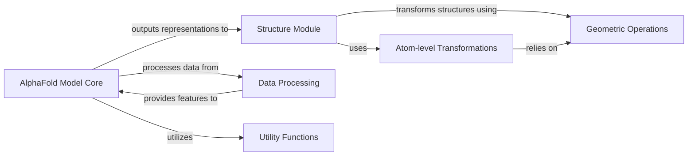

## Component Details

This overview details the core components of the AlphaFold model, focusing on its neural network architecture, structural prediction, geometric transformations, atom-level manipulations, and data processing. The main flow involves the 'Data Processing' component preparing input features, which are then fed into the 'AlphaFold Model Core' for iterative processing and representation learning. The 'Structure Module' then takes these abstract representations and converts them into concrete 3D protein coordinates, heavily relying on 'Geometric Operations' and 'Atom-level Transformations' for accurate spatial calculations and structural refinement. 'Utility Functions' provide general support across these components.

### AlphaFold Model Core

Implements the core neural network architecture of AlphaFold, including model initialization, the Evoformer block, various attention mechanisms, and modules for embedding, processing sequence and pair representations, predicting structural properties, and transforming abstract representations into concrete 3D protein coordinates. This component also orchestrates the overall prediction flow, from processing input features to running the model and calculating confidence metrics.

**Related Classes/Methods**:

- <a href="https://github.com/google-deepmind/alphafold/blob/master/alphafold/model/model.py#L66-L89" target="_blank" rel="noopener noreferrer">`alphafold.model.model.RunModel.__init__` (66:89)</a>

- <a href="https://github.com/google-deepmind/alphafold/blob/master/alphafold/model/model.py#L110-L138" target="_blank" rel="noopener noreferrer">`alphafold.model.model.RunModel.process_features` (110:138)</a>

- <a href="https://github.com/google-deepmind/alphafold/blob/master/alphafold/model/model.py#L140-L146" target="_blank" rel="noopener noreferrer">`alphafold.model.model.RunModel.eval_shape` (140:146)</a>

- <a href="https://github.com/google-deepmind/alphafold/blob/master/alphafold/model/model.py#L148-L176" target="_blank" rel="noopener noreferrer">`alphafold.model.model.RunModel.predict` (148:176)</a>

- <a href="https://github.com/google-deepmind/alphafold/blob/master/alphafold/model/model.py#L91-L108" target="_blank" rel="noopener noreferrer">`alphafold.model.model.RunModel.init_params` (91:108)</a>

- <a href="https://github.com/google-deepmind/alphafold/blob/master/alphafold/model/model.py#L30-L60" target="_blank" rel="noopener noreferrer">`alphafold.model.model.get_confidence_metrics` (30:60)</a>

- <a href="https://github.com/google-deepmind/alphafold/blob/master/alphafold/model/modules.py#L144-L272" target="_blank" rel="noopener noreferrer">`alphafold.model.modules.AlphaFoldIteration.__call__` (144:272)</a>

- <a href="https://github.com/google-deepmind/alphafold/blob/master/alphafold/model/modules.py#L286-L395" target="_blank" rel="noopener noreferrer">`alphafold.model.modules.AlphaFold.__call__` (286:395)</a>

- <a href="https://github.com/google-deepmind/alphafold/blob/master/alphafold/model/modules.py#L1789-L2012" target="_blank" rel="noopener noreferrer">`alphafold.model.modules.EmbeddingsAndEvoformer.__call__` (1789:2012)</a>

- <a href="https://github.com/google-deepmind/alphafold/blob/master/alphafold/model/modules.py#L409-L478" target="_blank" rel="noopener noreferrer">`alphafold.model.modules.TemplatePairStack.__call__` (409:478)</a>

- <a href="https://github.com/google-deepmind/alphafold/blob/master/alphafold/model/modules.py#L493-L534" target="_blank" rel="noopener noreferrer">`alphafold.model.modules.Transition.__call__` (493:534)</a>

- <a href="https://github.com/google-deepmind/alphafold/blob/master/alphafold/model/modules.py#L553-L633" target="_blank" rel="noopener noreferrer">`alphafold.model.modules.Attention.__call__` (553:633)</a>

- <a href="https://github.com/google-deepmind/alphafold/blob/master/alphafold/model/modules.py#L649-L731" target="_blank" rel="noopener noreferrer">`alphafold.model.modules.GlobalAttention.__call__` (649:731)</a>

- <a href="https://github.com/google-deepmind/alphafold/blob/master/alphafold/model/modules.py#L746-L799" target="_blank" rel="noopener noreferrer">`alphafold.model.modules.MSARowAttentionWithPairBias.__call__` (746:799)</a>

- <a href="https://github.com/google-deepmind/alphafold/blob/master/alphafold/model/modules.py#L813-L854" target="_blank" rel="noopener noreferrer">`alphafold.model.modules.MSAColumnAttention.__call__` (813:854)</a>

- <a href="https://github.com/google-deepmind/alphafold/blob/master/alphafold/model/modules.py#L868-L909" target="_blank" rel="noopener noreferrer">`alphafold.model.modules.MSAColumnGlobalAttention.__call__` (868:909)</a>

- <a href="https://github.com/google-deepmind/alphafold/blob/master/alphafold/model/modules.py#L924-L972" target="_blank" rel="noopener noreferrer">`alphafold.model.modules.TriangleAttention.__call__` (924:972)</a>

- <a href="https://github.com/google-deepmind/alphafold/blob/master/alphafold/model/modules.py#L1301-L1317" target="_blank" rel="noopener noreferrer">`alphafold.model.modules.TriangleMultiplication.__call__` (1301:1317)</a>

- <a href="https://github.com/google-deepmind/alphafold/blob/master/alphafold/model/modules.py#L1320-L1385" target="_blank" rel="noopener noreferrer">`alphafold.model.modules.TriangleMultiplication._triangle_multiplication` (1320:1385)</a>

- <a href="https://github.com/google-deepmind/alphafold/blob/master/alphafold/model/modules.py#L1388-L1429" target="_blank" rel="noopener noreferrer">`alphafold.model.modules.TriangleMultiplication._fused_triangle_multiplication` (1388:1429)</a>

- <a href="https://github.com/google-deepmind/alphafold/blob/master/alphafold/model/modules.py#L1522-L1592" target="_blank" rel="noopener noreferrer">`alphafold.model.modules.OuterProductMean.__call__` (1522:1592)</a>

- <a href="https://github.com/google-deepmind/alphafold/blob/master/alphafold/model/modules.py#L1660-L1774" target="_blank" rel="noopener noreferrer">`alphafold.model.modules.EvoformerIteration.__call__` (1660:1774)</a>

- <a href="https://github.com/google-deepmind/alphafold/blob/master/alphafold/model/modules.py#L2026-L2114" target="_blank" rel="noopener noreferrer">`alphafold.model.modules.SingleTemplateEmbedding.__call__` (2026:2114)</a>

- <a href="https://github.com/google-deepmind/alphafold/blob/master/alphafold/model/modules.py#L2129-L2194" target="_blank" rel="noopener noreferrer">`alphafold.model.modules.TemplateEmbedding.__call__` (2129:2194)</a>

- <a href="https://github.com/google-deepmind/alphafold/blob/master/alphafold/model/modules.py#L1276-L1286" target="_blank" rel="noopener noreferrer">`alphafold.model.modules._layer_norm` (1276:1286)</a>

- <a href="https://github.com/google-deepmind/alphafold/blob/master/alphafold/model/modules.py#L1595-L1624" target="_blank" rel="noopener noreferrer">`alphafold.model.modules.dgram_from_positions` (1595:1624)</a>

- <a href="https://github.com/google-deepmind/alphafold/blob/master/alphafold/model/modules.py#L1627-L1644" target="_blank" rel="noopener noreferrer">`alphafold.model.modules.pseudo_beta_fn` (1627:1644)</a>

- <a href="https://github.com/google-deepmind/alphafold/blob/master/alphafold/model/modules.py#L103-L125" target="_blank" rel="noopener noreferrer">`alphafold.model.modules.create_extra_msa_feature` (103:125)</a>

- <a href="https://github.com/google-deepmind/alphafold/blob/master/alphafold/model/modules.py#L65-L100" target="_blank" rel="noopener noreferrer">`alphafold.model.modules.dropout_wrapper` (65:100)</a>

- <a href="https://github.com/google-deepmind/alphafold/blob/master/alphafold/model/modules.py#L52-L62" target="_blank" rel="noopener noreferrer">`alphafold.model.modules.apply_dropout` (52:62)</a>

- <a href="https://github.com/google-deepmind/alphafold/blob/master/alphafold/model/modules.py#L537-L540" target="_blank" rel="noopener noreferrer">`alphafold.model.modules.glorot_uniform` (537:540)</a>

- <a href="https://github.com/google-deepmind/alphafold/blob/master/alphafold/model/modules.py#L994-L1014" target="_blank" rel="noopener noreferrer">`alphafold.model.modules.MaskedMsaHead.__call__` (994:1014)</a>

- <a href="https://github.com/google-deepmind/alphafold/blob/master/alphafold/model/modules.py#L1016-L1022" target="_blank" rel="noopener noreferrer">`alphafold.model.modules.MaskedMsaHead.loss` (1016:1022)</a>

- <a href="https://github.com/google-deepmind/alphafold/blob/master/alphafold/model/modules.py#L1037-L1081" target="_blank" rel="noopener noreferrer">`alphafold.model.modules.PredictedLDDTHead.__call__` (1037:1081)</a>

- <a href="https://github.com/google-deepmind/alphafold/blob/master/alphafold/model/modules.py#L1083-L1126" target="_blank" rel="noopener noreferrer">`alphafold.model.modules.PredictedLDDTHead.loss` (1083:1126)</a>

- <a href="https://github.com/google-deepmind/alphafold/blob/master/alphafold/model/modules.py#L1142-L1167" target="_blank" rel="noopener noreferrer">`alphafold.model.modules.PredictedAlignedErrorHead.__call__` (1142:1167)</a>

- <a href="https://github.com/google-deepmind/alphafold/blob/master/alphafold/model/modules.py#L1169-L1216" target="_blank" rel="noopener noreferrer">`alphafold.model.modules.PredictedAlignedErrorHead.loss` (1169:1216)</a>

- <a href="https://github.com/google-deepmind/alphafold/blob/master/alphafold/model/modules.py#L1232-L1251" target="_blank" rel="noopener noreferrer">`alphafold.model.modules.ExperimentallyResolvedHead.__call__` (1232:1251)</a>

- <a href="https://github.com/google-deepmind/alphafold/blob/master/alphafold/model/modules.py#L1253-L1273" target="_blank" rel="noopener noreferrer">`alphafold.model.modules.ExperimentallyResolvedHead.loss` (1253:1273)</a>

- <a href="https://github.com/google-deepmind/alphafold/blob/master/alphafold/model/modules.py#L1443-L1467" target="_blank" rel="noopener noreferrer">`alphafold.model.modules.DistogramHead.__call__` (1443:1467)</a>

- <a href="https://github.com/google-deepmind/alphafold/blob/master/alphafold/model/modules.py#L1469-L1471" target="_blank" rel="noopener noreferrer">`alphafold.model.modules.DistogramHead.loss` (1469:1471)</a>

- <a href="https://github.com/google-deepmind/alphafold/blob/master/alphafold/model/modules.py#L1474-L1503" target="_blank" rel="noopener noreferrer">`alphafold.model.modules._distogram_log_loss` (1474:1503)</a>

- <a href="https://github.com/google-deepmind/alphafold/blob/master/alphafold/model/modules.py#L37-L40" target="_blank" rel="noopener noreferrer">`alphafold.model.modules.softmax_cross_entropy` (37:40)</a>

- <a href="https://github.com/google-deepmind/alphafold/blob/master/alphafold/model/modules.py#L43-L49" target="_blank" rel="noopener noreferrer">`alphafold.model.modules.sigmoid_cross_entropy` (43:49)</a>

- <a href="https://github.com/google-deepmind/alphafold/blob/master/alphafold/model/modules_multimer.py#L52-L69" target="_blank" rel="noopener noreferrer">`alphafold.model.modules_multimer.gumbel_noise` (52:69)</a>

- <a href="https://github.com/google-deepmind/alphafold/blob/master/alphafold/model/modules_multimer.py#L72-L89" target="_blank" rel="noopener noreferrer">`alphafold.model.modules_multimer.gumbel_max_sample` (72:89)</a>

- <a href="https://github.com/google-deepmind/alphafold/blob/master/alphafold/model/modules_multimer.py#L92-L116" target="_blank" rel="noopener noreferrer">`alphafold.model.modules_multimer.gumbel_argsort_sample_idx` (92:116)</a>

- <a href="https://github.com/google-deepmind/alphafold/blob/master/alphafold/model/modules_multimer.py#L119-L156" target="_blank" rel="noopener noreferrer">`alphafold.model.modules_multimer.make_masked_msa` (119:156)</a>

- <a href="https://github.com/google-deepmind/alphafold/blob/master/alphafold/model/modules_multimer.py#L252-L282" target="_blank" rel="noopener noreferrer">`alphafold.model.modules_multimer.sample_msa` (252:282)</a>

- <a href="https://github.com/google-deepmind/alphafold/blob/master/alphafold/model/modules_multimer.py#L285-L290" target="_blank" rel="noopener noreferrer">`alphafold.model.modules_multimer.make_msa_profile` (285:290)</a>

- <a href="https://github.com/google-deepmind/alphafold/blob/master/alphafold/model/modules_multimer.py#L306-L407" target="_blank" rel="noopener noreferrer">`alphafold.model.modules_multimer.AlphaFoldIteration.__call__` (306:407)</a>

- <a href="https://github.com/google-deepmind/alphafold/blob/master/alphafold/model/modules_multimer.py#L419-L522" target="_blank" rel="noopener noreferrer">`alphafold.model.modules_multimer.AlphaFold.__call__` (419:522)</a>

- <a href="https://github.com/google-deepmind/alphafold/blob/master/alphafold/model/modules_multimer.py#L536-L607" target="_blank" rel="noopener noreferrer">`alphafold.model.modules_multimer.EmbeddingsAndEvoformer._relative_encoding` (536:607)</a>

- <a href="https://github.com/google-deepmind/alphafold/blob/master/alphafold/model/modules_multimer.py#L609-L815" target="_blank" rel="noopener noreferrer">`alphafold.model.modules_multimer.EmbeddingsAndEvoformer.__call__` (609:815)</a>

- <a href="https://github.com/google-deepmind/alphafold/blob/master/alphafold/model/modules_multimer.py#L826-L895" target="_blank" rel="noopener noreferrer">`alphafold.model.modules_multimer.TemplateEmbedding.__call__` (826:895)</a>

- <a href="https://github.com/google-deepmind/alphafold/blob/master/alphafold/model/modules_multimer.py#L906-L1044" target="_blank" rel="noopener noreferrer">`alphafold.model.modules_multimer.SingleTemplateEmbedding.__call__` (906:1044)</a>

- <a href="https://github.com/google-deepmind/alphafold/blob/master/alphafold/model/modules_multimer.py#L1056-L1115" target="_blank" rel="noopener noreferrer">`alphafold.model.modules_multimer.TemplateEmbeddingIteration.__call__` (1056:1115)</a>

- <a href="https://github.com/google-deepmind/alphafold/blob/master/alphafold/model/modules_multimer.py#L1118-L1177" target="_blank" rel="noopener noreferrer">`alphafold.model.modules_multimer.template_embedding_1d` (1118:1177)</a>

- <a href="https://github.com/google-deepmind/alphafold/blob/master/alphafold/model/modules_multimer.py#L159-L201" target="_blank" rel="noopener noreferrer">`alphafold.model.modules_multimer.nearest_neighbor_clusters` (159:201)</a>

- <a href="https://github.com/google-deepmind/alphafold/blob/master/alphafold/model/modules_multimer.py#L204-L222" target="_blank" rel="noopener noreferrer">`alphafold.model.modules_multimer.create_msa_feat` (204:222)</a>

- <a href="https://github.com/google-deepmind/alphafold/blob/master/alphafold/model/common_modules.py#L93-L128" target="_blank" rel="noopener noreferrer">`alphafold.model.common_modules.Linear.__call__` (93:128)</a>

- <a href="https://github.com/google-deepmind/alphafold/blob/master/alphafold/model/common_modules.py#L131-L189" target="_blank" rel="noopener noreferrer">`alphafold.model.common_modules.LayerNorm` (131:189)</a>

- <a href="https://github.com/google-deepmind/alphafold/blob/master/alphafold/model/common_modules.py#L28-L48" target="_blank" rel="noopener noreferrer">`alphafold.model.common_modules.get_initializer_scale` (28:48)</a>

- <a href="https://github.com/google-deepmind/alphafold/blob/master/alphafold/model/layer_stack.py#L51-L55" target="_blank" rel="noopener noreferrer">`alphafold.model.layer_stack.maybe_with_rng` (51:55)</a>

- <a href="https://github.com/google-deepmind/alphafold/blob/master/alphafold/model/layer_stack.py#L77-L157" target="_blank" rel="noopener noreferrer">`alphafold.model.layer_stack._LayerStack.__call__` (77:157)</a>

- <a href="https://github.com/google-deepmind/alphafold/blob/master/alphafold/model/layer_stack.py#L169-L176" target="_blank" rel="noopener noreferrer">`alphafold.model.layer_stack._LayerStackNoState.__init__` (169:176)</a>

- <a href="https://github.com/google-deepmind/alphafold/blob/master/alphafold/model/layer_stack.py#L192-L198" target="_blank" rel="noopener noreferrer">`alphafold.model.layer_stack._LayerStackWithState.__init__` (192:198)</a>

- <a href="https://github.com/google-deepmind/alphafold/blob/master/alphafold/model/layer_stack.py#L205-L273" target="_blank" rel="noopener noreferrer">`alphafold.model.layer_stack.layer_stack` (205:273)</a>

### Structure Module

This component is responsible for generating and refining the 3D atomic coordinates of the protein. It includes iterative folding steps (FoldIteration) and the main StructureModule, which converts abstract protein representations into concrete 3D structures, handling backbone and sidechain atom positions and calculating structural violations. It also includes invariant point attention mechanisms crucial for geometric reasoning.

**Related Classes/Methods**:

- <a href="https://github.com/google-deepmind/alphafold/blob/master/alphafold/model/folding.py#L71-L277" target="_blank" rel="noopener noreferrer">`alphafold.model.folding.InvariantPointAttention.__call__` (71:277)</a>

- <a href="https://github.com/google-deepmind/alphafold/blob/master/alphafold/model/folding.py#L297-L386" target="_blank" rel="noopener noreferrer">`alphafold.model.folding.FoldIteration.__call__` (297:386)</a>

- <a href="https://github.com/google-deepmind/alphafold/blob/master/alphafold/model/folding.py#L389-L460" target="_blank" rel="noopener noreferrer">`alphafold.model.folding.generate_affines` (389:460)</a>

- <a href="https://github.com/google-deepmind/alphafold/blob/master/alphafold/model/folding.py#L476-L517" target="_blank" rel="noopener noreferrer">`alphafold.model.folding.StructureModule.__call__` (476:517)</a>

- <a href="https://github.com/google-deepmind/alphafold/blob/master/alphafold/model/folding.py#L519-L557" target="_blank" rel="noopener noreferrer">`alphafold.model.folding.StructureModule.loss` (519:557)</a>

- <a href="https://github.com/google-deepmind/alphafold/blob/master/alphafold/model/folding.py#L560-L614" target="_blank" rel="noopener noreferrer">`alphafold.model.folding.compute_renamed_ground_truth` (560:614)</a>

- <a href="https://github.com/google-deepmind/alphafold/blob/master/alphafold/model/folding.py#L617-L668" target="_blank" rel="noopener noreferrer">`alphafold.model.folding.backbone_loss` (617:668)</a>

- <a href="https://github.com/google-deepmind/alphafold/blob/master/alphafold/model/folding.py#L671-L713" target="_blank" rel="noopener noreferrer">`alphafold.model.folding.sidechain_loss` (671:713)</a>

- <a href="https://github.com/google-deepmind/alphafold/blob/master/alphafold/model/folding.py#L733-L818" target="_blank" rel="noopener noreferrer">`alphafold.model.folding.find_structural_violations` (733:818)</a>

- <a href="https://github.com/google-deepmind/alphafold/blob/master/alphafold/model/folding.py#L821-L850" target="_blank" rel="noopener noreferrer">`alphafold.model.folding.compute_violation_metrics` (821:850)</a>

- <a href="https://github.com/google-deepmind/alphafold/blob/master/alphafold/model/folding.py#L853-L910" target="_blank" rel="noopener noreferrer">`alphafold.model.folding.supervised_chi_loss` (853:910)</a>

- <a href="https://github.com/google-deepmind/alphafold/blob/master/alphafold/model/folding.py#L913-L920" target="_blank" rel="noopener noreferrer">`alphafold.model.folding.generate_new_affine` (913:920)</a>

- <a href="https://github.com/google-deepmind/alphafold/blob/master/alphafold/model/folding.py#L936-L1008" target="_blank" rel="noopener noreferrer">`alphafold.model.folding.MultiRigidSidechain.__call__` (936:1008)</a>

- <a href="https://github.com/google-deepmind/alphafold/blob/master/alphafold/model/folding.py#L716-L730" target="_blank" rel="noopener noreferrer">`alphafold.model.folding.structural_violation_loss` (716:730)</a>

- <a href="https://github.com/google-deepmind/alphafold/blob/master/alphafold/model/folding.py#L923-L925" target="_blank" rel="noopener noreferrer">`alphafold.model.folding.l2_normalize` (923:925)</a>

- <a href="https://github.com/google-deepmind/alphafold/blob/master/alphafold/model/folding_multimer.py#L44-L61" target="_blank" rel="noopener noreferrer">`alphafold.model.folding_multimer.make_backbone_affine` (44:61)</a>

- <a href="https://github.com/google-deepmind/alphafold/blob/master/alphafold/model/folding_multimer.py#L99-L136" target="_blank" rel="noopener noreferrer">`alphafold.model.folding_multimer.QuatRigid.__call__` (99:136)</a>

- <a href="https://github.com/google-deepmind/alphafold/blob/master/alphafold/model/folding_multimer.py#L167-L184" target="_blank" rel="noopener noreferrer">`alphafold.model.folding_multimer.PointProjection.__call__` (167:184)</a>

- <a href="https://github.com/google-deepmind/alphafold/blob/master/alphafold/model/folding_multimer.py#L220-L370" target="_blank" rel="noopener noreferrer">`alphafold.model.folding_multimer.InvariantPointAttention.__call__` (220:370)</a>

- <a href="https://github.com/google-deepmind/alphafold/blob/master/alphafold/model/folding_multimer.py#L390-L474" target="_blank" rel="noopener noreferrer">`alphafold.model.folding_multimer.FoldIteration.__call__` (390:474)</a>

- <a href="https://github.com/google-deepmind/alphafold/blob/master/alphafold/model/folding_multimer.py#L477-L552" target="_blank" rel="noopener noreferrer">`alphafold.model.folding_multimer.generate_monomer_rigids` (477:552)</a>

- <a href="https://github.com/google-deepmind/alphafold/blob/master/alphafold/model/folding_multimer.py#L569-L624" target="_blank" rel="noopener noreferrer">`alphafold.model.folding_multimer.StructureModule.__call__` (569:624)</a>

- <a href="https://github.com/google-deepmind/alphafold/blob/master/alphafold/model/folding_multimer.py#L626-L748" target="_blank" rel="noopener noreferrer">`alphafold.model.folding_multimer.StructureModule.loss` (626:748)</a>

- <a href="https://github.com/google-deepmind/alphafold/blob/master/alphafold/model/folding_multimer.py#L751-L777" target="_blank" rel="noopener noreferrer">`alphafold.model.folding_multimer.compute_atom14_gt` (751:777)</a>

- <a href="https://github.com/google-deepmind/alphafold/blob/master/alphafold/model/folding_multimer.py#L801-L828" target="_blank" rel="noopener noreferrer">`alphafold.model.folding_multimer.compute_frames` (801:828)</a>

- <a href="https://github.com/google-deepmind/alphafold/blob/master/alphafold/model/folding_multimer.py#L831-L867" target="_blank" rel="noopener noreferrer">`alphafold.model.folding_multimer.sidechain_loss` (831:867)</a>

- <a href="https://github.com/google-deepmind/alphafold/blob/master/alphafold/model/folding_multimer.py#L888-L978" target="_blank" rel="noopener noreferrer">`alphafold.model.folding_multimer.find_structural_violations` (888:978)</a>

- <a href="https://github.com/google-deepmind/alphafold/blob/master/alphafold/model/folding_multimer.py#L981-L1008" target="_blank" rel="noopener noreferrer">`alphafold.model.folding_multimer.compute_violation_metrics` (981:1008)</a>

- <a href="https://github.com/google-deepmind/alphafold/blob/master/alphafold/model/folding_multimer.py#L1011-L1052" target="_blank" rel="noopener noreferrer">`alphafold.model.folding_multimer.supervised_chi_loss` (1011:1052)</a>

- <a href="https://github.com/google-deepmind/alphafold/blob/master/alphafold/model/folding_multimer.py#L1063-L1075" target="_blank" rel="noopener noreferrer">`alphafold.model.folding_multimer.get_renamed_chi_angles` (1063:1075)</a>

- <a href="https://github.com/google-deepmind/alphafold/blob/master/alphafold/model/folding_multimer.py#L1089-L1161" target="_blank" rel="noopener noreferrer">`alphafold.model.folding_multimer.MultiRigidSidechain.__call__` (1089:1161)</a>

- <a href="https://github.com/google-deepmind/alphafold/blob/master/alphafold/model/folding_multimer.py#L870-L885" target="_blank" rel="noopener noreferrer">`alphafold.model.folding_multimer.structural_violation_loss` (870:885)</a>

- <a href="https://github.com/google-deepmind/alphafold/blob/master/alphafold/model/folding_multimer.py#L1055-L1060" target="_blank" rel="noopener noreferrer">`alphafold.model.folding_multimer.l2_normalize` (1055:1060)</a>

### Geometric Operations

This component provides fundamental mathematical operations for 3D geometry, including rotations (Rot3Array), vectors (Vec3Array), rigid transformations (Rigid3Array), and specialized quaternion affine transformations. These operations are crucial for manipulating and calculating distances between atoms and residues in the protein structure, and are used extensively by the Structure Module and Atom-level Transformations.

**Related Classes/Methods**:

- <a href="https://github.com/google-deepmind/alphafold/blob/master/alphafold/model/r3.py#L57-L62" target="_blank" rel="noopener noreferrer">`alphafold.model.r3.invert_rigids` (57:62)</a>

- <a href="https://github.com/google-deepmind/alphafold/blob/master/alphafold/model/r3.py#L65-L69" target="_blank" rel="noopener noreferrer">`alphafold.model.r3.invert_rots` (65:69)</a>

- <a href="https://github.com/google-deepmind/alphafold/blob/master/alphafold/model/r3.py#L72-L95" target="_blank" rel="noopener noreferrer">`alphafold.model.r3.rigids_from_3_points` (72:95)</a>

- <a href="https://github.com/google-deepmind/alphafold/blob/master/alphafold/model/r3.py#L98-L101" target="_blank" rel="noopener noreferrer">`alphafold.model.r3.rigids_from_list` (98:101)</a>

- <a href="https://github.com/google-deepmind/alphafold/blob/master/alphafold/model/r3.py#L104-L107" target="_blank" rel="noopener noreferrer">`alphafold.model.r3.rigids_from_quataffine` (104:107)</a>

- <a href="https://github.com/google-deepmind/alphafold/blob/master/alphafold/model/r3.py#L110-L128" target="_blank" rel="noopener noreferrer">`alphafold.model.r3.rigids_from_tensor4x4` (110:128)</a>

- <a href="https://github.com/google-deepmind/alphafold/blob/master/alphafold/model/r3.py#L131-L140" target="_blank" rel="noopener noreferrer">`alphafold.model.r3.rigids_from_tensor_flat9` (131:140)</a>

- <a href="https://github.com/google-deepmind/alphafold/blob/master/alphafold/model/r3.py#L143-L149" target="_blank" rel="noopener noreferrer">`alphafold.model.r3.rigids_from_tensor_flat12` (143:149)</a>

- <a href="https://github.com/google-deepmind/alphafold/blob/master/alphafold/model/r3.py#L152-L156" target="_blank" rel="noopener noreferrer">`alphafold.model.r3.rigids_mul_rigids` (152:156)</a>

- <a href="https://github.com/google-deepmind/alphafold/blob/master/alphafold/model/r3.py#L159-L161" target="_blank" rel="noopener noreferrer">`alphafold.model.r3.rigids_mul_rots` (159:161)</a>

- <a href="https://github.com/google-deepmind/alphafold/blob/master/alphafold/model/r3.py#L164-L166" target="_blank" rel="noopener noreferrer">`alphafold.model.r3.rigids_mul_vecs` (164:166)</a>

- <a href="https://github.com/google-deepmind/alphafold/blob/master/alphafold/model/r3.py#L174-L181" target="_blank" rel="noopener noreferrer">`alphafold.model.r3.rigids_to_quataffine` (174:181)</a>

- <a href="https://github.com/google-deepmind/alphafold/blob/master/alphafold/model/r3.py#L200-L208" target="_blank" rel="noopener noreferrer">`alphafold.model.r3.rots_from_tensor3x3` (200:208)</a>

- <a href="https://github.com/google-deepmind/alphafold/blob/master/alphafold/model/r3.py#L211-L236" target="_blank" rel="noopener noreferrer">`alphafold.model.r3.rots_from_two_vecs` (211:236)</a>

- <a href="https://github.com/google-deepmind/alphafold/blob/master/alphafold/model/r3.py#L239-L244" target="_blank" rel="noopener noreferrer">`alphafold.model.r3.rots_mul_rots` (239:244)</a>

- <a href="https://github.com/google-deepmind/alphafold/blob/master/alphafold/model/r3.py#L247-L251" target="_blank" rel="noopener noreferrer">`alphafold.model.r3.rots_mul_vecs` (247:251)</a>

- <a href="https://github.com/google-deepmind/alphafold/blob/master/alphafold/model/r3.py#L254-L256" target="_blank" rel="noopener noreferrer">`alphafold.model.r3.vecs_add` (254:256)</a>

- <a href="https://github.com/google-deepmind/alphafold/blob/master/alphafold/model/r3.py#L264-L268" target="_blank" rel="noopener noreferrer">`alphafold.model.r3.vecs_cross_vecs` (264:268)</a>

- <a href="https://github.com/google-deepmind/alphafold/blob/master/alphafold/model/r3.py#L271-L276" target="_blank" rel="noopener noreferrer">`alphafold.model.r3.vecs_from_tensor` (271:276)</a>

- <a href="https://github.com/google-deepmind/alphafold/blob/master/alphafold/model/r3.py#L279-L289" target="_blank" rel="noopener noreferrer">`alphafold.model.r3.vecs_robust_normalize` (279:289)</a>

- <a href="https://github.com/google-deepmind/alphafold/blob/master/alphafold/model/r3.py#L304-L306" target="_blank" rel="noopener noreferrer">`alphafold.model.r3.vecs_sub` (304:306)</a>

- <a href="https://github.com/google-deepmind/alphafold/blob/master/alphafold/model/r3.py#L309-L313" target="_blank" rel="noopener noreferrer">`alphafold.model.r3.vecs_squared_distance` (309:313)</a>

- <a href="https://github.com/google-deepmind/alphafold/blob/master/alphafold/model/geometry/rotation_matrix.py#L31-L156" target="_blank" rel="noopener noreferrer">`alphafold.model.geometry.rotation_matrix.Rot3Array` (31:156)</a>

- <a href="https://github.com/google-deepmind/alphafold/blob/master/alphafold/model/geometry/rigid_matrix_vector.py#L30-L105" target="_blank" rel="noopener noreferrer">`alphafold.model.geometry.rigid_matrix_vector.Rigid3Array` (30:105)</a>

- <a href="https://github.com/google-deepmind/alphafold/blob/master/alphafold/model/geometry/vector.py#L31-L125" target="_blank" rel="noopener noreferrer">`alphafold.model.geometry.vector.Vec3Array` (31:125)</a>

- <a href="https://github.com/google-deepmind/alphafold/blob/master/alphafold/model/geometry/vector.py#L166-L183" target="_blank" rel="noopener noreferrer">`alphafold.model.geometry.vector.euclidean_distance` (166:183)</a>

- <a href="https://github.com/google-deepmind/alphafold/blob/master/alphafold/model/geometry/vector.py#L214-L216" target="_blank" rel="noopener noreferrer">`alphafold.model.geometry.vector.random_gaussian_vector` (214:216)</a>

- <a href="https://github.com/google-deepmind/alphafold/blob/master/alphafold/model/quat_affine.py#L183-L218" target="_blank" rel="noopener noreferrer">`alphafold.model.quat_affine.QuatAffine.__init__` (183:218)</a>

- <a href="https://github.com/google-deepmind/alphafold/blob/master/alphafold/model/quat_affine.py#L226-L232" target="_blank" rel="noopener noreferrer">`alphafold.model.quat_affine.QuatAffine.apply_tensor_fn` (226:232)</a>

- <a href="https://github.com/google-deepmind/alphafold/blob/master/alphafold/model/quat_affine.py#L234-L240" target="_blank" rel="noopener noreferrer">`alphafold.model.quat_affine.QuatAffine.apply_rotation_tensor_fn` (234:240)</a>

- <a href="https://github.com/google-deepmind/alphafold/blob/master/alphafold/model/quat_affine.py#L242-L249" target="_blank" rel="noopener noreferrer">`alphafold.model.quat_affine.QuatAffine.scale_translation` (242:249)</a>

- <a href="https://github.com/google-deepmind/alphafold/blob/master/alphafold/model/quat_affine.py#L252-L256" target="_blank" rel="noopener noreferrer">`alphafold.model.quat_affine.QuatAffine.from_tensor` (252:256)</a>

- <a href="https://github.com/google-deepmind/alphafold/blob/master/alphafold/model/quat_affine.py#L258-L284" target="_blank" rel="noopener noreferrer">`alphafold.model.quat_affine.QuatAffine.pre_compose` (258:284)</a>

- <a href="https://github.com/google-deepmind/alphafold/blob/master/alphafold/model/quat_affine.py#L286-L310" target="_blank" rel="noopener noreferrer">`alphafold.model.quat_affine.QuatAffine.apply_to_point` (286:310)</a>

- <a href="https://github.com/google-deepmind/alphafold/blob/master/alphafold/model/quat_affine.py#L312-L337" target="_blank" rel="noopener noreferrer">`alphafold.model.quat_affine.QuatAffine.invert_point` (312:337)</a>

- <a href="https://github.com/google-deepmind/alphafold/blob/master/alphafold/model/quat_affine.py#L358-L427" target="_blank" rel="noopener noreferrer">`alphafold.model.quat_affine.make_canonical_transform` (358:427)</a>

- <a href="https://github.com/google-deepmind/alphafold/blob/master/alphafold/model/quat_affine.py#L430-L458" target="_blank" rel="noopener noreferrer">`alphafold.model.quat_affine.make_transform_from_reference` (430:458)</a>

### Atom-level Transformations

This component handles the conversion and manipulation of protein atom representations, specifically between atom14 and atom37 coordinate systems. It also includes functions for calculating torsion angles, identifying ambiguous atoms, and computing various atom-level loss functions related to bond lengths and clashes. It is critical for detailed structural analysis and refinement.

**Related Classes/Methods**:

- <a href="https://github.com/google-deepmind/alphafold/blob/master/alphafold/model/all_atom.py#L75-L91" target="_blank" rel="noopener noreferrer">`alphafold.model.all_atom.atom14_to_atom37` (75:91)</a>

- <a href="https://github.com/google-deepmind/alphafold/blob/master/alphafold/model/all_atom.py#L94-L110" target="_blank" rel="noopener noreferrer">`alphafold.model.all_atom.atom37_to_atom14` (94:110)</a>

- <a href="https://github.com/google-deepmind/alphafold/blob/master/alphafold/model/all_atom.py#L113-L267" target="_blank" rel="noopener noreferrer">`alphafold.model.all_atom.atom37_to_frames` (113:267)</a>

- <a href="https://github.com/google-deepmind/alphafold/blob/master/alphafold/model/all_atom.py#L444-L528" target="_blank" rel="noopener noreferrer">`alphafold.model.all_atom.torsion_angles_to_frames` (444:528)</a>

- <a href="https://github.com/google-deepmind/alphafold/blob/master/alphafold/model/all_atom.py#L531-L571" target="_blank" rel="noopener noreferrer">`alphafold.model.all_atom.frames_and_literature_positions_to_atom14_pos` (531:571)</a>

- <a href="https://github.com/google-deepmind/alphafold/blob/master/alphafold/model/all_atom.py#L574-L605" target="_blank" rel="noopener noreferrer">`alphafold.model.all_atom.extreme_ca_ca_distance_violations` (574:605)</a>

- <a href="https://github.com/google-deepmind/alphafold/blob/master/alphafold/model/all_atom.py#L608-L740" target="_blank" rel="noopener noreferrer">`alphafold.model.all_atom.between_residue_bond_loss` (608:740)</a>

- <a href="https://github.com/google-deepmind/alphafold/blob/master/alphafold/model/all_atom.py#L743-L849" target="_blank" rel="noopener noreferrer">`alphafold.model.all_atom.between_residue_clash_loss` (743:849)</a>

- <a href="https://github.com/google-deepmind/alphafold/blob/master/alphafold/model/all_atom.py#L852-L925" target="_blank" rel="noopener noreferrer">`alphafold.model.all_atom.within_residue_violations` (852:925)</a>

- <a href="https://github.com/google-deepmind/alphafold/blob/master/alphafold/model/all_atom.py#L928-L1009" target="_blank" rel="noopener noreferrer">`alphafold.model.all_atom.find_optimal_renaming` (928:1009)</a>

- <a href="https://github.com/google-deepmind/alphafold/blob/master/alphafold/model/all_atom.py#L1012-L1078" target="_blank" rel="noopener noreferrer">`alphafold.model.all_atom.frame_aligned_point_error` (1012:1078)</a>

- <a href="https://github.com/google-deepmind/alphafold/blob/master/alphafold/model/all_atom.py#L1111-L1140" target="_blank" rel="noopener noreferrer">`alphafold.model.all_atom.get_alt_atom14` (1111:1140)</a>

- <a href="https://github.com/google-deepmind/alphafold/blob/master/alphafold/model/all_atom.py#L49-L72" target="_blank" rel="noopener noreferrer">`alphafold.model.all_atom.get_chi_atom_indices` (49:72)</a>

- <a href="https://github.com/google-deepmind/alphafold/blob/master/alphafold/model/all_atom.py#L45-L46" target="_blank" rel="noopener noreferrer">`alphafold.model.all_atom.squared_difference` (45:46)</a>

- <a href="https://github.com/google-deepmind/alphafold/blob/master/alphafold/model/all_atom_multimer.py#L204-L205" target="_blank" rel="noopener noreferrer">`alphafold.model.all_atom_multimer.get_atom37_mask` (204:205)</a>

- <a href="https://github.com/google-deepmind/alphafold/blob/master/alphafold/model/all_atom_multimer.py#L208-L209" target="_blank" rel="noopener noreferrer">`alphafold.model.all_atom_multimer.get_atom14_mask` (208:209)</a>

- <a href="https://github.com/google-deepmind/alphafold/blob/master/alphafold/model/all_atom_multimer.py#L212-L213" target="_blank" rel="noopener noreferrer">`alphafold.model.all_atom_multimer.get_atom14_is_ambiguous` (212:213)</a>

- <a href="https://github.com/google-deepmind/alphafold/blob/master/alphafold/model/all_atom_multimer.py#L216-L217" target="_blank" rel="noopener noreferrer">`alphafold.model.all_atom_multimer.get_atom14_to_atom37_map` (216:217)</a>

- <a href="https://github.com/google-deepmind/alphafold/blob/master/alphafold/model/all_atom_multimer.py#L220-L221" target="_blank" rel="noopener noreferrer">`alphafold.model.all_atom_multimer.get_atom37_to_atom14_map` (220:221)</a>

- <a href="https://github.com/google-deepmind/alphafold/blob/master/alphafold/model/all_atom_multimer.py#L224-L237" target="_blank" rel="noopener noreferrer">`alphafold.model.all_atom_multimer.atom14_to_atom37` (224:237)</a>

- <a href="https://github.com/google-deepmind/alphafold/blob/master/alphafold/model/all_atom_multimer.py#L240-L253" target="_blank" rel="noopener noreferrer">`alphafold.model.all_atom_multimer.atom37_to_atom14` (240:253)</a>

- <a href="https://github.com/google-deepmind/alphafold/blob/master/alphafold/model/all_atom_multimer.py#L256-L271" target="_blank" rel="noopener noreferrer">`alphafold.model.all_atom_multimer.get_alt_atom14` (256:271)</a>

- <a href="https://github.com/google-deepmind/alphafold/blob/master/alphafold/model/all_atom_multimer.py#L274-L370" target="_blank" rel="noopener noreferrer">`alphafold.model.all_atom_multimer.atom37_to_frames` (274:370)</a>

- <a href="https://github.com/google-deepmind/alphafold/blob/master/alphafold/model/all_atom_multimer.py#L373-L437" target="_blank" rel="noopener noreferrer">`alphafold.model.all_atom_multimer.torsion_angles_to_frames` (373:437)</a>

- <a href="https://github.com/google-deepmind/alphafold/blob/master/alphafold/model/all_atom_multimer.py#L440-L471" target="_blank" rel="noopener noreferrer">`alphafold.model.all_atom_multimer.frames_and_literature_positions_to_atom14_pos` (440:471)</a>

- <a href="https://github.com/google-deepmind/alphafold/blob/master/alphafold/model/all_atom_multimer.py#L474-L491" target="_blank" rel="noopener noreferrer">`alphafold.model.all_atom_multimer.extreme_ca_ca_distance_violations` (474:491)</a>

- <a href="https://github.com/google-deepmind/alphafold/blob/master/alphafold/model/all_atom_multimer.py#L494-L592" target="_blank" rel="noopener noreferrer">`alphafold.model.all_atom_multimer.between_residue_bond_loss` (494:592)</a>

- <a href="https://github.com/google-deepmind/alphafold/blob/master/alphafold/model/all_atom_multimer.py#L595-L675" target="_blank" rel="noopener noreferrer">`alphafold.model.all_atom_multimer.between_residue_clash_loss` (595:675)</a>

- <a href="https://github.com/google-deepmind/alphafold/blob/master/alphafold/model/all_atom_multimer.py#L678-L726" target="_blank" rel="noopener noreferrer">`alphafold.model.all_atom_multimer.within_residue_violations` (678:726)</a>

- <a href="https://github.com/google-deepmind/alphafold/blob/master/alphafold/model/all_atom_multimer.py#L729-L781" target="_blank" rel="noopener noreferrer">`alphafold.model.all_atom_multimer.find_optimal_renaming` (729:781)</a>

- <a href="https://github.com/google-deepmind/alphafold/blob/master/alphafold/model/all_atom_multimer.py#L784-L852" target="_blank" rel="noopener noreferrer">`alphafold.model.all_atom_multimer.frame_aligned_point_error` (784:852)</a>

- <a href="https://github.com/google-deepmind/alphafold/blob/master/alphafold/model/all_atom_multimer.py#L881-L941" target="_blank" rel="noopener noreferrer">`alphafold.model.all_atom_multimer.compute_chi_angles` (881:941)</a>

- <a href="https://github.com/google-deepmind/alphafold/blob/master/alphafold/model/all_atom_multimer.py#L944-L967" target="_blank" rel="noopener noreferrer">`alphafold.model.all_atom_multimer.make_transform_from_reference` (944:967)</a>

- <a href="https://github.com/google-deepmind/alphafold/blob/master/alphafold/model/all_atom_multimer.py#L855-L878" target="_blank" rel="noopener noreferrer">`alphafold.model.all_atom_multimer.get_chi_atom_indices` (855:878)</a>

- <a href="https://github.com/google-deepmind/alphafold/blob/master/alphafold/model/all_atom_multimer.py#L25-L26" target="_blank" rel="noopener noreferrer">`alphafold.model.all_atom_multimer.squared_difference` (25:26)</a>

### Data Processing

This component is responsible for preparing and transforming raw input data into features suitable for the AlphaFold model. It handles parsing TF examples or NumPy arrays, applying various data augmentation and masking techniques, and ensuring the data is in the correct format and shape for model consumption. It also includes utilities for handling model configurations and parameters.

**Related Classes/Methods**:

- <a href="https://github.com/google-deepmind/alphafold/blob/master/alphafold/model/data.py#L24-L32" target="_blank" rel="noopener noreferrer">`alphafold.model.data.get_model_haiku_params` (24:32)</a>

- <a href="https://github.com/google-deepmind/alphafold/blob/master/alphafold/model/config.py#L25-L35" target="_blank" rel="noopener noreferrer">`alphafold.model.config.model_config` (25:35)</a>

- <a href="https://github.com/google-deepmind/alphafold/blob/master/alphafold/model/features.py#L45-L74" target="_blank" rel="noopener noreferrer">`alphafold.model.features.tf_example_to_features` (45:74)</a>

- <a href="https://github.com/google-deepmind/alphafold/blob/master/alphafold/model/features.py#L77-L103" target="_blank" rel="noopener noreferrer">`alphafold.model.features.np_example_to_features` (77:103)</a>

- <a href="https://github.com/google-deepmind/alphafold/blob/master/alphafold/model/features.py#L28-L42" target="_blank" rel="noopener noreferrer">`alphafold.model.features.make_data_config` (28:42)</a>

- <a href="https://github.com/google-deepmind/alphafold/blob/master/alphafold/model/tf/data_transforms.py#L48-L51" target="_blank" rel="noopener noreferrer">`alphafold.model.tf.data_transforms.make_seq_mask` (48:51)</a>

- <a href="https://github.com/google-deepmind/alphafold/blob/master/alphafold/model/tf/data_transforms.py#L54-L58" target="_blank" rel="noopener noreferrer">`alphafold.model.tf.data_transforms.make_template_mask` (54:58)</a>

- <a href="https://github.com/google-deepmind/alphafold/blob/master/alphafold/model/tf/data_transforms.py#L114-L130" target="_blank" rel="noopener noreferrer">`alphafold.model.tf.data_transforms.squeeze_features` (114:130)</a>

- <a href="https://github.com/google-deepmind/alphafold/blob/master/alphafold/model/tf/data_transforms.py#L133-L136" target="_blank" rel="noopener noreferrer">`alphafold.model.tf.data_transforms.make_random_crop_to_size_seed` (133:136)</a>

- <a href="https://github.com/google-deepmind/alphafold/blob/master/alphafold/model/tf/data_transforms.py#L140-L157" target="_blank" rel="noopener noreferrer">`alphafold.model.tf.data_transforms.randomly_replace_msa_with_unknown` (140:157)</a>

- <a href="https://github.com/google-deepmind/alphafold/blob/master/alphafold/model/tf/data_transforms.py#L210-L247" target="_blank" rel="noopener noreferrer">`alphafold.model.tf.data_transforms.block_delete_msa` (210:247)</a>

- <a href="https://github.com/google-deepmind/alphafold/blob/master/alphafold/model/tf/data_transforms.py#L251-L283" target="_blank" rel="noopener noreferrer">`alphafold.model.tf.data_transforms.nearest_neighbor_clusters` (251:283)</a>

- <a href="https://github.com/google-deepmind/alphafold/blob/master/alphafold/model/tf/data_transforms.py#L287-L308" target="_blank" rel="noopener noreferrer">`alphafold.model.tf.data_transforms.summarize_clusters` (287:308)</a>

- <a href="https://github.com/google-deepmind/alphafold/blob/master/alphafold/model/tf/data_transforms.py#L311-L317" target="_blank" rel="noopener noreferrer">`alphafold.model.tf.data_transforms.make_msa_mask` (311:317)</a>

- <a href="https://github.com/google-deepmind/alphafold/blob/master/alphafold/model/tf/data_transforms.py#L340-L348" target="_blank" rel="noopener noreferrer">`alphafold.model.tf.data_transforms.make_pseudo_beta` (340:348)</a>

- <a href="https://github.com/google-deepmind/alphafold/blob/master/alphafold/model/tf/data_transforms.py#L357-L364" target="_blank" rel="noopener noreferrer">`alphafold.model.tf.data_transforms.shaped_categorical` (357:364)</a>

- <a href="https://github.com/google-deepmind/alphafold/blob/master/alphafold/model/tf/data_transforms.py#L379-L408" target="_blank" rel="noopener noreferrer">`alphafold.model.tf.data_transforms.make_masked_msa` (379:408)</a>

- <a href="https://github.com/google-deepmind/alphafold/blob/master/alphafold/model/tf/data_transforms.py#L502-L561" target="_blank" rel="noopener noreferrer">`alphafold.model.tf.data_transforms.random_crop_to_size` (502:561)</a>

- <a href="https://github.com/google-deepmind/alphafold/blob/master/alphafold/model/tf/proteins_dataset.py#L23-L48" target="_blank" rel="noopener noreferrer">`alphafold.model.tf.proteins_dataset.parse_tfexample` (23:48)</a>

- <a href="https://github.com/google-deepmind/alphafold/blob/master/alphafold/model/tf/proteins_dataset.py#L56-L108" target="_blank" rel="noopener noreferrer">`alphafold.model.tf.proteins_dataset.parse_reshape_logic` (56:108)</a>

- <a href="https://github.com/google-deepmind/alphafold/blob/master/alphafold/model/tf/proteins_dataset.py#L123-L141" target="_blank" rel="noopener noreferrer">`alphafold.model.tf.proteins_dataset.create_tensor_dict` (123:141)</a>

- <a href="https://github.com/google-deepmind/alphafold/blob/master/alphafold/model/tf/proteins_dataset.py#L144-L165" target="_blank" rel="noopener noreferrer">`alphafold.model.tf.proteins_dataset.np_to_tensor_dict` (144:165)</a>

- <a href="https://github.com/google-deepmind/alphafold/blob/master/alphafold/model/tf/input_pipeline.py#L32-L60" target="_blank" rel="noopener noreferrer">`alphafold.model.tf.input_pipeline.nonensembled_map_fns` (32:60)</a>

- <a href="https://github.com/google-deepmind/alphafold/blob/master/alphafold/model/tf/input_pipeline.py#L63-L121" target="_blank" rel="noopener noreferrer">`alphafold.model.tf.input_pipeline.ensembled_map_fns` (63:121)</a>

- <a href="https://github.com/google-deepmind/alphafold/blob/master/alphafold/model/tf/input_pipeline.py#L124-L158" target="_blank" rel="noopener noreferrer">`alphafold.model.tf.input_pipeline.process_tensors_from_config` (124:158)</a>

### Utility Functions

This component provides a collection of general-purpose utility functions that support various operations across the AlphaFold model. These include functions for batched data gathering, padding-consistent random number generation, and other common mathematical or data manipulation tasks.

**Related Classes/Methods**:

- <a href="https://github.com/google-deepmind/alphafold/blob/master/alphafold/model/utils.py#L70-L75" target="_blank" rel="noopener noreferrer">`alphafold.model.utils.batched_gather` (70:75)</a>

- <a href="https://github.com/google-deepmind/alphafold/blob/master/alphafold/model/utils.py#L120-L172" target="_blank" rel="noopener noreferrer">`alphafold.model.utils.padding_consistent_rng` (120:172)</a>

- <a href="https://github.com/google-deepmind/alphafold/blob/master/alphafold/model/modules_multimer.py#L52-L69" target="_blank" rel="noopener noreferrer">`alphafold.model.modules_multimer.gumbel_noise` (52:69)</a>

- <a href="https://github.com/google-deepmind/alphafold/blob/master/alphafold/model/modules_multimer.py#L72-L89" target="_blank" rel="noopener noreferrer">`alphafold.model.modules_multimer.gumbel_max_sample` (72:89)</a>

- <a href="https://github.com/google-deepmind/alphafold/blob/master/alphafold/model/modules_multimer.py#L92-L116" target="_blank" rel="noopener noreferrer">`alphafold.model.modules_multimer.gumbel_argsort_sample_idx` (92:116)</a>

- `alphafold.model.prng.PRNGSequence` (full file reference)

- `alphafold.model.prng.PRNGKey` (full file reference)

### [FAQ](https://github.com/CodeBoarding/GeneratedOnBoardings/tree/main?tab=readme-ov-file#faq)