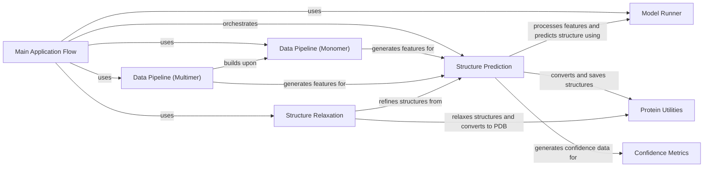

## Component Details

The AlphaFold Runner orchestrates the entire protein structure prediction workflow, from initial input processing and feature generation to the final output generation and saving of predicted structures and confidence metrics. It serves as the main entry point for running the AlphaFold application, coordinating various sub-components like data pipelines, model inference, and structure relaxation to deliver accurate protein structure predictions.

### Main Application Flow

This component orchestrates the entire AlphaFold prediction process. It handles command-line argument parsing, sets up data pipelines (monomer or multimer), initializes model runners, and manages the overall execution flow, including calling the structure prediction and relaxation components. It's the entry point for the AlphaFold application.

**Related Classes/Methods**:

- <a href="https://github.com/google-deepmind/alphafold/blob/master/run_alphafold.py#L424-L553" target="_blank" rel="noopener noreferrer">`alphafold.run_alphafold.main` (424:553)</a>

### Structure Prediction

This component is responsible for predicting the 3D structure of a protein given its sequence. It utilizes the data pipeline to generate features, runs the AlphaFold model to obtain predictions, and then processes and saves the unrelaxed protein structures, confidence metrics (pLDDT, PAE), and intermediate results. It also handles the initial PDB and mmCIF file generation.

**Related Classes/Methods**:

- <a href="https://github.com/google-deepmind/alphafold/blob/master/run_alphafold.py#L231-L421" target="_blank" rel="noopener noreferrer">`alphafold.run_alphafold.predict_structure` (231:421)</a>

- <a href="https://github.com/google-deepmind/alphafold/blob/master/run_alphafold.py#L174-L184" target="_blank" rel="noopener noreferrer">`alphafold.run_alphafold._save_confidence_json_file` (174:184)</a>

- <a href="https://github.com/google-deepmind/alphafold/blob/master/run_alphafold.py#L187-L209" target="_blank" rel="noopener noreferrer">`alphafold.run_alphafold._save_mmcif_file` (187:209)</a>

- <a href="https://github.com/google-deepmind/alphafold/blob/master/run_alphafold.py#L212-L228" target="_blank" rel="noopener noreferrer">`alphafold.run_alphafold._save_pae_json_file` (212:228)</a>

- <a href="https://github.com/google-deepmind/alphafold/blob/master/run_alphafold.py#L164-L171" target="_blank" rel="noopener noreferrer">`alphafold.run_alphafold._jnp_to_np` (164:171)</a>

### Data Pipeline (Monomer)

This component prepares the input features for the AlphaFold model for single-chain proteins (monomers). It runs various MSA (Multiple Sequence Alignment) tools like Jackhmmer and HHblits against different databases (UniRef90, MGnify, BFD/UniRef30, Small BFD) and searches for structural templates. It then processes these raw outputs into a structured feature dictionary suitable for the AlphaFold model.

**Related Classes/Methods**:

- <a href="https://github.com/google-deepmind/alphafold/blob/master/alphafold/data/pipeline.py#L110-L242" target="_blank" rel="noopener noreferrer">`alphafold.data.pipeline.DataPipeline` (110:242)</a>

### Data Pipeline (Multimer)

This component extends the monomer data pipeline to handle multiple protein chains (multimers). It orchestrates the processing of individual chains using the monomer pipeline and then adds features related to inter-chain interactions and assembly, such as MSA pairing and padding, to prepare the input for the multimer AlphaFold model.

**Related Classes/Methods**:

- <a href="https://github.com/google-deepmind/alphafold/blob/master/alphafold/data/pipeline_multimer.py#L169-L283" target="_blank" rel="noopener noreferrer">`alphafold.data.pipeline_multimer.DataPipeline` (169:283)</a>

### Model Runner

This component encapsulates the AlphaFold model and its inference capabilities. It handles the processing of input features, runs the neural network prediction, and computes confidence metrics. It provides a standardized interface for interacting with the core AlphaFold model.

**Related Classes/Methods**:

- <a href="https://github.com/google-deepmind/alphafold/blob/master/alphafold/model/model.py#L63-L176" target="_blank" rel="noopener noreferrer">`alphafold.model.model.RunModel` (63:176)</a>

### Structure Relaxation

This component refines the predicted protein structures using Amber relaxation. It takes the unrelaxed protein structures and applies a molecular dynamics simulation to minimize energy and resolve structural violations, resulting in a more physically realistic and stable protein conformation. It also generates relaxed PDB and mmCIF files.

**Related Classes/Methods**:

- <a href="https://github.com/google-deepmind/alphafold/blob/master/alphafold/relax/relax.py#L22-L83" target="_blank" rel="noopener noreferrer">`alphafold.relax.relax.AmberRelaxation` (22:83)</a>

### Protein Utilities

This component provides utility functions for handling protein structures, including converting protein objects to PDB and mmCIF file formats, and creating protein objects from prediction results or PDB strings. It serves as a foundational layer for structural data manipulation.

**Related Classes/Methods**:

- <a href="https://github.com/google-deepmind/alphafold/blob/master/alphafold/common/protein.py#L226-L303" target="_blank" rel="noopener noreferrer">`alphafold.common.protein.to_pdb` (226:303)</a>

- <a href="https://github.com/google-deepmind/alphafold/blob/master/alphafold/common/protein.py#L322-L358" target="_blank" rel="noopener noreferrer">`alphafold.common.protein.from_prediction` (322:358)</a>

- <a href="https://github.com/google-deepmind/alphafold/blob/master/alphafold/common/protein.py#L361-L497" target="_blank" rel="noopener noreferrer">`alphafold.common.protein.to_mmcif` (361:497)</a>

- <a href="https://github.com/google-deepmind/alphafold/blob/master/alphafold/common/protein.py#L178-L195" target="_blank" rel="noopener noreferrer">`alphafold.common.protein.from_pdb_string` (178:195)</a>

### Confidence Metrics

This component is responsible for calculating and formatting confidence scores associated with the predicted protein structures. It generates JSON files containing per-residue confidence metrics like pLDDT and PAE, which are crucial for evaluating the quality of the predictions.

**Related Classes/Methods**:

- <a href="https://github.com/google-deepmind/alphafold/blob/master/alphafold/common/confidence.py#L54-L74" target="_blank" rel="noopener noreferrer">`alphafold.common.confidence.confidence_json` (54:74)</a>

- <a href="https://github.com/google-deepmind/alphafold/blob/master/alphafold/common/confidence.py#L149-L172" target="_blank" rel="noopener noreferrer">`alphafold.common.confidence.pae_json` (149:172)</a>

### [FAQ](https://github.com/CodeBoarding/GeneratedOnBoardings/tree/main?tab=readme-ov-file#faq)