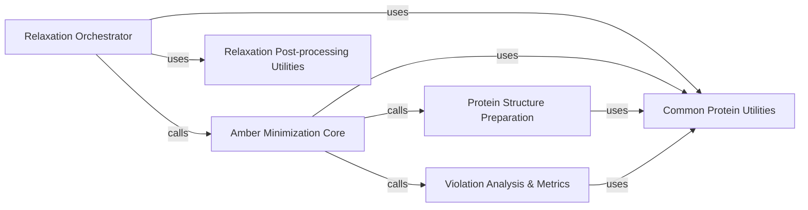

## Component Details

The Amber Relaxation Module refines predicted protein structures using Amber molecular dynamics simulations. The main flow involves an orchestration component that initiates the relaxation process, which then calls a core minimization component. This core component prepares the protein structure, performs iterative energy minimization steps, and analyzes structural violations. Various utility components are used throughout the process for common protein manipulations and post-processing tasks.

### Relaxation Orchestrator

This component initiates and manages the overall protein relaxation process. It orchestrates calls to the core minimization pipeline and handles final data processing and validation.

**Related Classes/Methods**:

- <a href="https://github.com/google-deepmind/alphafold/blob/master/alphafold/relax/relax.py#L57-L83" target="_blank" rel="noopener noreferrer">`alphafold.relax.relax.AmberRelaxation.process` (57:83)</a>

- <a href="https://github.com/google-deepmind/alphafold/blob/master/alphafold/relax/relax.py#L22-L83" target="_blank" rel="noopener noreferrer">`alphafold.relax.relax.AmberRelaxation` (22:83)</a>

### Amber Minimization Core

This component encapsulates the primary logic for performing energy minimization using Amber. It manages iterative minimization steps, applies restraints, and interacts with OpenMM.

**Related Classes/Methods**:

- <a href="https://github.com/google-deepmind/alphafold/blob/master/alphafold/relax/amber_minimize.py#L425-L504" target="_blank" rel="noopener noreferrer">`alphafold.relax.amber_minimize.run_pipeline` (425:504)</a>

- <a href="https://github.com/google-deepmind/alphafold/blob/master/alphafold/relax/amber_minimize.py#L367-L422" target="_blank" rel="noopener noreferrer">`alphafold.relax.amber_minimize._run_one_iteration` (367:422)</a>

- <a href="https://github.com/google-deepmind/alphafold/blob/master/alphafold/relax/amber_minimize.py#L73-L109" target="_blank" rel="noopener noreferrer">`alphafold.relax.amber_minimize._openmm_minimize` (73:109)</a>

- <a href="https://github.com/google-deepmind/alphafold/blob/master/alphafold/relax/amber_minimize.py#L48-L70" target="_blank" rel="noopener noreferrer">`alphafold.relax.amber_minimize._add_restraints` (48:70)</a>

- <a href="https://github.com/google-deepmind/alphafold/blob/master/alphafold/relax/amber_minimize.py#L112-L116" target="_blank" rel="noopener noreferrer">`alphafold.relax.amber_minimize._get_pdb_string` (112:116)</a>

- <a href="https://github.com/google-deepmind/alphafold/blob/master/alphafold/relax/amber_minimize.py#L138-L143" target="_blank" rel="noopener noreferrer">`alphafold.relax.amber_minimize._check_residues_are_well_defined` (138:143)</a>

- <a href="https://github.com/google-deepmind/alphafold/blob/master/alphafold/relax/amber_minimize.py#L39-L45" target="_blank" rel="noopener noreferrer">`alphafold.relax.amber_minimize.will_restrain` (39:45)</a>

### Protein Structure Preparation

This component handles the initial cleaning and preparation of protein structures for minimization. It includes fixing PDB issues, general structure cleanup, and validating atom masks.

**Related Classes/Methods**:

- <a href="https://github.com/google-deepmind/alphafold/blob/master/alphafold/relax/amber_minimize.py#L153-L184" target="_blank" rel="noopener noreferrer">`alphafold.relax.amber_minimize.clean_protein` (153:184)</a>

- <a href="https://github.com/google-deepmind/alphafold/blob/master/alphafold/relax/amber_minimize.py#L146-L150" target="_blank" rel="noopener noreferrer">`alphafold.relax.amber_minimize._check_atom_mask_is_ideal` (146:150)</a>

- <a href="https://github.com/google-deepmind/alphafold/blob/master/alphafold/relax/amber_minimize.py#L119-L135" target="_blank" rel="noopener noreferrer">`alphafold.relax.amber_minimize._check_cleaned_atoms` (119:135)</a>

- <a href="https://github.com/google-deepmind/alphafold/blob/master/alphafold/relax/cleanup.py#L26-L59" target="_blank" rel="noopener noreferrer">`alphafold.relax.cleanup.fix_pdb` (26:59)</a>

- <a href="https://github.com/google-deepmind/alphafold/blob/master/alphafold/relax/cleanup.py#L62-L70" target="_blank" rel="noopener noreferrer">`alphafold.relax.cleanup.clean_structure` (62:70)</a>

- <a href="https://github.com/google-deepmind/alphafold/blob/master/alphafold/relax/cleanup.py#L73-L91" target="_blank" rel="noopener noreferrer">`alphafold.relax.cleanup._remove_heterogens` (73:91)</a>

- <a href="https://github.com/google-deepmind/alphafold/blob/master/alphafold/relax/cleanup.py#L94-L105" target="_blank" rel="noopener noreferrer">`alphafold.relax.cleanup._replace_met_se` (94:105)</a>

- <a href="https://github.com/google-deepmind/alphafold/blob/master/alphafold/relax/cleanup.py#L108-L126" target="_blank" rel="noopener noreferrer">`alphafold.relax.cleanup._remove_chains_of_length_one` (108:126)</a>

### Violation Analysis & Metrics

This component is responsible for identifying and quantifying structural violations within the protein, providing metrics to assess the quality of the relaxed structure.

**Related Classes/Methods**:

- <a href="https://github.com/google-deepmind/alphafold/blob/master/alphafold/relax/amber_minimize.py#L319-L352" target="_blank" rel="noopener noreferrer">`alphafold.relax.amber_minimize.find_violations` (319:352)</a>

- <a href="https://github.com/google-deepmind/alphafold/blob/master/alphafold/relax/amber_minimize.py#L355-L364" target="_blank" rel="noopener noreferrer">`alphafold.relax.amber_minimize.get_violation_metrics` (355:364)</a>

- <a href="https://github.com/google-deepmind/alphafold/blob/master/alphafold/relax/amber_minimize.py#L187-L316" target="_blank" rel="noopener noreferrer">`alphafold.relax.amber_minimize.make_atom14_positions` (187:316)</a>

- <a href="https://github.com/google-deepmind/alphafold/blob/master/alphafold/model/folding.py#L733-L818" target="_blank" rel="noopener noreferrer">`alphafold.model.folding.find_structural_violations` (733:818)</a>

- <a href="https://github.com/google-deepmind/alphafold/blob/master/alphafold/model/folding.py#L821-L850" target="_blank" rel="noopener noreferrer">`alphafold.model.folding.compute_violation_metrics` (821:850)</a>

### Common Protein Utilities

This component provides fundamental utility functions for manipulating protein data, such as converting between protein objects and PDB strings, and managing atom masks.

**Related Classes/Methods**:

- <a href="https://github.com/google-deepmind/alphafold/blob/master/alphafold/common/protein.py#L226-L303" target="_blank" rel="noopener noreferrer">`alphafold.common.protein.to_pdb` (226:303)</a>

- <a href="https://github.com/google-deepmind/alphafold/blob/master/alphafold/common/protein.py#L178-L195" target="_blank" rel="noopener noreferrer">`alphafold.common.protein.from_pdb_string` (178:195)</a>

- <a href="https://github.com/google-deepmind/alphafold/blob/master/alphafold/common/protein.py#L306-L319" target="_blank" rel="noopener noreferrer">`alphafold.common.protein.ideal_atom_mask` (306:319)</a>

### Relaxation Post-processing Utilities

This component contains utility functions used after the core minimization, such as overwriting B-factors and asserting atom type consistency.

**Related Classes/Methods**:

- <a href="https://github.com/google-deepmind/alphafold/blob/master/alphafold/relax/utils.py#L21-L57" target="_blank" rel="noopener noreferrer">`alphafold.relax.utils.overwrite_b_factors` (21:57)</a>

- <a href="https://github.com/google-deepmind/alphafold/blob/master/alphafold/relax/utils.py#L60-L68" target="_blank" rel="noopener noreferrer">`alphafold.relax.utils.assert_equal_nonterminal_atom_types` (60:68)</a>

### [FAQ](https://github.com/CodeBoarding/GeneratedOnBoardings/tree/main?tab=readme-ov-file#faq)