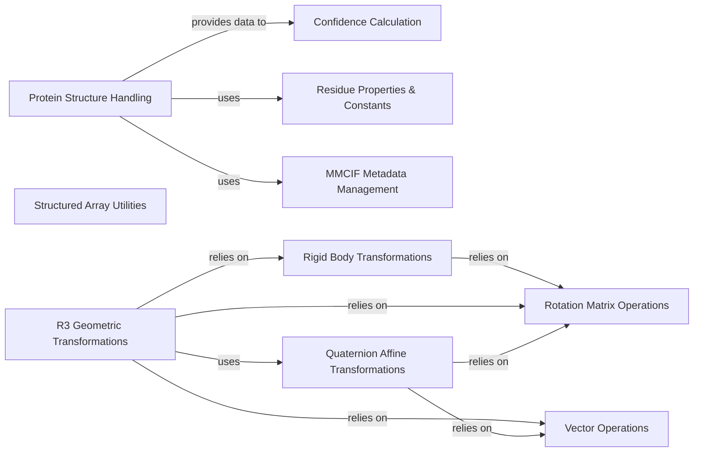

## Component Details

The Core Utilities component provides foundational functionalities for the AlphaFold system, encompassing data structures for protein representation, utilities for handling protein structures (PDB, MMCIF), calculations for model confidence metrics (PAE, TM-score), and a comprehensive suite of mathematical tools for 3D geometric transformations, including rotations, translations, rigid body operations, and quaternion-based affine transformations. It serves as a bedrock for higher-level modules by offering robust and efficient low-level operations.

### Confidence Calculation

Handles the computation of confidence metrics for predicted protein structures, including Predicted Aligned Error (PAE) and Predicted TM-score, crucial for evaluating model accuracy.

**Related Classes/Methods**:

- <a href="https://github.com/google-deepmind/alphafold/blob/master/alphafold/common/confidence.py#L54-L74" target="_blank" rel="noopener noreferrer">`alphafold.common.confidence.confidence_json` (54:74)</a>

- <a href="https://github.com/google-deepmind/alphafold/blob/master/alphafold/common/confidence.py#L96-L115" target="_blank" rel="noopener noreferrer">`alphafold.common.confidence._calculate_expected_aligned_error` (96:115)</a>

- <a href="https://github.com/google-deepmind/alphafold/blob/master/alphafold/common/confidence.py#L118-L146" target="_blank" rel="noopener noreferrer">`alphafold.common.confidence.compute_predicted_aligned_error` (118:146)</a>

- <a href="https://github.com/google-deepmind/alphafold/blob/master/alphafold/common/confidence.py#L175-L232" target="_blank" rel="noopener noreferrer">`alphafold.common.confidence.predicted_tm_score` (175:232)</a>

- <a href="https://github.com/google-deepmind/alphafold/blob/master/alphafold/common/confidence.py#L77-L93" target="_blank" rel="noopener noreferrer">`alphafold.common.confidence._calculate_bin_centers` (77:93)</a>

### Protein Structure Handling

Provides utilities for converting protein structures between different formats (PDB, MMCIF), creating protein objects from predictions, and managing atom masks and chain identifiers.

**Related Classes/Methods**:

- <a href="https://github.com/google-deepmind/alphafold/blob/master/alphafold/common/protein.py#L98-L175" target="_blank" rel="noopener noreferrer">`alphafold.common.protein._from_bio_structure` (98:175)</a>

- <a href="https://github.com/google-deepmind/alphafold/blob/master/alphafold/common/protein.py#L178-L195" target="_blank" rel="noopener noreferrer">`alphafold.common.protein.from_pdb_string` (178:195)</a>

- <a href="https://github.com/google-deepmind/alphafold/blob/master/alphafold/common/protein.py#L198-L217" target="_blank" rel="noopener noreferrer">`alphafold.common.protein.from_mmcif_string` (198:217)</a>

- <a href="https://github.com/google-deepmind/alphafold/blob/master/alphafold/common/protein.py#L226-L303" target="_blank" rel="noopener noreferrer">`alphafold.common.protein.to_pdb` (226:303)</a>

- <a href="https://github.com/google-deepmind/alphafold/blob/master/alphafold/common/protein.py#L322-L358" target="_blank" rel="noopener noreferrer">`alphafold.common.protein.from_prediction` (322:358)</a>

- <a href="https://github.com/google-deepmind/alphafold/blob/master/alphafold/common/protein.py#L361-L497" target="_blank" rel="noopener noreferrer">`alphafold.common.protein.to_mmcif` (361:497)</a>

- <a href="https://github.com/google-deepmind/alphafold/blob/master/alphafold/common/protein.py#L306-L319" target="_blank" rel="noopener noreferrer">`alphafold.common.protein.ideal_atom_mask` (306:319)</a>

- <a href="https://github.com/google-deepmind/alphafold/blob/master/alphafold/common/protein.py#L220-L223" target="_blank" rel="noopener noreferrer">`alphafold.common.protein._chain_end` (220:223)</a>

- <a href="https://github.com/google-deepmind/alphafold/blob/master/alphafold/common/protein.py#L501-L520" target="_blank" rel="noopener noreferrer">`alphafold.common.protein._int_id_to_str_id` (501:520)</a>

- <a href="https://github.com/google-deepmind/alphafold/blob/master/alphafold/common/protein.py#L523-L568" target="_blank" rel="noopener noreferrer">`alphafold.common.protein._get_entity_poly_seq` (523:568)</a>

- <a href="https://github.com/google-deepmind/alphafold/blob/master/alphafold/common/protein.py#L571-L578" target="_blank" rel="noopener noreferrer">`alphafold.common.protein._create_mmcif_string` (571:578)</a>

### Residue Properties & Constants

Manages constants and properties related to amino acid residues, including stereochemical data, rigid group definitions, atom distances, and sequence encoding.

**Related Classes/Methods**:

- <a href="https://github.com/google-deepmind/alphafold/blob/master/alphafold/common/residue_constants.py#L391-L477" target="_blank" rel="noopener noreferrer">`alphafold.common.residue_constants.load_stereo_chemical_props` (391:477)</a>

- <a href="https://github.com/google-deepmind/alphafold/blob/master/alphafold/common/residue_constants.py#L813-L878" target="_blank" rel="noopener noreferrer">`alphafold.common.residue_constants._make_rigid_group_constants` (813:878)</a>

- <a href="https://github.com/google-deepmind/alphafold/blob/master/alphafold/common/residue_constants.py#L884-L926" target="_blank" rel="noopener noreferrer">`alphafold.common.residue_constants.make_atom14_dists_bounds` (884:926)</a>

- <a href="https://github.com/google-deepmind/alphafold/blob/master/alphafold/common/residue_constants.py#L784-L797" target="_blank" rel="noopener noreferrer">`alphafold.common.residue_constants._make_rigid_transformation_4x4` (784:797)</a>

- <a href="https://github.com/google-deepmind/alphafold/blob/master/alphafold/common/residue_constants.py#L616-L639" target="_blank" rel="noopener noreferrer">`alphafold.common.residue_constants.atom_id_to_type` (616:639)</a>

- <a href="https://github.com/google-deepmind/alphafold/blob/master/alphafold/common/residue_constants.py#L546-L586" target="_blank" rel="noopener noreferrer">`alphafold.common.residue_constants.sequence_to_onehot` (546:586)</a>

### MMCIF Metadata Management

Provides functionality to add metadata to MMCIF protein structure files, ensuring proper annotation and data integrity.

**Related Classes/Methods**:

- <a href="https://github.com/google-deepmind/alphafold/blob/master/alphafold/common/mmcif_metadata.py#L71-L212" target="_blank" rel="noopener noreferrer">`alphafold.common.mmcif_metadata.add_metadata_to_mmcif` (71:212)</a>

### Rotation Matrix Operations

Offers a set of utilities for 3D rotation matrices, including inversion, application to points, composition, and generation from various inputs like quaternions or vectors.

**Related Classes/Methods**:

- <a href="https://github.com/google-deepmind/alphafold/blob/master/alphafold/model/geometry/rotation_matrix.py#L46-L50" target="_blank" rel="noopener noreferrer">`alphafold.model.geometry.rotation_matrix.Rot3Array.inverse` (46:50)</a>

- <a href="https://github.com/google-deepmind/alphafold/blob/master/alphafold/model/geometry/rotation_matrix.py#L52-L57" target="_blank" rel="noopener noreferrer">`alphafold.model.geometry.rotation_matrix.Rot3Array.apply_to_point` (52:57)</a>

- <a href="https://github.com/google-deepmind/alphafold/blob/master/alphafold/model/geometry/rotation_matrix.py#L59-L61" target="_blank" rel="noopener noreferrer">`alphafold.model.geometry.rotation_matrix.Rot3Array.apply_inverse_to_point` (59:61)</a>

- <a href="https://github.com/google-deepmind/alphafold/blob/master/alphafold/model/geometry/rotation_matrix.py#L63-L68" target="_blank" rel="noopener noreferrer">`alphafold.model.geometry.rotation_matrix.Rot3Array.__matmul__` (63:68)</a>

- <a href="https://github.com/google-deepmind/alphafold/blob/master/alphafold/model/geometry/rotation_matrix.py#L71-L75" target="_blank" rel="noopener noreferrer">`alphafold.model.geometry.rotation_matrix.Rot3Array.identity` (71:75)</a>

- <a href="https://github.com/google-deepmind/alphafold/blob/master/alphafold/model/geometry/rotation_matrix.py#L78-L98" target="_blank" rel="noopener noreferrer">`alphafold.model.geometry.rotation_matrix.Rot3Array.from_two_vectors` (78:98)</a>

- <a href="https://github.com/google-deepmind/alphafold/blob/master/alphafold/model/geometry/rotation_matrix.py#L101-L105" target="_blank" rel="noopener noreferrer">`alphafold.model.geometry.rotation_matrix.Rot3Array.from_array` (101:105)</a>

- <a href="https://github.com/google-deepmind/alphafold/blob/master/alphafold/model/geometry/rotation_matrix.py#L116-L139" target="_blank" rel="noopener noreferrer">`alphafold.model.geometry.rotation_matrix.Rot3Array.from_quaternion` (116:139)</a>

- <a href="https://github.com/google-deepmind/alphafold/blob/master/alphafold/model/geometry/rotation_matrix.py#L142-L146" target="_blank" rel="noopener noreferrer">`alphafold.model.geometry.rotation_matrix.Rot3Array.random_uniform` (142:146)</a>

### Rigid Body Transformations

Provides tools for handling 3D rigid body transformations, including composition, inversion, scaling, and creation from various array formats.

**Related Classes/Methods**:

- <a href="https://github.com/google-deepmind/alphafold/blob/master/alphafold/model/geometry/rigid_matrix_vector.py#L36-L39" target="_blank" rel="noopener noreferrer">`alphafold.model.geometry.rigid_matrix_vector.Rigid3Array.__matmul__` (36:39)</a>

- <a href="https://github.com/google-deepmind/alphafold/blob/master/alphafold/model/geometry/rigid_matrix_vector.py#L41-L45" target="_blank" rel="noopener noreferrer">`alphafold.model.geometry.rigid_matrix_vector.Rigid3Array.inverse` (41:45)</a>

- <a href="https://github.com/google-deepmind/alphafold/blob/master/alphafold/model/geometry/rigid_matrix_vector.py#L56-L60" target="_blank" rel="noopener noreferrer">`alphafold.model.geometry.rigid_matrix_vector.Rigid3Array.compose_rotation` (56:60)</a>

- <a href="https://github.com/google-deepmind/alphafold/blob/master/alphafold/model/geometry/rigid_matrix_vector.py#L63-L67" target="_blank" rel="noopener noreferrer">`alphafold.model.geometry.rigid_matrix_vector.Rigid3Array.identity` (63:67)</a>

- <a href="https://github.com/google-deepmind/alphafold/blob/master/alphafold/model/geometry/rigid_matrix_vector.py#L69-L71" target="_blank" rel="noopener noreferrer">`alphafold.model.geometry.rigid_matrix_vector.Rigid3Array.scale_translation` (69:71)</a>

- <a href="https://github.com/google-deepmind/alphafold/blob/master/alphafold/model/geometry/rigid_matrix_vector.py#L79-L82" target="_blank" rel="noopener noreferrer">`alphafold.model.geometry.rigid_matrix_vector.Rigid3Array.from_array` (79:82)</a>

- <a href="https://github.com/google-deepmind/alphafold/blob/master/alphafold/model/geometry/rigid_matrix_vector.py#L85-L96" target="_blank" rel="noopener noreferrer">`alphafold.model.geometry.rigid_matrix_vector.Rigid3Array.from_array4x4` (85:96)</a>

### Vector Operations

Encapsulates common 3D vector operations such as cross products, norms, normalization, and distance calculations, along with vector creation utilities.

**Related Classes/Methods**:

- <a href="https://github.com/google-deepmind/alphafold/blob/master/alphafold/model/geometry/vector.py#L75-L80" target="_blank" rel="noopener noreferrer">`alphafold.model.geometry.vector.Vec3Array.cross` (75:80)</a>

- <a href="https://github.com/google-deepmind/alphafold/blob/master/alphafold/model/geometry/vector.py#L86-L92" target="_blank" rel="noopener noreferrer">`alphafold.model.geometry.vector.Vec3Array.norm` (86:92)</a>

- <a href="https://github.com/google-deepmind/alphafold/blob/master/alphafold/model/geometry/vector.py#L94-L95" target="_blank" rel="noopener noreferrer">`alphafold.model.geometry.vector.Vec3Array.norm2` (94:95)</a>

- <a href="https://github.com/google-deepmind/alphafold/blob/master/alphafold/model/geometry/vector.py#L97-L99" target="_blank" rel="noopener noreferrer">`alphafold.model.geometry.vector.Vec3Array.normalized` (97:99)</a>

- <a href="https://github.com/google-deepmind/alphafold/blob/master/alphafold/model/geometry/vector.py#L102-L106" target="_blank" rel="noopener noreferrer">`alphafold.model.geometry.vector.Vec3Array.zeros` (102:106)</a>

- <a href="https://github.com/google-deepmind/alphafold/blob/master/alphafold/model/geometry/vector.py#L112-L113" target="_blank" rel="noopener noreferrer">`alphafold.model.geometry.vector.Vec3Array.from_array` (112:113)</a>

- <a href="https://github.com/google-deepmind/alphafold/blob/master/alphafold/model/geometry/vector.py#L166-L183" target="_blank" rel="noopener noreferrer">`alphafold.model.geometry.vector.euclidean_distance` (166:183)</a>

- <a href="https://github.com/google-deepmind/alphafold/blob/master/alphafold/model/geometry/vector.py#L214-L216" target="_blank" rel="noopener noreferrer">`alphafold.model.geometry.vector.random_gaussian_vector` (214:216)</a>

- <a href="https://github.com/google-deepmind/alphafold/blob/master/alphafold/model/geometry/vector.py#L128-L147" target="_blank" rel="noopener noreferrer">`alphafold.model.geometry.vector.square_euclidean_distance` (128:147)</a>

### Structured Array Utilities

Provides utilities for handling structured arrays, enabling efficient access, manipulation, and flattening of data with defined metadata and array fields.

**Related Classes/Methods**:

- <a href="https://github.com/google-deepmind/alphafold/blob/master/alphafold/model/geometry/struct_of_array.py#L20-L28" target="_blank" rel="noopener noreferrer">`alphafold.model.geometry.struct_of_array.get_item` (20:28)</a>

- <a href="https://github.com/google-deepmind/alphafold/blob/master/alphafold/model/geometry/struct_of_array.py#L80-L125" target="_blank" rel="noopener noreferrer">`alphafold.model.geometry.struct_of_array.post_init` (80:125)</a>

- <a href="https://github.com/google-deepmind/alphafold/blob/master/alphafold/model/geometry/struct_of_array.py#L128-L141" target="_blank" rel="noopener noreferrer">`alphafold.model.geometry.struct_of_array.flatten` (128:141)</a>

- <a href="https://github.com/google-deepmind/alphafold/blob/master/alphafold/model/geometry/struct_of_array.py#L144-L152" target="_blank" rel="noopener noreferrer">`alphafold.model.geometry.struct_of_array.make_metadata_class` (144:152)</a>

- <a href="https://github.com/google-deepmind/alphafold/blob/master/alphafold/model/geometry/struct_of_array.py#L166-L170" target="_blank" rel="noopener noreferrer">`alphafold.model.geometry.struct_of_array.get_array_fields` (166:170)</a>

- <a href="https://github.com/google-deepmind/alphafold/blob/master/alphafold/model/geometry/struct_of_array.py#L173-L177" target="_blank" rel="noopener noreferrer">`alphafold.model.geometry.struct_of_array.get_metadata_fields` (173:177)</a>

- <a href="https://github.com/google-deepmind/alphafold/blob/master/alphafold/model/geometry/struct_of_array.py#L155-L163" target="_blank" rel="noopener noreferrer">`alphafold.model.geometry.struct_of_array.get_fields` (155:163)</a>

- <a href="https://github.com/google-deepmind/alphafold/blob/master/alphafold/model/geometry/struct_of_array.py#L186-L219" target="_blank" rel="noopener noreferrer">`alphafold.model.geometry.struct_of_array.StructOfArray.__call__` (186:219)</a>

### R3 Geometric Transformations

Provides a comprehensive set of functions for 3D geometric transformations, including operations on rigid bodies, rotations, and vectors, facilitating complex spatial manipulations.

**Related Classes/Methods**:

- <a href="https://github.com/google-deepmind/alphafold/blob/master/alphafold/model/r3.py#L57-L62" target="_blank" rel="noopener noreferrer">`alphafold.model.r3.invert_rigids` (57:62)</a>

- <a href="https://github.com/google-deepmind/alphafold/blob/master/alphafold/model/r3.py#L65-L69" target="_blank" rel="noopener noreferrer">`alphafold.model.r3.invert_rots` (65:69)</a>

- <a href="https://github.com/google-deepmind/alphafold/blob/master/alphafold/model/r3.py#L72-L95" target="_blank" rel="noopener noreferrer">`alphafold.model.r3.rigids_from_3_points` (72:95)</a>

- <a href="https://github.com/google-deepmind/alphafold/blob/master/alphafold/model/r3.py#L98-L101" target="_blank" rel="noopener noreferrer">`alphafold.model.r3.rigids_from_list` (98:101)</a>

- <a href="https://github.com/google-deepmind/alphafold/blob/master/alphafold/model/r3.py#L104-L107" target="_blank" rel="noopener noreferrer">`alphafold.model.r3.rigids_from_quataffine` (104:107)</a>

- <a href="https://github.com/google-deepmind/alphafold/blob/master/alphafold/model/r3.py#L110-L128" target="_blank" rel="noopener noreferrer">`alphafold.model.r3.rigids_from_tensor4x4` (110:128)</a>

- <a href="https://github.com/google-deepmind/alphafold/blob/master/alphafold/model/r3.py#L131-L140" target="_blank" rel="noopener noreferrer">`alphafold.model.r3.rigids_from_tensor_flat9` (131:140)</a>

- <a href="https://github.com/google-deepmind/alphafold/blob/master/alphafold/model/r3.py#L143-L149" target="_blank" rel="noopener noreferrer">`alphafold.model.r3.rigids_from_tensor_flat12` (143:149)</a>

- <a href="https://github.com/google-deepmind/alphafold/blob/master/alphafold/model/r3.py#L152-L156" target="_blank" rel="noopener noreferrer">`alphafold.model.r3.rigids_mul_rigids` (152:156)</a>

- <a href="https://github.com/google-deepmind/alphafold/blob/master/alphafold/model/r3.py#L159-L161" target="_blank" rel="noopener noreferrer">`alphafold.model.r3.rigids_mul_rots` (159:161)</a>

- <a href="https://github.com/google-deepmind/alphafold/blob/master/alphafold/model/r3.py#L164-L166" target="_blank" rel="noopener noreferrer">`alphafold.model.r3.rigids_mul_vecs` (164:166)</a>

- <a href="https://github.com/google-deepmind/alphafold/blob/master/alphafold/model/r3.py#L174-L181" target="_blank" rel="noopener noreferrer">`alphafold.model.r3.rigids_to_quataffine` (174:181)</a>

- <a href="https://github.com/google-deepmind/alphafold/blob/master/alphafold/model/r3.py#L200-L208" target="_blank" rel="noopener noreferrer">`alphafold.model.r3.rots_from_tensor3x3` (200:208)</a>

- <a href="https://github.com/google-deepmind/alphafold/blob/master/alphafold/model/r3.py#L211-L236" target="_blank" rel="noopener noreferrer">`alphafold.model.r3.rots_from_two_vecs` (211:236)</a>

- <a href="https://github.com/google-deepmind/alphafold/blob/master/alphafold/model/r3.py#L239-L244" target="_blank" rel="noopener noreferrer">`alphafold.model.r3.rots_mul_rots` (239:244)</a>

- <a href="https://github.com/google-deepmind/alphafold/blob/master/alphafold/model/r3.py#L247-L251" target="_blank" rel="noopener noreferrer">`alphafold.model.r3.rots_mul_vecs` (247:251)</a>

- <a href="https://github.com/google-deepmind/alphafold/blob/master/alphafold/model/r3.py#L254-L256" target="_blank" rel="noopener noreferrer">`alphafold.model.r3.vecs_add` (254:256)</a>

- <a href="https://github.com/google-deepmind/alphafold/blob/master/alphafold/model/r3.py#L264-L268" target="_blank" rel="noopener noreferrer">`alphafold.model.r3.vecs_cross_vecs` (264:268)</a>

- <a href="https://github.com/google-deepmind/alphafold/blob/master/alphafold/model/r3.py#L271-L276" target="_blank" rel="noopener noreferrer">`alphafold.model.r3.vecs_from_tensor` (271:276)</a>

- <a href="https://github.com/google-deepmind/alphafold/blob/master/alphafold/model/r3.py#L279-L289" target="_blank" rel="noopener noreferrer">`alphafold.model.r3.vecs_robust_normalize` (279:289)</a>

- <a href="https://github.com/google-deepmind/alphafold/blob/master/alphafold/model/r3.py#L304-L306" target="_blank" rel="noopener noreferrer">`alphafold.model.r3.vecs_sub` (304:306)</a>

- <a href="https://github.com/google-deepmind/alphafold/blob/master/alphafold/model/r3.py#L309-L313" target="_blank" rel="noopener noreferrer">`alphafold.model.r3.vecs_squared_distance` (309:313)</a>

- <a href="https://github.com/google-deepmind/alphafold/blob/master/alphafold/model/r3.py#L292-L301" target="_blank" rel="noopener noreferrer">`alphafold.model.r3.vecs_robust_norm` (292:301)</a>

- <a href="https://github.com/google-deepmind/alphafold/blob/master/alphafold/model/r3.py#L259-L261" target="_blank" rel="noopener noreferrer">`alphafold.model.r3.vecs_dot_vecs` (259:261)</a>

- <a href="https://github.com/google-deepmind/alphafold/blob/master/alphafold/model/r3.py#L53-L54" target="_blank" rel="noopener noreferrer">`alphafold.model.r3.squared_difference` (53:54)</a>

- <a href="https://github.com/google-deepmind/alphafold/blob/master/alphafold/model/r3.py#L32-L40" target="_blank" rel="noopener noreferrer">`alphafold.model.r3.Rigids` (32:40)</a>

- <a href="https://github.com/google-deepmind/alphafold/blob/master/alphafold/model/r3.py#L43-L47" target="_blank" rel="noopener noreferrer">`alphafold.model.r3.Rots` (43:47)</a>

- <a href="https://github.com/google-deepmind/alphafold/blob/master/alphafold/model/r3.py#L50-L51" target="_blank" rel="noopener noreferrer">`alphafold.model.r3.Vecs` (50:51)</a>

### Quaternion Affine Transformations

Manages 3D affine transformations using quaternions, providing methods for composition, application to points, inversion, and conversion between quaternions and rotation matrices.

**Related Classes/Methods**:

- <a href="https://github.com/google-deepmind/alphafold/blob/master/alphafold/model/quat_affine.py#L183-L218" target="_blank" rel="noopener noreferrer">`alphafold.model.quat_affine.QuatAffine.__init__` (183:218)</a>

- <a href="https://github.com/google-deepmind/alphafold/blob/master/alphafold/model/quat_affine.py#L226-L232" target="_blank" rel="noopener noreferrer">`alphafold.model.quat_affine.QuatAffine.apply_tensor_fn` (226:232)</a>

- <a href="https://github.com/google-deepmind/alphafold/blob/master/alphafold/model/quat_affine.py#L234-L240" target="_blank" rel="noopener noreferrer">`alphafold.model.quat_affine.QuatAffine.apply_rotation_tensor_fn` (234:240)</a>

- <a href="https://github.com/google-deepmind/alphafold/blob/master/alphafold/model/quat_affine.py#L242-L249" target="_blank" rel="noopener noreferrer">`alphafold.model.quat_affine.QuatAffine.scale_translation` (242:249)</a>

- <a href="https://github.com/google-deepmind/alphafold/blob/master/alphafold/model/quat_affine.py#L252-L256" target="_blank" rel="noopener noreferrer">`alphafold.model.quat_affine.QuatAffine.from_tensor` (252:256)</a>

- <a href="https://github.com/google-deepmind/alphafold/blob/master/alphafold/model/quat_affine.py#L258-L284" target="_blank" rel="noopener noreferrer">`alphafold.model.quat_affine.QuatAffine.pre_compose` (258:284)</a>

- <a href="https://github.com/google-deepmind/alphafold/blob/master/alphafold/model/quat_affine.py#L286-L310" target="_blank" rel="noopener noreferrer">`alphafold.model.quat_affine.QuatAffine.apply_to_point` (286:310)</a>

- <a href="https://github.com/google-deepmind/alphafold/blob/master/alphafold/model/quat_affine.py#L312-L337" target="_blank" rel="noopener noreferrer">`alphafold.model.quat_affine.QuatAffine.invert_point` (312:337)</a>

- <a href="https://github.com/google-deepmind/alphafold/blob/master/alphafold/model/quat_affine.py#L358-L427" target="_blank" rel="noopener noreferrer">`alphafold.model.quat_affine.make_canonical_transform` (358:427)</a>

- <a href="https://github.com/google-deepmind/alphafold/blob/master/alphafold/model/quat_affine.py#L430-L458" target="_blank" rel="noopener noreferrer">`alphafold.model.quat_affine.make_transform_from_reference` (430:458)</a>

- <a href="https://github.com/google-deepmind/alphafold/blob/master/alphafold/model/quat_affine.py#L130-L140" target="_blank" rel="noopener noreferrer">`alphafold.model.quat_affine.quat_to_rot` (130:140)</a>

- <a href="https://github.com/google-deepmind/alphafold/blob/master/alphafold/model/quat_affine.py#L143-L149" target="_blank" rel="noopener noreferrer">`alphafold.model.quat_affine.quat_multiply_by_vec` (143:149)</a>

- <a href="https://github.com/google-deepmind/alphafold/blob/master/alphafold/model/quat_affine.py#L161-L169" target="_blank" rel="noopener noreferrer">`alphafold.model.quat_affine.apply_rot_to_vec` (161:169)</a>

- <a href="https://github.com/google-deepmind/alphafold/blob/master/alphafold/model/quat_affine.py#L172-L177" target="_blank" rel="noopener noreferrer">`alphafold.model.quat_affine.apply_inverse_rot_to_vec` (172:177)</a>

- <a href="https://github.com/google-deepmind/alphafold/blob/master/alphafold/model/quat_affine.py#L343-L355" target="_blank" rel="noopener noreferrer">`alphafold.model.quat_affine._multiply` (343:355)</a>

- <a href="https://github.com/google-deepmind/alphafold/blob/master/alphafold/model/quat_affine.py#L82-L113" target="_blank" rel="noopener noreferrer">`alphafold.model.quat_affine.rot_to_quat` (82:113)</a>

- <a href="https://github.com/google-deepmind/alphafold/blob/master/alphafold/model/quat_affine.py#L152-L158" target="_blank" rel="noopener noreferrer">`alphafold.model.quat_affine.quat_multiply` (152:158)</a>

- <a href="https://github.com/google-deepmind/alphafold/blob/master/alphafold/model/quat_affine.py#L116-L122" target="_blank" rel="noopener noreferrer">`alphafold.model.quat_affine.rot_list_to_tensor` (116:122)</a>

- <a href="https://github.com/google-deepmind/alphafold/blob/master/alphafold/model/quat_affine.py#L125-L127" target="_blank" rel="noopener noreferrer">`alphafold.model.quat_affine.vec_list_to_tensor` (125:127)</a>

### [FAQ](https://github.com/CodeBoarding/GeneratedOnBoardings/tree/main?tab=readme-ov-file#faq)