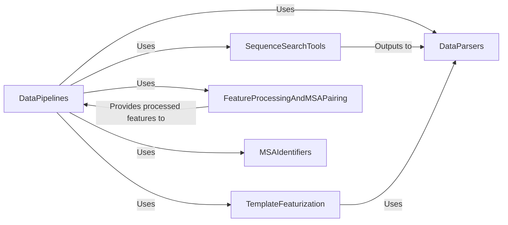

## Component Details

The Data Preprocessing subsystem is responsible for preparing raw biological sequence and structural data into a structured feature set suitable for input into the AlphaFold model. This involves several key steps: generating Multiple Sequence Alignments (MSAs) using various sequence search tools, searching for structural templates, parsing diverse biological data formats, extracting and featurizing template information, and finally, processing and pairing MSA features, especially for multimer predictions. The overall purpose is to transform raw input into a comprehensive and model-ready representation of the protein or protein complex.

### DataPipelines

Manages the processing of input sequences and generation of features required by the AlphaFold model. This includes handling both monomer and multimer data pipelines, and preparing sequence and MSA features.

**Related Classes/Methods**:

- <a href="https://github.com/google-deepmind/alphafold/blob/master/alphafold/data/pipeline.py#L113-L147" target="_blank" rel="noopener noreferrer">`alphafold.data.pipeline.DataPipeline.__init__` (113:147)</a>

- <a href="https://github.com/google-deepmind/alphafold/blob/master/alphafold/data/pipeline.py#L149-L242" target="_blank" rel="noopener noreferrer">`alphafold.data.pipeline.DataPipeline.process` (149:242)</a>

- <a href="https://github.com/google-deepmind/alphafold/blob/master/alphafold/data/pipeline.py#L35-L49" target="_blank" rel="noopener noreferrer">`alphafold.data.pipeline.make_sequence_features` (35:49)</a>

- <a href="https://github.com/google-deepmind/alphafold/blob/master/alphafold/data/pipeline.py#L52-L83" target="_blank" rel="noopener noreferrer">`alphafold.data.pipeline.make_msa_features` (52:83)</a>

- <a href="https://github.com/google-deepmind/alphafold/blob/master/alphafold/data/pipeline.py#L86-L107" target="_blank" rel="noopener noreferrer">`alphafold.data.pipeline.run_msa_tool` (86:107)</a>

- <a href="https://github.com/google-deepmind/alphafold/blob/master/alphafold/data/pipeline_multimer.py#L172-L194" target="_blank" rel="noopener noreferrer">`alphafold.data.pipeline_multimer.DataPipeline.__init__` (172:194)</a>

- <a href="https://github.com/google-deepmind/alphafold/blob/master/alphafold/data/pipeline_multimer.py#L196-L221" target="_blank" rel="noopener noreferrer">`alphafold.data.pipeline_multimer.DataPipeline._process_single_chain` (196:221)</a>

- <a href="https://github.com/google-deepmind/alphafold/blob/master/alphafold/data/pipeline_multimer.py#L223-L237" target="_blank" rel="noopener noreferrer">`alphafold.data.pipeline_multimer.DataPipeline._all_seq_msa_features` (223:237)</a>

- <a href="https://github.com/google-deepmind/alphafold/blob/master/alphafold/data/pipeline_multimer.py#L239-L283" target="_blank" rel="noopener noreferrer">`alphafold.data.pipeline_multimer.DataPipeline.process` (239:283)</a>

- <a href="https://github.com/google-deepmind/alphafold/blob/master/alphafold/data/pipeline_multimer.py#L71-L93" target="_blank" rel="noopener noreferrer">`alphafold.data.pipeline_multimer.convert_monomer_features` (71:93)</a>

- <a href="https://github.com/google-deepmind/alphafold/blob/master/alphafold/data/pipeline_multimer.py#L118-L154" target="_blank" rel="noopener noreferrer">`alphafold.data.pipeline_multimer.add_assembly_features` (118:154)</a>

- <a href="https://github.com/google-deepmind/alphafold/blob/master/alphafold/data/pipeline_multimer.py#L157-L166" target="_blank" rel="noopener noreferrer">`alphafold.data.pipeline_multimer.pad_msa` (157:166)</a>

- <a href="https://github.com/google-deepmind/alphafold/blob/master/alphafold/data/pipeline_multimer.py#L44-L60" target="_blank" rel="noopener noreferrer">`alphafold.data.pipeline_multimer._make_chain_id_map` (44:60)</a>

- <a href="https://github.com/google-deepmind/alphafold/blob/master/alphafold/data/pipeline_multimer.py#L96-L115" target="_blank" rel="noopener noreferrer">`alphafold.data.pipeline_multimer.int_id_to_str_id` (96:115)</a>

- <a href="https://github.com/google-deepmind/alphafold/blob/master/alphafold/data/pipeline_multimer.py#L64-L68" target="_blank" rel="noopener noreferrer">`alphafold.data.pipeline_multimer.temp_fasta_file` (64:68)</a>

### SequenceSearchTools

Provides interfaces to external sequence search tools like Jackhmmer, HHBlits, Hmmsearch, and HHSearch. These tools are crucial for generating Multiple Sequence Alignments (MSAs) and identifying homologous protein templates.

**Related Classes/Methods**:

- <a href="https://github.com/google-deepmind/alphafold/blob/master/alphafold/data/tools/hmmsearch.py#L30-L64" target="_blank" rel="noopener noreferrer">`alphafold.data.tools.hmmsearch.Hmmsearch.__init__` (30:64)</a>

- <a href="https://github.com/google-deepmind/alphafold/blob/master/alphafold/data/tools/hmmsearch.py#L74-L78" target="_blank" rel="noopener noreferrer">`alphafold.data.tools.hmmsearch.Hmmsearch.query` (74:78)</a>

- <a href="https://github.com/google-deepmind/alphafold/blob/master/alphafold/data/tools/hmmsearch.py#L80-L118" target="_blank" rel="noopener noreferrer">`alphafold.data.tools.hmmsearch.Hmmsearch.query_with_hmm` (80:118)</a>

- <a href="https://github.com/google-deepmind/alphafold/blob/master/alphafold/data/tools/hmmsearch.py#L120-L130" target="_blank" rel="noopener noreferrer">`alphafold.data.tools.hmmsearch.Hmmsearch.get_template_hits` (120:130)</a>

- <a href="https://github.com/google-deepmind/alphafold/blob/master/alphafold/data/tools/hmmbuild.py#L45-L59" target="_blank" rel="noopener noreferrer">`alphafold.data.tools.hmmbuild.Hmmbuild.build_profile_from_sto` (45:59)</a>

- <a href="https://github.com/google-deepmind/alphafold/blob/master/alphafold/data/tools/hmmbuild.py#L61-L79" target="_blank" rel="noopener noreferrer">`alphafold.data.tools.hmmbuild.Hmmbuild.build_profile_from_a3m` (61:79)</a>

- <a href="https://github.com/google-deepmind/alphafold/blob/master/alphafold/data/tools/hmmbuild.py#L81-L137" target="_blank" rel="noopener noreferrer">`alphafold.data.tools.hmmbuild.Hmmbuild._build_profile` (81:137)</a>

- <a href="https://github.com/google-deepmind/alphafold/blob/master/alphafold/data/tools/jackhmmer.py#L89-L163" target="_blank" rel="noopener noreferrer">`alphafold.data.tools.jackhmmer.Jackhmmer._query_chunk` (89:163)</a>

- <a href="https://github.com/google-deepmind/alphafold/blob/master/alphafold/data/tools/jackhmmer.py#L165-L169" target="_blank" rel="noopener noreferrer">`alphafold.data.tools.jackhmmer.Jackhmmer.query` (165:169)</a>

- <a href="https://github.com/google-deepmind/alphafold/blob/master/alphafold/data/tools/jackhmmer.py#L171-L220" target="_blank" rel="noopener noreferrer">`alphafold.data.tools.jackhmmer.Jackhmmer.query_multiple` (171:220)</a>

- <a href="https://github.com/google-deepmind/alphafold/blob/master/alphafold/data/tools/kalign.py#L49-L103" target="_blank" rel="noopener noreferrer">`alphafold.data.tools.kalign.Kalign.align` (49:103)</a>

- <a href="https://github.com/google-deepmind/alphafold/blob/master/alphafold/data/tools/hhblits.py#L96-L154" target="_blank" rel="noopener noreferrer">`alphafold.data.tools.hhblits.HHBlits.query` (96:154)</a>

- <a href="https://github.com/google-deepmind/alphafold/blob/master/alphafold/data/tools/hhsearch.py#L66-L99" target="_blank" rel="noopener noreferrer">`alphafold.data.tools.hhsearch.HHSearch.query` (66:99)</a>

- <a href="https://github.com/google-deepmind/alphafold/blob/master/alphafold/data/tools/hhsearch.py#L101-L106" target="_blank" rel="noopener noreferrer">`alphafold.data.tools.hhsearch.HHSearch.get_template_hits` (101:106)</a>

### DataParsers

Responsible for parsing various biological data formats, including FASTA, Stockholm, A3M, HHR, and MMCIF, into structured data that can be used by other components of the AlphaFold system.

**Related Classes/Methods**:

- <a href="https://github.com/google-deepmind/alphafold/blob/master/alphafold/data/parsers.py#L48-L51" target="_blank" rel="noopener noreferrer">`alphafold.data.parsers.Msa.truncate` (48:51)</a>

- <a href="https://github.com/google-deepmind/alphafold/blob/master/alphafold/data/parsers.py#L96-L153" target="_blank" rel="noopener noreferrer">`alphafold.data.parsers.parse_stockholm` (96:153)</a>

- <a href="https://github.com/google-deepmind/alphafold/blob/master/alphafold/data/parsers.py#L156-L190" target="_blank" rel="noopener noreferrer">`alphafold.data.parsers.parse_a3m` (156:190)</a>

- <a href="https://github.com/google-deepmind/alphafold/blob/master/alphafold/data/parsers.py#L202-L253" target="_blank" rel="noopener noreferrer">`alphafold.data.parsers.convert_stockholm_to_a3m` (202:253)</a>

- <a href="https://github.com/google-deepmind/alphafold/blob/master/alphafold/data/parsers.py#L276-L296" target="_blank" rel="noopener noreferrer">`alphafold.data.parsers.truncate_stockholm_msa` (276:296)</a>

- <a href="https://github.com/google-deepmind/alphafold/blob/master/alphafold/data/parsers.py#L339-L371" target="_blank" rel="noopener noreferrer">`alphafold.data.parsers.deduplicate_stockholm_msa` (339:371)</a>

- <a href="https://github.com/google-deepmind/alphafold/blob/master/alphafold/data/parsers.py#L394-L487" target="_blank" rel="noopener noreferrer">`alphafold.data.parsers._parse_hhr_hit` (394:487)</a>

- <a href="https://github.com/google-deepmind/alphafold/blob/master/alphafold/data/parsers.py#L490-L505" target="_blank" rel="noopener noreferrer">`alphafold.data.parsers.parse_hhr` (490:505)</a>

- <a href="https://github.com/google-deepmind/alphafold/blob/master/alphafold/data/parsers.py#L551-L568" target="_blank" rel="noopener noreferrer">`alphafold.data.parsers._parse_hmmsearch_description` (551:568)</a>

- <a href="https://github.com/google-deepmind/alphafold/blob/master/alphafold/data/parsers.py#L571-L612" target="_blank" rel="noopener noreferrer">`alphafold.data.parsers.parse_hmmsearch_a3m` (571:612)</a>

- <a href="https://github.com/google-deepmind/alphafold/blob/master/alphafold/data/parsers.py#L299-L336" target="_blank" rel="noopener noreferrer">`alphafold.data.parsers.remove_empty_columns_from_stockholm_msa` (299:336)</a>

- <a href="https://github.com/google-deepmind/alphafold/blob/master/alphafold/data/parsers.py#L67-L93" target="_blank" rel="noopener noreferrer">`alphafold.data.parsers.parse_fasta` (67:93)</a>

- <a href="https://github.com/google-deepmind/alphafold/blob/master/alphafold/data/parsers.py#L508-L520" target="_blank" rel="noopener noreferrer">`alphafold.data.parsers.parse_e_values_from_tblout` (508:520)</a>

- <a href="https://github.com/google-deepmind/alphafold/blob/master/alphafold/data/mmcif_parsing.py#L141-L160" target="_blank" rel="noopener noreferrer">`alphafold.data.mmcif_parsing.mmcif_loop_to_dict` (141:160)</a>

- <a href="https://github.com/google-deepmind/alphafold/blob/master/alphafold/data/mmcif_parsing.py#L164-L278" target="_blank" rel="noopener noreferrer">`alphafold.data.mmcif_parsing.parse` (164:278)</a>

- <a href="https://github.com/google-deepmind/alphafold/blob/master/alphafold/data/mmcif_parsing.py#L294-L321" target="_blank" rel="noopener noreferrer">`alphafold.data.mmcif_parsing._get_header` (294:321)</a>

- <a href="https://github.com/google-deepmind/alphafold/blob/master/alphafold/data/mmcif_parsing.py#L324-L335" target="_blank" rel="noopener noreferrer">`alphafold.data.mmcif_parsing._get_atom_site_list` (324:335)</a>

- <a href="https://github.com/google-deepmind/alphafold/blob/master/alphafold/data/mmcif_parsing.py#L338-L381" target="_blank" rel="noopener noreferrer">`alphafold.data.mmcif_parsing._get_protein_chains` (338:381)</a>

- <a href="https://github.com/google-deepmind/alphafold/blob/master/alphafold/data/mmcif_parsing.py#L111-L138" target="_blank" rel="noopener noreferrer">`alphafold.data.mmcif_parsing.mmcif_loop_to_list` (111:138)</a>

- <a href="https://github.com/google-deepmind/alphafold/blob/master/alphafold/data/mmcif_parsing.py#L281-L283" target="_blank" rel="noopener noreferrer">`alphafold.data.mmcif_parsing._get_first_model` (281:283)</a>

- <a href="https://github.com/google-deepmind/alphafold/blob/master/alphafold/data/mmcif_parsing.py#L384-L386" target="_blank" rel="noopener noreferrer">`alphafold.data.mmcif_parsing._is_set` (384:386)</a>

### TemplateFeaturization

Handles the processing of template hits obtained from sequence searches. It extracts relevant structural features from PDB/MMCIF structures to be used as input for the AlphaFold model.

**Related Classes/Methods**:

- <a href="https://github.com/google-deepmind/alphafold/blob/master/alphafold/data/templates.py#L172-L229" target="_blank" rel="noopener noreferrer">`alphafold.data.templates._assess_hhsearch_hit` (172:229)</a>

- <a href="https://github.com/google-deepmind/alphafold/blob/master/alphafold/data/templates.py#L232-L293" target="_blank" rel="noopener noreferrer">`alphafold.data.templates._find_template_in_pdb` (232:293)</a>

- <a href="https://github.com/google-deepmind/alphafold/blob/master/alphafold/data/templates.py#L296-L405" target="_blank" rel="noopener noreferrer">`alphafold.data.templates._realign_pdb_template_to_query` (296:405)</a>

- <a href="https://github.com/google-deepmind/alphafold/blob/master/alphafold/data/templates.py#L408-L426" target="_blank" rel="noopener noreferrer">`alphafold.data.templates._check_residue_distances` (408:426)</a>

- <a href="https://github.com/google-deepmind/alphafold/blob/master/alphafold/data/templates.py#L429-L482" target="_blank" rel="noopener noreferrer">`alphafold.data.templates._get_atom_positions` (429:482)</a>

- <a href="https://github.com/google-deepmind/alphafold/blob/master/alphafold/data/templates.py#L485-L612" target="_blank" rel="noopener noreferrer">`alphafold.data.templates._extract_template_features` (485:612)</a>

- <a href="https://github.com/google-deepmind/alphafold/blob/master/alphafold/data/templates.py#L686-L790" target="_blank" rel="noopener noreferrer">`alphafold.data.templates._process_single_hit` (686:790)</a>

- <a href="https://github.com/google-deepmind/alphafold/blob/master/alphafold/data/templates.py#L803-L860" target="_blank" rel="noopener noreferrer">`alphafold.data.templates.TemplateHitFeaturizer.__init__` (803:860)</a>

- <a href="https://github.com/google-deepmind/alphafold/blob/master/alphafold/data/templates.py#L873-L929" target="_blank" rel="noopener noreferrer">`alphafold.data.templates.HhsearchHitFeaturizer.get_templates` (873:929)</a>

- <a href="https://github.com/google-deepmind/alphafold/blob/master/alphafold/data/templates.py#L935-L1010" target="_blank" rel="noopener noreferrer">`alphafold.data.templates.HmmsearchHitFeaturizer.get_templates` (935:1010)</a>

- <a href="https://github.com/google-deepmind/alphafold/blob/master/alphafold/data/templates.py#L154-L169" target="_blank" rel="noopener noreferrer">`alphafold.data.templates._parse_release_dates` (154:169)</a>

- <a href="https://github.com/google-deepmind/alphafold/blob/master/alphafold/data/templates.py#L131-L151" target="_blank" rel="noopener noreferrer">`alphafold.data.templates._parse_obsolete` (131:151)</a>

- <a href="https://github.com/google-deepmind/alphafold/blob/master/alphafold/data/templates.py#L97-L104" target="_blank" rel="noopener noreferrer">`alphafold.data.templates._get_pdb_id_and_chain` (97:104)</a>

- <a href="https://github.com/google-deepmind/alphafold/blob/master/alphafold/data/templates.py#L615-L669" target="_blank" rel="noopener noreferrer">`alphafold.data.templates._build_query_to_hit_index_mapping` (615:669)</a>

- <a href="https://github.com/google-deepmind/alphafold/blob/master/alphafold/data/templates.py#L680-L683" target="_blank" rel="noopener noreferrer">`alphafold.data.templates._read_file` (680:683)</a>

- <a href="https://github.com/google-deepmind/alphafold/blob/master/alphafold/data/templates.py#L107-L128" target="_blank" rel="noopener noreferrer">`alphafold.data.templates._is_after_cutoff` (107:128)</a>

- <a href="https://github.com/google-deepmind/alphafold/blob/master/alphafold/data/templates.py#L1013-L1028" target="_blank" rel="noopener noreferrer">`alphafold.data.templates._pad_templates` (1013:1028)</a>

### FeatureProcessingAndMSAPairing

Manages the advanced processing of features, including the crucial step of pairing Multiple Sequence Alignments (MSAs) for multimer predictions and performing final feature preparation before model input.

**Related Classes/Methods**:

- <a href="https://github.com/google-deepmind/alphafold/blob/master/alphafold/data/feature_processing.py#L47-L78" target="_blank" rel="noopener noreferrer">`alphafold.data.feature_processing.pair_and_merge` (47:78)</a>

- <a href="https://github.com/google-deepmind/alphafold/blob/master/alphafold/data/feature_processing.py#L81-L108" target="_blank" rel="noopener noreferrer">`alphafold.data.feature_processing.crop_chains` (81:108)</a>

- <a href="https://github.com/google-deepmind/alphafold/blob/master/alphafold/data/feature_processing.py#L162-L168" target="_blank" rel="noopener noreferrer">`alphafold.data.feature_processing.process_final` (162:168)</a>

- <a href="https://github.com/google-deepmind/alphafold/blob/master/alphafold/data/feature_processing.py#L200-L228" target="_blank" rel="noopener noreferrer">`alphafold.data.feature_processing.process_unmerged_features` (200:228)</a>

- <a href="https://github.com/google-deepmind/alphafold/blob/master/alphafold/data/feature_processing.py#L38-L44" target="_blank" rel="noopener noreferrer">`alphafold.data.feature_processing._is_homomer_or_monomer` (38:44)</a>

- <a href="https://github.com/google-deepmind/alphafold/blob/master/alphafold/data/feature_processing.py#L111-L159" target="_blank" rel="noopener noreferrer">`alphafold.data.feature_processing._crop_single_chain` (111:159)</a>

- <a href="https://github.com/google-deepmind/alphafold/blob/master/alphafold/data/feature_processing.py#L171-L176" target="_blank" rel="noopener noreferrer">`alphafold.data.feature_processing._correct_msa_restypes` (171:176)</a>

- <a href="https://github.com/google-deepmind/alphafold/blob/master/alphafold/data/feature_processing.py#L179-L181" target="_blank" rel="noopener noreferrer">`alphafold.data.feature_processing._make_seq_mask` (179:181)</a>

- <a href="https://github.com/google-deepmind/alphafold/blob/master/alphafold/data/feature_processing.py#L184-L192" target="_blank" rel="noopener noreferrer">`alphafold.data.feature_processing._make_msa_mask` (184:192)</a>

- <a href="https://github.com/google-deepmind/alphafold/blob/master/alphafold/data/feature_processing.py#L195-L197" target="_blank" rel="noopener noreferrer">`alphafold.data.feature_processing._filter_features` (195:197)</a>

- <a href="https://github.com/google-deepmind/alphafold/blob/master/alphafold/data/msa_pairing.py#L51-L82" target="_blank" rel="noopener noreferrer">`alphafold.data.msa_pairing.create_paired_features` (51:82)</a>

- <a href="https://github.com/google-deepmind/alphafold/blob/master/alphafold/data/msa_pairing.py#L139-L172" target="_blank" rel="noopener noreferrer">`alphafold.data.msa_pairing._match_rows_by_sequence_similarity` (139:172)</a>

- <a href="https://github.com/google-deepmind/alphafold/blob/master/alphafold/data/msa_pairing.py#L175-L225" target="_blank" rel="noopener noreferrer">`alphafold.data.msa_pairing.pair_sequences` (175:225)</a>

- <a href="https://github.com/google-deepmind/alphafold/blob/master/alphafold/data/msa_pairing.py#L263-L307" target="_blank" rel="noopener noreferrer">`alphafold.data.msa_pairing._correct_post_merged_feats` (263:307)</a>

- <a href="https://github.com/google-deepmind/alphafold/blob/master/alphafold/data/msa_pairing.py#L332-L363" target="_blank" rel="noopener noreferrer">`alphafold.data.msa_pairing._merge_features_from_multiple_chains` (332:363)</a>

- <a href="https://github.com/google-deepmind/alphafold/blob/master/alphafold/data/msa_pairing.py#L366-L390" target="_blank" rel="noopener noreferrer">`alphafold.data.msa_pairing._merge_homomers_dense_msa` (366:390)</a>

- <a href="https://github.com/google-deepmind/alphafold/blob/master/alphafold/data/msa_pairing.py#L408-L435" target="_blank" rel="noopener noreferrer">`alphafold.data.msa_pairing.merge_chain_features` (408:435)</a>

- <a href="https://github.com/google-deepmind/alphafold/blob/master/alphafold/data/msa_pairing.py#L438-L458" target="_blank" rel="noopener noreferrer">`alphafold.data.msa_pairing.deduplicate_unpaired_sequences` (438:458)</a>

- <a href="https://github.com/google-deepmind/alphafold/blob/master/alphafold/data/msa_pairing.py#L228-L251" target="_blank" rel="noopener noreferrer">`alphafold.data.msa_pairing.reorder_paired_rows` (228:251)</a>

- <a href="https://github.com/google-deepmind/alphafold/blob/master/alphafold/data/msa_pairing.py#L85-L109" target="_blank" rel="noopener noreferrer">`alphafold.data.msa_pairing.pad_features` (85:109)</a>

- <a href="https://github.com/google-deepmind/alphafold/blob/master/alphafold/data/msa_pairing.py#L112-L128" target="_blank" rel="noopener noreferrer">`alphafold.data.msa_pairing._make_msa_df` (112:128)</a>

- <a href="https://github.com/google-deepmind/alphafold/blob/master/alphafold/data/msa_pairing.py#L131-L136" target="_blank" rel="noopener noreferrer">`alphafold.data.msa_pairing._create_species_dict` (131:136)</a>

- <a href="https://github.com/google-deepmind/alphafold/blob/master/alphafold/data/msa_pairing.py#L254-L260" target="_blank" rel="noopener noreferrer">`alphafold.data.msa_pairing.block_diag` (254:260)</a>

### MSAIdentifiers

Handles the parsing and extraction of sequence identifiers from MSAs, which is crucial for tracking and linking sequences within the data processing pipeline.

**Related Classes/Methods**:

- <a href="https://github.com/google-deepmind/alphafold/blob/master/alphafold/data/msa_identifiers.py#L53-L71" target="_blank" rel="noopener noreferrer">`alphafold.data.msa_identifiers._parse_sequence_identifier` (53:71)</a>

- <a href="https://github.com/google-deepmind/alphafold/blob/master/alphafold/data/msa_identifiers.py#L83-L89" target="_blank" rel="noopener noreferrer">`alphafold.data.msa_identifiers.get_identifiers` (83:89)</a>

- <a href="https://github.com/google-deepmind/alphafold/blob/master/alphafold/data/msa_identifiers.py#L74-L80" target="_blank" rel="noopener noreferrer">`alphafold.data.msa_identifiers._extract_sequence_identifier` (74:80)</a>

### [FAQ](https://github.com/CodeBoarding/GeneratedOnBoardings/tree/main?tab=readme-ov-file#faq)