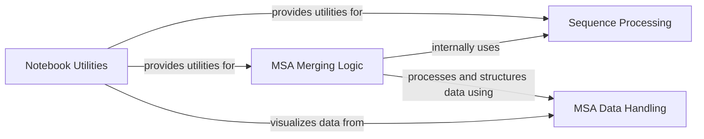

## Component Details

This graph outlines the structure and interactions of components related to Notebook Utilities in the AlphaFold project. The primary purpose is to facilitate interactive data preparation, sequence validation, and visualization within Jupyter notebooks. It involves components for handling sequence processing, managing MSA data, and merging MSA results, all orchestrated by the overarching Notebook Utilities.

### Notebook Utilities

Provides helper functions specifically designed for interactive use within Jupyter notebooks, facilitating tasks such as data preparation, sequence validation, and visualization of results.

**Related Classes/Methods**:

- <a href="https://github.com/google-deepmind/alphafold/blob/master/alphafold/notebooks/notebook_utils.py#L23-L45" target="_blank" rel="noopener noreferrer">`alphafold.notebooks.notebook_utils.clean_and_validate_single_sequence` (23:45)</a>

- <a href="https://github.com/google-deepmind/alphafold/blob/master/alphafold/notebooks/notebook_utils.py#L48-L67" target="_blank" rel="noopener noreferrer">`alphafold.notebooks.notebook_utils.clean_and_validate_input_sequences` (48:67)</a>

- <a href="https://github.com/google-deepmind/alphafold/blob/master/alphafold/notebooks/notebook_utils.py#L70-L96" target="_blank" rel="noopener noreferrer">`alphafold.notebooks.notebook_utils.merge_chunked_msa` (70:96)</a>

- <a href="https://github.com/google-deepmind/alphafold/blob/master/alphafold/notebooks/notebook_utils.py#L99-L123" target="_blank" rel="noopener noreferrer">`alphafold.notebooks.notebook_utils.show_msa_info` (99:123)</a>

- <a href="https://github.com/google-deepmind/alphafold/blob/master/alphafold/notebooks/notebook_utils.py#L126-L141" target="_blank" rel="noopener noreferrer">`alphafold.notebooks.notebook_utils.empty_placeholder_template_features` (126:141)</a>

- <a href="https://github.com/google-deepmind/alphafold/blob/master/alphafold/notebooks/notebook_utils.py#L144-L162" target="_blank" rel="noopener noreferrer">`alphafold.notebooks.notebook_utils.check_cell_execution_order` (144:162)</a>

### Sequence Processing

This component is responsible for the cleaning and validation of amino acid sequences, ensuring they meet specified criteria such as length and valid amino acid types. It provides functionalities for both single and multiple sequence processing.

**Related Classes/Methods**:

- <a href="https://github.com/google-deepmind/alphafold/blob/master/alphafold/notebooks/notebook_utils.py#L23-L45" target="_blank" rel="noopener noreferrer">`alphafold.notebooks.notebook_utils.clean_and_validate_single_sequence` (23:45)</a>

- <a href="https://github.com/google-deepmind/alphafold/blob/master/alphafold/notebooks/notebook_utils.py#L48-L67" target="_blank" rel="noopener noreferrer">`alphafold.notebooks.notebook_utils.clean_and_validate_input_sequences` (48:67)</a>

### MSA Data Handling

This component focuses on parsing and representing Multiple Sequence Alignment (MSA) data. It includes functionalities to parse Stockholm format files and extract E-values from Jackhmmer output, as well as a class to encapsulate MSA data and provide truncation capabilities.

**Related Classes/Methods**:

- <a href="https://github.com/google-deepmind/alphafold/blob/master/alphafold/data/parsers.py#L29-L51" target="_blank" rel="noopener noreferrer">`alphafold.data.parsers.Msa` (29:51)</a>

- <a href="https://github.com/google-deepmind/alphafold/blob/master/alphafold/data/parsers.py#L96-L153" target="_blank" rel="noopener noreferrer">`alphafold.data.parsers.parse_stockholm` (96:153)</a>

- <a href="https://github.com/google-deepmind/alphafold/blob/master/alphafold/data/parsers.py#L508-L520" target="_blank" rel="noopener noreferrer">`alphafold.data.parsers.parse_e_values_from_tblout` (508:520)</a>

### MSA Merging Logic

This component provides the logic for merging multiple chunks of MSA results, typically obtained from database searches. It sorts the results by E-value and can truncate the merged MSA to a specified number of top hits.

**Related Classes/Methods**:

- <a href="https://github.com/google-deepmind/alphafold/blob/master/alphafold/notebooks/notebook_utils.py#L70-L96" target="_blank" rel="noopener noreferrer">`alphafold.notebooks.notebook_utils.merge_chunked_msa` (70:96)</a>

### [FAQ](https://github.com/CodeBoarding/GeneratedOnBoardings/tree/main?tab=readme-ov-file#faq)