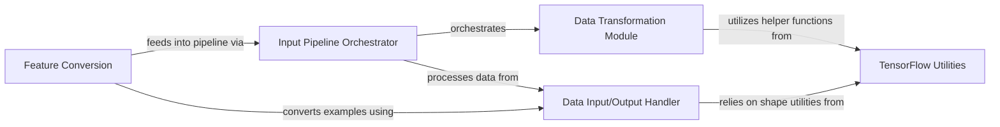

## Component Details

Manages the TensorFlow-specific data loading, preprocessing, and augmentation steps, ensuring that features are correctly formatted and efficiently fed into the model for training and inference. It also includes general utilities for random number generation, masking, and sharded computations.

### Data Transformation Module

This component is responsible for applying various transformations to the raw protein data, such as creating masks, handling MSA (Multiple Sequence Alignment) data, and performing random cropping. These transformations prepare the data for consumption by the AlphaFold model.

**Related Classes/Methods**:

- <a href="https://github.com/google-deepmind/alphafold/blob/master/alphafold/model/tf/data_transforms.py#L48-L51" target="_blank" rel="noopener noreferrer">`alphafold.model.tf.data_transforms.make_seq_mask` (48:51)</a>

- <a href="https://github.com/google-deepmind/alphafold/blob/master/alphafold/model/tf/data_transforms.py#L54-L58" target="_blank" rel="noopener noreferrer">`alphafold.model.tf.data_transforms.make_template_mask` (54:58)</a>

- <a href="https://github.com/google-deepmind/alphafold/blob/master/alphafold/model/tf/data_transforms.py#L114-L130" target="_blank" rel="noopener noreferrer">`alphafold.model.tf.data_transforms.squeeze_features` (114:130)</a>

- <a href="https://github.com/google-deepmind/alphafold/blob/master/alphafold/model/tf/data_transforms.py#L133-L136" target="_blank" rel="noopener noreferrer">`alphafold.model.tf.data_transforms.make_random_crop_to_size_seed` (133:136)</a>

- <a href="https://github.com/google-deepmind/alphafold/blob/master/alphafold/model/tf/data_transforms.py#L140-L157" target="_blank" rel="noopener noreferrer">`alphafold.model.tf.data_transforms.randomly_replace_msa_with_unknown` (140:157)</a>

- <a href="https://github.com/google-deepmind/alphafold/blob/master/alphafold/model/tf/data_transforms.py#L210-L247" target="_blank" rel="noopener noreferrer">`alphafold.model.tf.data_transforms.block_delete_msa` (210:247)</a>

- <a href="https://github.com/google-deepmind/alphafold/blob/master/alphafold/model/tf/data_transforms.py#L251-L283" target="_blank" rel="noopener noreferrer">`alphafold.model.tf.data_transforms.nearest_neighbor_clusters` (251:283)</a>

- <a href="https://github.com/google-deepmind/alphafold/blob/master/alphafold/model/tf/data_transforms.py#L287-L308" target="_blank" rel="noopener noreferrer">`alphafold.model.tf.data_transforms.summarize_clusters` (287:308)</a>

- <a href="https://github.com/google-deepmind/alphafold/blob/master/alphafold/model/tf/data_transforms.py#L311-L317" target="_blank" rel="noopener noreferrer">`alphafold.model.tf.data_transforms.make_msa_mask` (311:317)</a>

- <a href="https://github.com/google-deepmind/alphafold/blob/master/alphafold/model/tf/data_transforms.py#L340-L348" target="_blank" rel="noopener noreferrer">`alphafold.model.tf.data_transforms.make_pseudo_beta` (340:348)</a>

- <a href="https://github.com/google-deepmind/alphafold/blob/master/alphafold/model/tf/data_transforms.py#L357-L364" target="_blank" rel="noopener noreferrer">`alphafold.model.tf.data_transforms.shaped_categorical` (357:364)</a>

- <a href="https://github.com/google-deepmind/alphafold/blob/master/alphafold/model/tf/data_transforms.py#L379-L408" target="_blank" rel="noopener noreferrer">`alphafold.model.tf.data_transforms.make_masked_msa` (379:408)</a>

- <a href="https://github.com/google-deepmind/alphafold/blob/master/alphafold/model/tf/data_transforms.py#L502-L561" target="_blank" rel="noopener noreferrer">`alphafold.model.tf.data_transforms.random_crop_to_size` (502:561)</a>

- <a href="https://github.com/google-deepmind/alphafold/blob/master/alphafold/model/tf/data_transforms.py#L71-L75" target="_blank" rel="noopener noreferrer">`alphafold.model.tf.data_transforms.add_distillation_flag` (71:75)</a>

- <a href="https://github.com/google-deepmind/alphafold/blob/master/alphafold/model/tf/data_transforms.py#L161-L186" target="_blank" rel="noopener noreferrer">`alphafold.model.tf.data_transforms.sample_msa` (161:186)</a>

- <a href="https://github.com/google-deepmind/alphafold/blob/master/alphafold/model/tf/data_transforms.py#L190-L199" target="_blank" rel="noopener noreferrer">`alphafold.model.tf.data_transforms.crop_extra_msa` (190:199)</a>

- <a href="https://github.com/google-deepmind/alphafold/blob/master/alphafold/model/tf/data_transforms.py#L445-L485" target="_blank" rel="noopener noreferrer">`alphafold.model.tf.data_transforms.make_msa_feat` (445:485)</a>

- <a href="https://github.com/google-deepmind/alphafold/blob/master/alphafold/model/tf/data_transforms.py#L489-L490" target="_blank" rel="noopener noreferrer">`alphafold.model.tf.data_transforms.select_feat` (489:490)</a>

- <a href="https://github.com/google-deepmind/alphafold/blob/master/alphafold/model/tf/data_transforms.py#L412-L441" target="_blank" rel="noopener noreferrer">`alphafold.model.tf.data_transforms.make_fixed_size` (412:441)</a>

- <a href="https://github.com/google-deepmind/alphafold/blob/master/alphafold/model/tf/data_transforms.py#L494-L498" target="_blank" rel="noopener noreferrer">`alphafold.model.tf.data_transforms.crop_templates` (494:498)</a>

### Data Input/Output Handler

This component focuses on parsing and structuring protein data, converting it into a format suitable for TensorFlow operations. It handles the conversion of TFExamples and NumPy arrays into tensor dictionaries and defines the structure of protein features.

**Related Classes/Methods**:

- <a href="https://github.com/google-deepmind/alphafold/blob/master/alphafold/model/tf/proteins_dataset.py#L23-L48" target="_blank" rel="noopener noreferrer">`alphafold.model.tf.proteins_dataset.parse_tfexample` (23:48)</a>

- <a href="https://github.com/google-deepmind/alphafold/blob/master/alphafold/model/tf/proteins_dataset.py#L56-L108" target="_blank" rel="noopener noreferrer">`alphafold.model.tf.proteins_dataset.parse_reshape_logic` (56:108)</a>

- <a href="https://github.com/google-deepmind/alphafold/blob/master/alphafold/model/tf/proteins_dataset.py#L123-L141" target="_blank" rel="noopener noreferrer">`alphafold.model.tf.proteins_dataset.create_tensor_dict` (123:141)</a>

- <a href="https://github.com/google-deepmind/alphafold/blob/master/alphafold/model/tf/proteins_dataset.py#L144-L165" target="_blank" rel="noopener noreferrer">`alphafold.model.tf.proteins_dataset.np_to_tensor_dict` (144:165)</a>

- <a href="https://github.com/google-deepmind/alphafold/blob/master/alphafold/model/tf/proteins_dataset.py#L111-L120" target="_blank" rel="noopener noreferrer">`alphafold.model.tf.proteins_dataset._make_features_metadata` (111:120)</a>

- <a href="https://github.com/google-deepmind/alphafold/blob/master/alphafold/model/tf/proteins_dataset.py#L51-L53" target="_blank" rel="noopener noreferrer">`alphafold.model.tf.proteins_dataset._first` (51:53)</a>

- <a href="https://github.com/google-deepmind/alphafold/blob/master/alphafold/model/tf/protein_features.py#L79-L128" target="_blank" rel="noopener noreferrer">`alphafold.model.tf.protein_features.shape` (79:128)</a>

### Input Pipeline Orchestrator

This component orchestrates the entire data processing pipeline, composing various data transformation functions and handling ensembled and non-ensembled data flows. It acts as the central point for preparing batched data for the model.

**Related Classes/Methods**:

- <a href="https://github.com/google-deepmind/alphafold/blob/master/alphafold/model/tf/input_pipeline.py#L32-L60" target="_blank" rel="noopener noreferrer">`alphafold.model.tf.input_pipeline.nonensembled_map_fns` (32:60)</a>

- <a href="https://github.com/google-deepmind/alphafold/blob/master/alphafold/model/tf/input_pipeline.py#L63-L121" target="_blank" rel="noopener noreferrer">`alphafold.model.tf.input_pipeline.ensembled_map_fns` (63:121)</a>

- <a href="https://github.com/google-deepmind/alphafold/blob/master/alphafold/model/tf/input_pipeline.py#L124-L158" target="_blank" rel="noopener noreferrer">`alphafold.model.tf.input_pipeline.process_tensors_from_config` (124:158)</a>

- <a href="https://github.com/google-deepmind/alphafold/blob/master/alphafold/model/tf/input_pipeline.py#L162-L165" target="_blank" rel="noopener noreferrer">`alphafold.model.tf.input_pipeline.compose` (162:165)</a>

- <a href="https://github.com/google-deepmind/alphafold/blob/master/alphafold/model/tf/input_pipeline.py#L127-L133" target="_blank" rel="noopener noreferrer">`alphafold.model.tf.input_pipeline.process_tensors_from_config.wrap_ensemble_fn` (127:133)</a>

- `alphafold.model.tf.input_pipeline.process_tensors_from_config.compute_shard` (full file reference)

### TensorFlow Utilities

This component provides fundamental utility functions specific to TensorFlow operations within the AlphaFold model, including random seed generation and shape manipulation helpers.

**Related Classes/Methods**:

- <a href="https://github.com/google-deepmind/alphafold/blob/master/alphafold/model/tf/utils.py#L40-L45" target="_blank" rel="noopener noreferrer">`alphafold.model.tf.utils.make_random_seed` (40:45)</a>

- <a href="https://github.com/google-deepmind/alphafold/blob/master/alphafold/model/tf/utils.py#L26-L35" target="_blank" rel="noopener noreferrer">`alphafold.model.tf.utils.SeedMaker` (26:35)</a>

- <a href="https://github.com/google-deepmind/alphafold/blob/master/alphafold/model/tf/shape_helpers.py#L79-L128" target="_blank" rel="noopener noreferrer">`alphafold.model.tf.shape_helpers.shape` (79:128)</a>

### Feature Conversion

This component acts as an interface for converting different types of input examples (TFExample or NumPy arrays) into the structured feature dictionaries required by the AlphaFold model's input pipeline.

**Related Classes/Methods**:

- <a href="https://github.com/google-deepmind/alphafold/blob/master/alphafold/model/features.py#L45-L74" target="_blank" rel="noopener noreferrer">`alphafold.model.features.tf_example_to_features` (45:74)</a>

- <a href="https://github.com/google-deepmind/alphafold/blob/master/alphafold/model/features.py#L77-L103" target="_blank" rel="noopener noreferrer">`alphafold.model.features.np_example_to_features` (77:103)</a>

### [FAQ](https://github.com/CodeBoarding/GeneratedOnBoardings/tree/main?tab=readme-ov-file#faq)