```mermaid

graph LR

    AlphaFold_Runner["AlphaFold Runner"]

    Data_Preprocessing["Data Preprocessing"]

    AlphaFold_Model_Core["AlphaFold Model Core"]

    Core_Utilities["Core Utilities"]

    TensorFlow_Input_Pipeline["TensorFlow Input Pipeline"]

    Amber_Relaxation_Module["Amber Relaxation Module"]

    Notebook_Utilities["Notebook Utilities"]

    AlphaFold_Runner -- "orchestrates" --> Data_Preprocessing

    AlphaFold_Runner -- "orchestrates" --> AlphaFold_Model_Core

    AlphaFold_Runner -- "orchestrates" --> Amber_Relaxation_Module

    AlphaFold_Runner -- "utilizes" --> Core_Utilities

    Data_Preprocessing -- "utilizes" --> Core_Utilities

    Data_Preprocessing -- "provides features to" --> TensorFlow_Input_Pipeline

    AlphaFold_Model_Core -- "relies on" --> Core_Utilities

    AlphaFold_Model_Core -- "consumes features from" --> TensorFlow_Input_Pipeline

    AlphaFold_Model_Core -- "produces structures for" --> Amber_Relaxation_Module

    TensorFlow_Input_Pipeline -- "provides data to" --> AlphaFold_Model_Core

    Amber_Relaxation_Module -- "uses" --> Core_Utilities

    Notebook_Utilities -- "assists in preparing input for" --> Data_Preprocessing

    Notebook_Utilities -- "utilizes" --> Core_Utilities

    click AlphaFold_Runner href "https://github.com/google-deepmind/alphafold/blob/main/.codeboarding//AlphaFold Runner.md" "Details"

    click Data_Preprocessing href "https://github.com/google-deepmind/alphafold/blob/main/.codeboarding//Data Preprocessing.md" "Details"

    click AlphaFold_Model_Core href "https://github.com/google-deepmind/alphafold/blob/main/.codeboarding//AlphaFold Model Core.md" "Details"

    click Core_Utilities href "https://github.com/google-deepmind/alphafold/blob/main/.codeboarding//Core Utilities.md" "Details"

    click TensorFlow_Input_Pipeline href "https://github.com/google-deepmind/alphafold/blob/main/.codeboarding//TensorFlow Input Pipeline.md" "Details"

    click Amber_Relaxation_Module href "https://github.com/google-deepmind/alphafold/blob/main/.codeboarding//Amber Relaxation Module.md" "Details"

    click Notebook_Utilities href "https://github.com/google-deepmind/alphafold/blob/main/.codeboarding//Notebook Utilities.md" "Details"

```

## Component Details

The AlphaFold system is a comprehensive protein structure prediction pipeline that takes amino acid sequences as input and outputs highly accurate 3D protein models. Its main flow involves initial data preprocessing to generate multiple sequence alignments and structural templates, followed by the core neural network model that iteratively refines the protein structure. The predicted structures are then optionally refined using molecular dynamics simulations, and various utilities support the overall process, including data handling, geometric calculations, and notebook-specific functionalities.

### AlphaFold Runner

Orchestrates the entire protein structure prediction workflow, from input processing to final output generation and saving. It serves as the main entry point for running AlphaFold.

**Related Classes/Methods**:

- <a href="https://github.com/google-deepmind/alphafold/blob/master/run_alphafold.py#L424-L553" target="_blank" rel="noopener noreferrer">`alphafold.run_alphafold.main` (424:553)</a>

- <a href="https://github.com/google-deepmind/alphafold/blob/master/run_alphafold.py#L231-L421" target="_blank" rel="noopener noreferrer">`alphafold.run_alphafold.predict_structure` (231:421)</a>

- <a href="https://github.com/google-deepmind/alphafold/blob/master/run_alphafold.py#L174-L184" target="_blank" rel="noopener noreferrer">`alphafold.run_alphafold._save_confidence_json_file` (174:184)</a>

- <a href="https://github.com/google-deepmind/alphafold/blob/master/run_alphafold.py#L187-L209" target="_blank" rel="noopener noreferrer">`alphafold.run_alphafold._save_mmcif_file` (187:209)</a>

- <a href="https://github.com/google-deepmind/alphafold/blob/master/run_alphafold.py#L212-L228" target="_blank" rel="noopener noreferrer">`alphafold.run_alphafold._save_pae_json_file` (212:228)</a>

- <a href="https://github.com/google-deepmind/alphafold/blob/master/run_alphafold.py#L164-L171" target="_blank" rel="noopener noreferrer">`alphafold.run_alphafold._jnp_to_np` (164:171)</a>

### Data Preprocessing

Manages the generation of Multiple Sequence Alignments (MSAs) and the search for structural templates, and processes raw MSA and template data into structured features suitable for input into the AlphaFold model.

**Related Classes/Methods**:

- <a href="https://github.com/google-deepmind/alphafold/blob/master/alphafold/data/pipeline.py#L113-L147" target="_blank" rel="noopener noreferrer">`alphafold.data.pipeline.DataPipeline.__init__` (113:147)</a>

- <a href="https://github.com/google-deepmind/alphafold/blob/master/alphafold/data/pipeline.py#L149-L242" target="_blank" rel="noopener noreferrer">`alphafold.data.pipeline.DataPipeline.process` (149:242)</a>

- <a href="https://github.com/google-deepmind/alphafold/blob/master/alphafold/data/pipeline.py#L35-L49" target="_blank" rel="noopener noreferrer">`alphafold.data.pipeline.make_sequence_features` (35:49)</a>

- <a href="https://github.com/google-deepmind/alphafold/blob/master/alphafold/data/pipeline.py#L52-L83" target="_blank" rel="noopener noreferrer">`alphafold.data.pipeline.make_msa_features` (52:83)</a>

- <a href="https://github.com/google-deepmind/alphafold/blob/master/alphafold/data/pipeline.py#L86-L107" target="_blank" rel="noopener noreferrer">`alphafold.data.pipeline.run_msa_tool` (86:107)</a>

- <a href="https://github.com/google-deepmind/alphafold/blob/master/alphafold/data/pipeline_multimer.py#L172-L194" target="_blank" rel="noopener noreferrer">`alphafold.data.pipeline_multimer.DataPipeline.__init__` (172:194)</a>

- <a href="https://github.com/google-deepmind/alphafold/blob/master/alphafold/data/pipeline_multimer.py#L196-L221" target="_blank" rel="noopener noreferrer">`alphafold.data.pipeline_multimer.DataPipeline._process_single_chain` (196:221)</a>

- <a href="https://github.com/google-deepmind/alphafold/blob/master/alphafold/data/pipeline_multimer.py#L223-L237" target="_blank" rel="noopener noreferrer">`alphafold.data.pipeline_multimer.DataPipeline._all_seq_msa_features` (223:237)</a>

- <a href="https://github.com/google-deepmind/alphafold/blob/master/alphafold/data/pipeline_multimer.py#L239-L283" target="_blank" rel="noopener noreferrer">`alphafold.data.pipeline_multimer.DataPipeline.process` (239:283)</a>

- <a href="https://github.com/google-deepmind/alphafold/blob/master/alphafold/data/tools/hmmsearch.py#L30-L64" target="_blank" rel="noopener noreferrer">`alphafold.data.tools.hmmsearch.Hmmsearch.__init__` (30:64)</a>

- <a href="https://github.com/google-deepmind/alphafold/blob/master/alphafold/data/tools/hmmsearch.py#L74-L78" target="_blank" rel="noopener noreferrer">`alphafold.data.tools.hmmsearch.Hmmsearch.query` (74:78)</a>

- <a href="https://github.com/google-deepmind/alphafold/blob/master/alphafold/data/tools/hmmsearch.py#L80-L118" target="_blank" rel="noopener noreferrer">`alphafold.data.tools.hmmsearch.Hmmsearch.query_with_hmm` (80:118)</a>

- <a href="https://github.com/google-deepmind/alphafold/blob/master/alphafold/data/tools/hmmsearch.py#L120-L130" target="_blank" rel="noopener noreferrer">`alphafold.data.tools.hmmsearch.Hmmsearch.get_template_hits` (120:130)</a>

- <a href="https://github.com/google-deepmind/alphafold/blob/master/alphafold/data/tools/hmmbuild.py#L45-L59" target="_blank" rel="noopener noreferrer">`alphafold.data.tools.hmmbuild.Hmmbuild.build_profile_from_sto` (45:59)</a>

- <a href="https://github.com/google-deepmind/alphafold/blob/master/alphafold/data/tools/hmmbuild.py#L61-L79" target="_blank" rel="noopener noreferrer">`alphafold.data.tools.hmmbuild.Hmmbuild.build_profile_from_a3m` (61:79)</a>

- <a href="https://github.com/google-deepmind/alphafold/blob/master/alphafold/data/tools/hmmbuild.py#L81-L137" target="_blank" rel="noopener noreferrer">`alphafold.data.tools.hmmbuild.Hmmbuild._build_profile` (81:137)</a>

- <a href="https://github.com/google-deepmind/alphafold/blob/master/alphafold/data/tools/jackhmmer.py#L89-L163" target="_blank" rel="noopener noreferrer">`alphafold.data.tools.jackhmmer.Jackhmmer._query_chunk` (89:163)</a>

- <a href="https://github.com/google-deepmind/alphafold/blob/master/alphafold/data/tools/jackhmmer.py#L165-L169" target="_blank" rel="noopener noreferrer">`alphafold.data.tools.jackhmmer.Jackhmmer.query` (165:169)</a>

- <a href="https://github.com/google-deepmind/alphafold/blob/master/alphafold/data/tools/jackhmmer.py#L171-L220" target="_blank" rel="noopener noreferrer">`alphafold.data.tools.jackhmmer.Jackhmmer.query_multiple` (171:220)</a>

- <a href="https://github.com/google-deepmind/alphafold/blob/master/alphafold/data/tools/kalign.py#L49-L103" target="_blank" rel="noopener noreferrer">`alphafold.data.tools.kalign.Kalign.align` (49:103)</a>

- <a href="https://github.com/google-deepmind/alphafold/blob/master/alphafold/data/tools/hhblits.py#L96-L154" target="_blank" rel="noopener noreferrer">`alphafold.data.tools.hhblits.HHBlits.query` (96:154)</a>

- <a href="https://github.com/google-deepmind/alphafold/blob/master/alphafold/data/tools/hhsearch.py#L66-L99" target="_blank" rel="noopener noreferrer">`alphafold.data.tools.hhsearch.HHSearch.query` (66:99)</a>

- <a href="https://github.com/google-deepmind/alphafold/blob/master/alphafold/data/tools/hhsearch.py#L101-L106" target="_blank" rel="noopener noreferrer">`alphafold.data.tools.hhsearch.HHSearch.get_template_hits` (101:106)</a>

- <a href="https://github.com/google-deepmind/alphafold/blob/master/alphafold/data/parsers.py#L48-L51" target="_blank" rel="noopener noreferrer">`alphafold.data.parsers.Msa.truncate` (48:51)</a>

- <a href="https://github.com/google-deepmind/alphafold/blob/master/alphafold/data/parsers.py#L96-L153" target="_blank" rel="noopener noreferrer">`alphafold.data.parsers.parse_stockholm` (96:153)</a>

- <a href="https://github.com/google-deepmind/alphafold/blob/master/alphafold/data/parsers.py#L156-L190" target="_blank" rel="noopener noreferrer">`alphafold.data.parsers.parse_a3m` (156:190)</a>

- <a href="https://github.com/google-deepmind/alphafold/blob/master/alphafold/data/parsers.py#L202-L253" target="_blank" rel="noopener noreferrer">`alphafold.data.parsers.convert_stockholm_to_a3m` (202:253)</a>

- <a href="https://github.com/google-deepmind/alphafold/blob/master/alphafold/data/parsers.py#L276-L296" target="_blank" rel="noopener noreferrer">`alphafold.data.parsers.truncate_stockholm_msa` (276:296)</a>

- <a href="https://github.com/google-deepmind/alphafold/blob/master/alphafold/data/parsers.py#L339-L371" target="_blank" rel="noopener noreferrer">`alphafold.data.parsers.deduplicate_stockholm_msa` (339:371)</a>

- <a href="https://github.com/google-deepmind/alphafold/blob/master/alphafold/data/parsers.py#L394-L487" target="_blank" rel="noopener noreferrer">`alphafold.data.parsers._parse_hhr_hit` (394:487)</a>

- <a href="https://github.com/google-deepmind/alphafold/blob/master/alphafold/data/parsers.py#L490-L505" target="_blank" rel="noopener noreferrer">`alphafold.data.parsers.parse_hhr` (490:505)</a>

- <a href="https://github.com/google-deepmind/alphafold/blob/master/alphafold/data/parsers.py#L551-L568" target="_blank" rel="noopener noreferrer">`alphafold.data.parsers._parse_hmmsearch_description` (551:568)</a>

- <a href="https://github.com/google-deepmind/alphafold/blob/master/alphafold/data/parsers.py#L571-L612" target="_blank" rel="noopener noreferrer">`alphafold.data.parsers.parse_hmmsearch_a3m` (571:612)</a>

- <a href="https://github.com/google-deepmind/alphafold/blob/master/alphafold/data/parsers.py#L299-L336" target="_blank" rel="noopener noreferrer">`alphafold.data.parsers.remove_empty_columns_from_stockholm_msa` (299:336)</a>

- <a href="https://github.com/google-deepmind/alphafold/blob/master/alphafold/data/parsers.py#L67-L93" target="_blank" rel="noopener noreferrer">`alphafold.data.parsers.parse_fasta` (67:93)</a>

- <a href="https://github.com/google-deepmind/alphafold/blob/master/alphafold/data/parsers.py#L508-L520" target="_blank" rel="noopener noreferrer">`alphafold.data.parsers.parse_e_values_from_tblout` (508:520)</a>

- <a href="https://github.com/google-deepmind/alphafold/blob/master/alphafold/data/mmcif_parsing.py#L141-L160" target="_blank" rel="noopener noreferrer">`alphafold.data.mmcif_parsing.mmcif_loop_to_dict` (141:160)</a>

- <a href="https://github.com/google-deepmind/alphafold/blob/master/alphafold/data/mmcif_parsing.py#L164-L278" target="_blank" rel="noopener noreferrer">`alphafold.data.mmcif_parsing.parse` (164:278)</a>

- <a href="https://github.com/google-deepmind/alphafold/blob/master/alphafold/data/mmcif_parsing.py#L294-L321" target="_blank" rel="noopener noreferrer">`alphafold.data.mmcif_parsing._get_header` (294:321)</a>

- <a href="https://github.com/google-deepmind/alphafold/blob/master/alphafold/data/mmcif_parsing.py#L324-L335" target="_blank" rel="noopener noreferrer">`alphafold.data.mmcif_parsing._get_atom_site_list` (324:335)</a>

- <a href="https://github.com/google-deepmind/alphafold/blob/master/alphafold/data/mmcif_parsing.py#L338-L381" target="_blank" rel="noopener noreferrer">`alphafold.data.mmcif_parsing._get_protein_chains` (338:381)</a>

- <a href="https://github.com/google-deepmind/alphafold/blob/master/alphafold/data/mmcif_parsing.py#L111-L138" target="_blank" rel="noopener noreferrer">`alphafold.data.mmcif_parsing.mmcif_loop_to_list` (111:138)</a>

- <a href="https://github.com/google-deepmind/alphafold/blob/master/alphafold/data/mmcif_parsing.py#L281-L283" target="_blank" rel="noopener noreferrer">`alphafold.data.mmcif_parsing._get_first_model` (281:283)</a>

- <a href="https://github.com/google-deepmind/alphafold/blob/master/alphafold/data/mmcif_parsing.py#L384-L386" target="_blank" rel="noopener noreferrer">`alphafold.data.mmcif_parsing._is_set` (384:386)</a>

- <a href="https://github.com/google-deepmind/alphafold/blob/master/alphafold/data/msa_identifiers.py#L53-L71" target="_blank" rel="noopener noreferrer">`alphafold.data.msa_identifiers._parse_sequence_identifier` (53:71)</a>

- <a href="https://github.com/google-deepmind/alphafold/blob/master/alphafold/data/msa_identifiers.py#L83-L89" target="_blank" rel="noopener noreferrer">`alphafold.data.msa_identifiers.get_identifiers` (83:89)</a>

- <a href="https://github.com/google-deepmind/alphafold/blob/master/alphafold/data/msa_identifiers.py#L74-L80" target="_blank" rel="noopener noreferrer">`alphafold.data.msa_identifiers._extract_sequence_identifier` (74:80)</a>

- <a href="https://github.com/google-deepmind/alphafold/blob/master/alphafold/data/feature_processing.py#L47-L78" target="_blank" rel="noopener noreferrer">`alphafold.data.feature_processing.pair_and_merge` (47:78)</a>

- <a href="https://github.com/google-deepmind/alphafold/blob/master/alphafold/data/feature_processing.py#L81-L108" target="_blank" rel="noopener noreferrer">`alphafold.data.feature_processing.crop_chains` (81:108)</a>

- <a href="https://github.com/google-deepmind/alphafold/blob/master/alphafold/data/feature_processing.py#L162-L168" target="_blank" rel="noopener noreferrer">`alphafold.data.feature_processing.process_final` (162:168)</a>

- <a href="https://github.com/google-deepmind/alphafold/blob/master/alphafold/data/feature_processing.py#L200-L228" target="_blank" rel="noopener noreferrer">`alphafold.data.feature_processing.process_unmerged_features` (200:228)</a>

- <a href="https://github.com/google-deepmind/alphafold/blob/master/alphafold/data/feature_processing.py#L38-L44" target="_blank" rel="noopener noreferrer">`alphafold.data.feature_processing._is_homomer_or_monomer` (38:44)</a>

- <a href="https://github.com/google-deepmind/alphafold/blob/master/alphafold/data/feature_processing.py#L111-L159" target="_blank" rel="noopener noreferrer">`alphafold.data.feature_processing._crop_single_chain` (111:159)</a>

- <a href="https://github.com/google-deepmind/alphafold/blob/master/alphafold/data/feature_processing.py#L171-L176" target="_blank" rel="noopener noreferrer">`alphafold.data.feature_processing._correct_msa_restypes` (171:176)</a>

- <a href="https://github.com/google-deepmind/alphafold/blob/master/alphafold/data/feature_processing.py#L179-L181" target="_blank" rel="noopener noreferrer">`alphafold.data.feature_processing._make_seq_mask` (179:181)</a>

- <a href="https://github.com/google-deepmind/alphafold/blob/master/alphafold/data/feature_processing.py#L184-L192" target="_blank" rel="noopener noreferrer">`alphafold.data.feature_processing._make_msa_mask` (184:192)</a>

- <a href="https://github.com/google-deepmind/alphafold/blob/master/alphafold/data/feature_processing.py#L195-L197" target="_blank" rel="noopener noreferrer">`alphafold.data.feature_processing._filter_features` (195:197)</a>

- <a href="https://github.com/google-deepmind/alphafold/blob/master/alphafold/data/msa_pairing.py#L51-L82" target="_blank" rel="noopener noreferrer">`alphafold.data.msa_pairing.create_paired_features` (51:82)</a>

- <a href="https://github.com/google-deepmind/alphafold/blob/master/alphafold/data/msa_pairing.py#L139-L172" target="_blank" rel="noopener noreferrer">`alphafold.data.msa_pairing._match_rows_by_sequence_similarity` (139:172)</a>

- <a href="https://github.com/google-deepmind/alphafold/blob/master/alphafold/data/msa_pairing.py#L175-L225" target="_blank" rel="noopener noreferrer">`alphafold.data.msa_pairing.pair_sequences` (175:225)</a>

- <a href="https://github.com/google-deepmind/alphafold/blob/master/alphafold/data/msa_pairing.py#L263-L307" target="_blank" rel="noopener noreferrer">`alphafold.data.msa_pairing._correct_post_merged_feats` (263:307)</a>

- <a href="https://github.com/google-deepmind/alphafold/blob/master/alphafold/data/msa_pairing.py#L332-L363" target="_blank" rel="noopener noreferrer">`alphafold.data.msa_pairing._merge_features_from_multiple_chains` (332:363)</a>

- <a href="https://github.com/google-deepmind/alphafold/blob/master/alphafold/data/msa_pairing.py#L366-L390" target="_blank" rel="noopener noreferrer">`alphafold.data.msa_pairing._merge_homomers_dense_msa` (366:390)</a>

- <a href="https://github.com/google-deepmind/alphafold/blob/master/alphafold/data/msa_pairing.py#L408-L435" target="_blank" rel="noopener noreferrer">`alphafold.data.msa_pairing.merge_chain_features` (408:435)</a>

- <a href="https://github.com/google-deepmind/alphafold/blob/master/alphafold/data/msa_pairing.py#L438-L458" target="_blank" rel="noopener noreferrer">`alphafold.data.msa_pairing.deduplicate_unpaired_sequences` (438:458)</a>

- <a href="https://github.com/google-deepmind/alphafold/blob/master/alphafold/data/msa_pairing.py#L228-L251" target="_blank" rel="noopener noreferrer">`alphafold.data.msa_pairing.reorder_paired_rows` (228:251)</a>

- <a href="https://github.com/google-deepmind/alphafold/blob/master/alphafold/data/msa_pairing.py#L85-L109" target="_blank" rel="noopener noreferrer">`alphafold.data.msa_pairing.pad_features` (85:109)</a>

- <a href="https://github.com/google-deepmind/alphafold/blob/master/alphafold/data/msa_pairing.py#L112-L128" target="_blank" rel="noopener noreferrer">`alphafold.data.msa_pairing._make_msa_df` (112:128)</a>

- <a href="https://github.com/google-deepmind/alphafold/blob/master/alphafold/data/msa_pairing.py#L131-L136" target="_blank" rel="noopener noreferrer">`alphafold.data.msa_pairing._create_species_dict` (131:136)</a>

- <a href="https://github.com/google-deepmind/alphafold/blob/master/alphafold/data/msa_pairing.py#L254-L260" target="_blank" rel="noopener noreferrer">`alphafold.data.msa_pairing.block_diag` (254:260)</a>

- <a href="https://github.com/google-deepmind/alphafold/blob/master/alphafold/data/templates.py#L172-L229" target="_blank" rel="noopener noreferrer">`alphafold.data.templates._assess_hhsearch_hit` (172:229)</a>

- <a href="https://github.com/google-deepmind/alphafold/blob/master/alphafold/data/templates.py#L232-L293" target="_blank" rel="noopener noreferrer">`alphafold.data.templates._find_template_in_pdb` (232:293)</a>

- <a href="https://github.com/google-deepmind/alphafold/blob/master/alphafold/data/templates.py#L296-L405" target="_blank" rel="noopener noreferrer">`alphafold.data.templates._realign_pdb_template_to_query` (296:405)</a>

- <a href="https://github.com/google-deepmind/alphafold/blob/master/alphafold/data/templates.py#L408-L426" target="_blank" rel="noopener noreferrer">`alphafold.data.templates._check_residue_distances` (408:426)</a>

- <a href="https://github.com/google-deepmind/alphafold/blob/master/alphafold/data/templates.py#L429-L482" target="_blank" rel="noopener noreferrer">`alphafold.data.templates._get_atom_positions` (429:482)</a>

- <a href="https://github.com/google-deepmind/alphafold/blob/master/alphafold/data/templates.py#L485-L612" target="_blank" rel="noopener noreferrer">`alphafold.data.templates._extract_template_features` (485:612)</a>

- <a href="https://github.com/google-deepmind/alphafold/blob/master/alphafold/data/templates.py#L686-L790" target="_blank" rel="noopener noreferrer">`alphafold.data.templates._process_single_hit` (686:790)</a>

- <a href="https://github.com/google-deepmind/alphafold/blob/master/alphafold/data/templates.py#L803-L860" target="_blank" rel="noopener noreferrer">`alphafold.data.templates.TemplateHitFeaturizer.__init__` (803:860)</a>

- <a href="https://github.com/google-deepmind/alphafold/blob/master/alphafold/data/templates.py#L873-L929" target="_blank" rel="noopener noreferrer">`alphafold.data.templates.HhsearchHitFeaturizer.get_templates` (873:929)</a>

- <a href="https://github.com/google-deepmind/alphafold/blob/master/alphafold/data/templates.py#L935-L1010" target="_blank" rel="noopener noreferrer">`alphafold.data.templates.HmmsearchHitFeaturizer.get_templates` (935:1010)</a>

- <a href="https://github.com/google-deepmind/alphafold/blob/master/alphafold/data/templates.py#L154-L169" target="_blank" rel="noopener noreferrer">`alphafold.data.templates._parse_release_dates` (154:169)</a>

- <a href="https://github.com/google-deepmind/alphafold/blob/master/alphafold/data/templates.py#L131-L151" target="_blank" rel="noopener noreferrer">`alphafold.data.templates._parse_obsolete` (131:151)</a>

- <a href="https://github.com/google-deepmind/alphafold/blob/master/alphafold/data/templates.py#L97-L104" target="_blank" rel="noopener noreferrer">`alphafold.data.templates._get_pdb_id_and_chain` (97:104)</a>

- <a href="https://github.com/google-deepmind/alphafold/blob/master/alphafold/data/templates.py#L615-L669" target="_blank" rel="noopener noreferrer">`alphafold.data.templates._build_query_to_hit_index_mapping` (615:669)</a>

- <a href="https://github.com/google-deepmind/alphafold/blob/master/alphafold/data/templates.py#L680-L683" target="_blank" rel="noopener noreferrer">`alphafold.data.templates._read_file` (680:683)</a>

- <a href="https://github.com/google-deepmind/alphafold/blob/master/alphafold/data/templates.py#L107-L128" target="_blank" rel="noopener noreferrer">`alphafold.data.templates._is_after_cutoff` (107:128)</a>

- `alphafold.data.templates._pad_templates` (full file reference)

- <a href="https://github.com/google-deepmind/alphafold/blob/master/alphafold/data/pipeline_multimer.py#L71-L93" target="_blank" rel="noopener noreferrer">`alphafold.data.pipeline_multimer.convert_monomer_features` (71:93)</a>

- <a href="https://github.com/google-deepmind/alphafold/blob/master/alphafold/data/pipeline_multimer.py#L118-L154" target="_blank" rel="noopener noreferrer">`alphafold.data.pipeline_multimer.add_assembly_features` (118:154)</a>

- <a href="https://github.com/google-deepmind/alphafold/blob/master/alphafold/data/pipeline_multimer.py#L157-L166" target="_blank" rel="noopener noreferrer">`alphafold.data.pipeline_multimer.pad_msa` (157:166)</a>

- <a href="https://github.com/google-deepmind/alphafold/blob/master/alphafold/data/pipeline_multimer.py#L44-L60" target="_blank" rel="noopener noreferrer">`alphafold.data.pipeline_multimer._make_chain_id_map` (44:60)</a>

- <a href="https://github.com/google-deepmind/alphafold/blob/master/alphafold/data/pipeline_multimer.py#L96-L115" target="_blank" rel="noopener noreferrer">`alphafold.data.pipeline_multimer.int_id_to_str_id` (96:115)</a>

- <a href="https://github.com/google-deepmind/alphafold/blob/master/alphafold/data/pipeline_multimer.py#L64-L68" target="_blank" rel="noopener noreferrer">`alphafold.data.pipeline_multimer.temp_fasta_file` (64:68)</a>

### AlphaFold Model Core

Implements the core neural network architecture of AlphaFold, including model initialization, the Evoformer block, various attention mechanisms, and modules for embedding, processing sequence and pair representations, predicting structural properties, and transforming abstract representations into concrete 3D protein coordinates.

**Related Classes/Methods**:

- <a href="https://github.com/google-deepmind/alphafold/blob/master/alphafold/model/model.py#L66-L89" target="_blank" rel="noopener noreferrer">`alphafold.model.model.RunModel.__init__` (66:89)</a>

- <a href="https://github.com/google-deepmind/alphafold/blob/master/alphafold/model/model.py#L110-L138" target="_blank" rel="noopener noreferrer">`alphafold.model.model.RunModel.process_features` (110:138)</a>

- <a href="https://github.com/google-deepmind/alphafold/blob/master/alphafold/model/model.py#L140-L146" target="_blank" rel="noopener noreferrer">`alphafold.model.model.RunModel.eval_shape` (140:146)</a>

- <a href="https://github.com/google-deepmind/alphafold/blob/master/alphafold/model/model.py#L148-L176" target="_blank" rel="noopener noreferrer">`alphafold.model.model.RunModel.predict` (148:176)</a>

- <a href="https://github.com/google-deepmind/alphafold/blob/master/alphafold/model/model.py#L91-L108" target="_blank" rel="noopener noreferrer">`alphafold.model.model.RunModel.init_params` (91:108)</a>

- <a href="https://github.com/google-deepmind/alphafold/blob/master/alphafold/model/model.py#L30-L60" target="_blank" rel="noopener noreferrer">`alphafold.model.model.get_confidence_metrics` (30:60)</a>

- <a href="https://github.com/google-deepmind/alphafold/blob/master/alphafold/model/data.py#L24-L32" target="_blank" rel="noopener noreferrer">`alphafold.model.data.get_model_haiku_params` (24:32)</a>

- <a href="https://github.com/google-deepmind/alphafold/blob/master/alphafold/model/config.py#L25-L35" target="_blank" rel="noopener noreferrer">`alphafold.model.config.model_config` (25:35)</a>

- <a href="https://github.com/google-deepmind/alphafold/blob/master/alphafold/model/features.py#L45-L74" target="_blank" rel="noopener noreferrer">`alphafold.model.features.tf_example_to_features` (45:74)</a>

- <a href="https://github.com/google-deepmind/alphafold/blob/master/alphafold/model/features.py#L77-L103" target="_blank" rel="noopener noreferrer">`alphafold.model.features.np_example_to_features` (77:103)</a>

- <a href="https://github.com/google-deepmind/alphafold/blob/master/alphafold/model/features.py#L28-L42" target="_blank" rel="noopener noreferrer">`alphafold.model.features.make_data_config` (28:42)</a>

- <a href="https://github.com/google-deepmind/alphafold/blob/master/alphafold/model/modules.py#L144-L272" target="_blank" rel="noopener noreferrer">`alphafold.model.modules.AlphaFoldIteration.__call__` (144:272)</a>

- <a href="https://github.com/google-deepmind/alphafold/blob/master/alphafold/model/modules.py#L286-L395" target="_blank" rel="noopener noreferrer">`alphafold.model.modules.AlphaFold.__call__` (286:395)</a>

- <a href="https://github.com/google-deepmind/alphafold/blob/master/alphafold/model/modules.py#L1789-L2012" target="_blank" rel="noopener noreferrer">`alphafold.model.modules.EmbeddingsAndEvoformer.__call__` (1789:2012)</a>

- <a href="https://github.com/google-deepmind/alphafold/blob/master/alphafold/model/modules.py#L409-L478" target="_blank" rel="noopener noreferrer">`alphafold.model.modules.TemplatePairStack.__call__` (409:478)</a>

- <a href="https://github.com/google-deepmind/alphafold/blob/master/alphafold/model/modules.py#L493-L534" target="_blank" rel="noopener noreferrer">`alphafold.model.modules.Transition.__call__` (493:534)</a>

- <a href="https://github.com/google-deepmind/alphafold/blob/master/alphafold/model/modules.py#L553-L633" target="_blank" rel="noopener noreferrer">`alphafold.model.modules.Attention.__call__` (553:633)</a>

- <a href="https://github.com/google-deepmind/alphafold/blob/master/alphafold/model/modules.py#L649-L731" target="_blank" rel="noopener noreferrer">`alphafold.model.modules.GlobalAttention.__call__` (649:731)</a>

- <a href="https://github.com/google-deepmind/alphafold/blob/master/alphafold/model/modules.py#L746-L799" target="_blank" rel="noopener noreferrer">`alphafold.model.modules.MSARowAttentionWithPairBias.__call__` (746:799)</a>

- <a href="https://github.com/google-deepmind/alphafold/blob/master/alphafold/model/modules.py#L813-L854" target="_blank" rel="noopener noreferrer">`alphafold.model.modules.MSAColumnAttention.__call__` (813:854)</a>

- <a href="https://github.com/google-deepmind/alphafold/blob/master/alphafold/model/modules.py#L868-L909" target="_blank" rel="noopener noreferrer">`alphafold.model.modules.MSAColumnGlobalAttention.__call__` (868:909)</a>

- <a href="https://github.com/google-deepmind/alphafold/blob/master/alphafold/model/modules.py#L924-L972" target="_blank" rel="noopener noreferrer">`alphafold.model.modules.TriangleAttention.__call__` (924:972)</a>

- <a href="https://github.com/google-deepmind/alphafold/blob/master/alphafold/model/modules.py#L1301-L1317" target="_blank" rel="noopener noreferrer">`alphafold.model.modules.TriangleMultiplication.__call__` (1301:1317)</a>

- <a href="https://github.com/google-deepmind/alphafold/blob/master/alphafold/model/modules.py#L1320-L1385" target="_blank" rel="noopener noreferrer">`alphafold.model.modules.TriangleMultiplication._triangle_multiplication` (1320:1385)</a>

- <a href="https://github.com/google-deepmind/alphafold/blob/master/alphafold/model/modules.py#L1388-L1429" target="_blank" rel="noopener noreferrer">`alphafold.model.modules.TriangleMultiplication._fused_triangle_multiplication` (1388:1429)</a>

- <a href="https://github.com/google-deepmind/alphafold/blob/master/alphafold/model/modules.py#L1522-L1592" target="_blank" rel="noopener noreferrer">`alphafold.model.modules.OuterProductMean.__call__` (1522:1592)</a>

- <a href="https://github.com/google-deepmind/alphafold/blob/master/alphafold/model/modules.py#L1660-L1774" target="_blank" rel="noopener noreferrer">`alphafold.model.modules.EvoformerIteration.__call__` (1660:1774)</a>

- <a href="https://github.com/google-deepmind/alphafold/blob/master/alphafold/model/modules.py#L2026-L2114" target="_blank" rel="noopener noreferrer">`alphafold.model.modules.SingleTemplateEmbedding.__call__` (2026:2114)</a>

- <a href="https://github.com/google-deepmind/alphafold/blob/master/alphafold/model/modules.py#L2129-L2194" target="_blank" rel="noopener noreferrer">`alphafold.model.modules.TemplateEmbedding.__call__` (2129:2194)</a>

- <a href="https://github.com/google-deepmind/alphafold/blob/master/alphafold/model/modules.py#L1276-L1286" target="_blank" rel="noopener noreferrer">`alphafold.model.modules._layer_norm` (1276:1286)</a>

- <a href="https://github.com/google-deepmind/alphafold/blob/master/alphafold/model/modules.py#L1595-L1624" target="_blank" rel="noopener noreferrer">`alphafold.model.modules.dgram_from_positions` (1595:1624)</a>

- <a href="https://github.com/google-deepmind/alphafold/blob/master/alphafold/model/modules.py#L1627-L1644" target="_blank" rel="noopener noreferrer">`alphafold.model.modules.pseudo_beta_fn` (1627:1644)</a>

- <a href="https://github.com/google-deepmind/alphafold/blob/master/alphafold/model/modules.py#L103-L125" target="_blank" rel="noopener noreferrer">`alphafold.model.modules.create_extra_msa_feature` (103:125)</a>

- <a href="https://github.com/google-deepmind/alphafold/blob/master/alphafold/model/modules.py#L65-L100" target="_blank" rel="noopener noreferrer">`alphafold.model.modules.dropout_wrapper` (65:100)</a>

- <a href="https://github.com/google-deepmind/alphafold/blob/master/alphafold/model/modules.py#L52-L62" target="_blank" rel="noopener noreferrer">`alphafold.model.modules.apply_dropout` (52:62)</a>

- <a href="https://github.com/google-deepmind/alphafold/blob/master/alphafold/model/modules.py#L537-L540" target="_blank" rel="noopener noreferrer">`alphafold.model.modules.glorot_uniform` (537:540)</a>

- <a href="https://github.com/google-deepmind/alphafold/blob/master/alphafold/model/modules_multimer.py#L52-L69" target="_blank" rel="noopener noreferrer">`alphafold.model.modules_multimer.gumbel_noise` (52:69)</a>

- <a href="https://github.com/google-deepmind/alphafold/blob/master/alphafold/model/modules_multimer.py#L72-L89" target="_blank" rel="noopener noreferrer">`alphafold.model.modules_multimer.gumbel_max_sample` (72:89)</a>

- <a href="https://github.com/google-deepmind/alphafold/blob/master/alphafold/model/modules_multimer.py#L92-L116" target="_blank" rel="noopener noreferrer">`alphafold.model.modules_multimer.gumbel_argsort_sample_idx` (92:116)</a>

- <a href="https://github.com/google-deepmind/alphafold/blob/master/alphafold/model/modules_multimer.py#L119-L156" target="_blank" rel="noopener noreferrer">`alphafold.model.modules_multimer.make_masked_msa` (119:156)</a>

- <a href="https://github.com/google-deepmind/alphafold/blob/master/alphafold/model/modules_multimer.py#L252-L282" target="_blank" rel="noopener noreferrer">`alphafold.model.modules_multimer.sample_msa` (252:282)</a>

- <a href="https://github.com/google-deepmind/alphafold/blob/master/alphafold/model/modules_multimer.py#L285-L290" target="_blank" rel="noopener noreferrer">`alphafold.model.modules_multimer.make_msa_profile` (285:290)</a>

- <a href="https://github.com/google-deepmind/alphafold/blob/master/alphafold/model/modules_multimer.py#L306-L407" target="_blank" rel="noopener noreferrer">`alphafold.model.modules_multimer.AlphaFoldIteration.__call__` (306:407)</a>

- <a href="https://github.com/google-deepmind/alphafold/blob/master/alphafold/model/modules_multimer.py#L419-L522" target="_blank" rel="noopener noreferrer">`alphafold.model.modules_multimer.AlphaFold.__call__` (419:522)</a>

- <a href="https://github.com/google-deepmind/alphafold/blob/master/alphafold/model/modules_multimer.py#L536-L607" target="_blank" rel="noopener noreferrer">`alphafold.model.modules_multimer.EmbeddingsAndEvoformer._relative_encoding` (536:607)</a>

- <a href="https://github.com/google-deepmind/alphafold/blob/master/alphafold/model/modules_multimer.py#L609-L815" target="_blank" rel="noopener noreferrer">`alphafold.model.modules_multimer.EmbeddingsAndEvoformer.__call__` (609:815)</a>

- <a href="https://github.com/google-deepmind/alphafold/blob/master/alphafold/model/modules_multimer.py#L826-L895" target="_blank" rel="noopener noreferrer">`alphafold.model.modules_multimer.TemplateEmbedding.__call__` (826:895)</a>

- <a href="https://github.com/google-deepmind/alphafold/blob/master/alphafold/model/modules_multimer.py#L906-L1044" target="_blank" rel="noopener noreferrer">`alphafold.model.modules_multimer.SingleTemplateEmbedding.__call__` (906:1044)</a>

- <a href="https://github.com/google-deepmind/alphafold/blob/master/alphafold/model/modules_multimer.py#L1056-L1115" target="_blank" rel="noopener noreferrer">`alphafold.model.modules_multimer.TemplateEmbeddingIteration.__call__` (1056:1115)</a>

- <a href="https://github.com/google-deepmind/alphafold/blob/master/alphafold/model/modules_multimer.py#L1118-L1177" target="_blank" rel="noopener noreferrer">`alphafold.model.modules_multimer.template_embedding_1d` (1118:1177)</a>

- <a href="https://github.com/google-deepmind/alphafold/blob/master/alphafold/model/modules_multimer.py#L159-L201" target="_blank" rel="noopener noreferrer">`alphafold.model.modules_multimer.nearest_neighbor_clusters` (159:201)</a>

- <a href="https://github.com/google-deepmind/alphafold/blob/master/alphafold/model/modules_multimer.py#L204-L222" target="_blank" rel="noopener noreferrer">`alphafold.model.modules_multimer.create_msa_feat` (204:222)</a>

- <a href="https://github.com/google-deepmind/alphafold/blob/master/alphafold/model/common_modules.py#L93-L128" target="_blank" rel="noopener noreferrer">`alphafold.model.common_modules.Linear.__call__` (93:128)</a>

- <a href="https://github.com/google-deepmind/alphafold/blob/master/alphafold/model/common_modules.py#L131-L189" target="_blank" rel="noopener noreferrer">`alphafold.model.common_modules.LayerNorm` (131:189)</a>

- <a href="https://github.com/google-deepmind/alphafold/blob/master/alphafold/model/common_modules.py#L28-L48" target="_blank" rel="noopener noreferrer">`alphafold.model.common_modules.get_initializer_scale` (28:48)</a>

- <a href="https://github.com/google-deepmind/alphafold/blob/master/alphafold/model/modules.py#L994-L1014" target="_blank" rel="noopener noreferrer">`alphafold.model.modules.MaskedMsaHead.__call__` (994:1014)</a>

- <a href="https://github.com/google-deepmind/alphafold/blob/master/alphafold/model/modules.py#L1016-L1022" target="_blank" rel="noopener noreferrer">`alphafold.model.modules.MaskedMsaHead.loss` (1016:1022)</a>

- <a href="https://github.com/google-deepmind/alphafold/blob/master/alphafold/model/modules.py#L1037-L1081" target="_blank" rel="noopener noreferrer">`alphafold.model.modules.PredictedLDDTHead.__call__` (1037:1081)</a>

- <a href="https://github.com/google-deepmind/alphafold/blob/master/alphafold/model/modules.py#L1083-L1126" target="_blank" rel="noopener noreferrer">`alphafold.model.modules.PredictedLDDTHead.loss` (1083:1126)</a>

- <a href="https://github.com/google-deepmind/alphafold/blob/master/alphafold/model/modules.py#L1142-L1167" target="_blank" rel="noopener noreferrer">`alphafold.model.modules.PredictedAlignedErrorHead.__call__` (1142:1167)</a>

- <a href="https://github.com/google-deepmind/alphafold/blob/master/alphafold/model/modules.py#L1169-L1216" target="_blank" rel="noopener noreferrer">`alphafold.model.modules.PredictedAlignedErrorHead.loss` (1169:1216)</a>

- <a href="https://github.com/google-deepmind/alphafold/blob/master/alphafold/model/modules.py#L1232-L1251" target="_blank" rel="noopener noreferrer">`alphafold.model.modules.ExperimentallyResolvedHead.__call__` (1232:1251)</a>

- <a href="https://github.com/google-deepmind/alphafold/blob/master/alphafold/model/modules.py#L1253-L1273" target="_blank" rel="noopener noreferrer">`alphafold.model.modules.ExperimentallyResolvedHead.loss` (1253:1273)</a>

- <a href="https://github.com/google-deepmind/alphafold/blob/master/alphafold/model/modules.py#L1443-L1467" target="_blank" rel="noopener noreferrer">`alphafold.model.modules.DistogramHead.__call__` (1443:1467)</a>

- <a href="https://github.com/google-deepmind/alphafold/blob/master/alphafold/model/modules.py#L1469-L1471" target="_blank" rel="noopener noreferrer">`alphafold.model.modules.DistogramHead.loss` (1469:1471)</a>

- <a href="https://github.com/google-deepmind/alphafold/blob/master/alphafold/model/modules.py#L1474-L1503" target="_blank" rel="noopener noreferrer">`alphafold.model.modules._distogram_log_loss` (1474:1503)</a>

- <a href="https://github.com/google-deepmind/alphafold/blob/master/alphafold/model/modules.py#L37-L40" target="_blank" rel="noopener noreferrer">`alphafold.model.modules.softmax_cross_entropy` (37:40)</a>

- <a href="https://github.com/google-deepmind/alphafold/blob/master/alphafold/model/modules.py#L43-L49" target="_blank" rel="noopener noreferrer">`alphafold.model.modules.sigmoid_cross_entropy` (43:49)</a>

- <a href="https://github.com/google-deepmind/alphafold/blob/master/alphafold/model/folding.py#L71-L277" target="_blank" rel="noopener noreferrer">`alphafold.model.folding.InvariantPointAttention.__call__` (71:277)</a>

- <a href="https://github.com/google-deepmind/alphafold/blob/master/alphafold/model/folding.py#L297-L386" target="_blank" rel="noopener noreferrer">`alphafold.model.folding.FoldIteration.__call__` (297:386)</a>

- <a href="https://github.com/google-deepmind/alphafold/blob/master/alphafold/model/folding.py#L389-L460" target="_blank" rel="noopener noreferrer">`alphafold.model.folding.generate_affines` (389:460)</a>

- <a href="https://github.com/google-deepmind/alphafold/blob/master/alphafold/model/folding.py#L476-L517" target="_blank" rel="noopener noreferrer">`alphafold.model.folding.StructureModule.__call__` (476:517)</a>

- <a href="https://github.com/google-deepmind/alphafold/blob/master/alphafold/model/folding.py#L519-L557" target="_blank" rel="noopener noreferrer">`alphafold.model.folding.StructureModule.loss` (519:557)</a>

- <a href="https://github.com/google-deepmind/alphafold/blob/master/alphafold/model/folding.py#L560-L614" target="_blank" rel="noopener noreferrer">`alphafold.model.folding.compute_renamed_ground_truth` (560:614)</a>

- <a href="https://github.com/google-deepmind/alphafold/blob/master/alphafold/model/folding.py#L617-L668" target="_blank" rel="noopener noreferrer">`alphafold.model.folding.backbone_loss` (617:668)</a>

- <a href="https://github.com/google-deepmind/alphafold/blob/master/alphafold/model/folding.py#L671-L713" target="_blank" rel="noopener noreferrer">`alphafold.model.folding.sidechain_loss` (671:713)</a>

- <a href="https://github.com/google-deepmind/alphafold/blob/master/alphafold/model/folding.py#L733-L818" target="_blank" rel="noopener noreferrer">`alphafold.model.folding.find_structural_violations` (733:818)</a>

- <a href="https://github.com/google-deepmind/alphafold/blob/master/alphafold/model/folding.py#L821-L850" target="_blank" rel="noopener noreferrer">`alphafold.model.folding.compute_violation_metrics` (821:850)</a>

- <a href="https://github.com/google-deepmind/alphafold/blob/master/alphafold/model/folding.py#L853-L910" target="_blank" rel="noopener noreferrer">`alphafold.model.folding.supervised_chi_loss` (853:910)</a>

- <a href="https://github.com/google-deepmind/alphafold/blob/master/alphafold/model/folding.py#L913-L920" target="_blank" rel="noopener noreferrer">`alphafold.model.folding.generate_new_affine` (913:920)</a>

- <a href="https://github.com/google-deepmind/alphafold/blob/master/alphafold/model/folding.py#L936-L1008" target="_blank" rel="noopener noreferrer">`alphafold.model.folding.MultiRigidSidechain.__call__` (936:1008)</a>

- <a href="https://github.com/google-deepmind/alphafold/blob/master/alphafold/model/folding.py#L716-L730" target="_blank" rel="noopener noreferrer">`alphafold.model.folding.structural_violation_loss` (716:730)</a>

- <a href="https://github.com/google-deepmind/alphafold/blob/master/alphafold/model/folding.py#L923-L925" target="_blank" rel="noopener noreferrer">`alphafold.model.folding.l2_normalize` (923:925)</a>

- <a href="https://github.com/google-deepmind/alphafold/blob/master/alphafold/model/folding_multimer.py#L44-L61" target="_blank" rel="noopener noreferrer">`alphafold.model.folding_multimer.make_backbone_affine` (44:61)</a>

- <a href="https://github.com/google-deepmind/alphafold/blob/master/alphafold/model/folding_multimer.py#L99-L136" target="_blank" rel="noopener noreferrer">`alphafold.model.folding_multimer.QuatRigid.__call__` (99:136)</a>

- <a href="https://github.com/google-deepmind/alphafold/blob/master/alphafold/model/folding_multimer.py#L167-L184" target="_blank" rel="noopener noreferrer">`alphafold.model.folding_multimer.PointProjection.__call__` (167:184)</a>

- <a href="https://github.com/google-deepmind/alphafold/blob/master/alphafold/model/folding_multimer.py#L220-L370" target="_blank" rel="noopener noreferrer">`alphafold.model.folding_multimer.InvariantPointAttention.__call__` (220:370)</a>

- <a href="https://github.com/google-deepmind/alphafold/blob/master/alphafold/model/folding_multimer.py#L390-L474" target="_blank" rel="noopener noreferrer">`alphafold.model.folding_multimer.FoldIteration.__call__` (390:474)</a>

- <a href="https://github.com/google-deepmind/alphafold/blob/master/alphafold/model/folding_multimer.py#L477-L552" target="_blank" rel="noopener noreferrer">`alphafold.model.folding_multimer.generate_monomer_rigids` (477:552)</a>

- <a href="https://github.com/google-deepmind/alphafold/blob/master/alphafold/model/folding_multimer.py#L569-L624" target="_blank" rel="noopener noreferrer">`alphafold.model.folding_multimer.StructureModule.__call__` (569:624)</a>

- <a href="https://github.com/google-deepmind/alphafold/blob/master/alphafold/model/folding_multimer.py#L626-L748" target="_blank" rel="noopener noreferrer">`alphafold.model.folding_multimer.StructureModule.loss` (626:748)</a>

- <a href="https://github.com/google-deepmind/alphafold/blob/master/alphafold/model/folding_multimer.py#L751-L777" target="_blank" rel="noopener noreferrer">`alphafold.model.folding_multimer.compute_atom14_gt` (751:777)</a>

- <a href="https://github.com/google-deepmind/alphafold/blob/master/alphafold/model/folding_multimer.py#L801-L828" target="_blank" rel="noopener noreferrer">`alphafold.model.folding_multimer.compute_frames` (801:828)</a>

- <a href="https://github.com/google-deepmind/alphafold/blob/master/alphafold/model/folding_multimer.py#L831-L867" target="_blank" rel="noopener noreferrer">`alphafold.model.folding_multimer.sidechain_loss` (831:867)</a>

- <a href="https://github.com/google-deepmind/alphafold/blob/master/alphafold/model/folding_multimer.py#L888-L978" target="_blank" rel="noopener noreferrer">`alphafold.model.folding_multimer.find_structural_violations` (888:978)</a>

- <a href="https://github.com/google-deepmind/alphafold/blob/master/alphafold/model/folding_multimer.py#L981-L1008" target="_blank" rel="noopener noreferrer">`alphafold.model.folding_multimer.compute_violation_metrics` (981:1008)</a>

- <a href="https://github.com/google-deepmind/alphafold/blob/master/alphafold/model/folding_multimer.py#L1011-L1052" target="_blank" rel="noopener noreferrer">`alphafold.model.folding_multimer.supervised_chi_loss` (1011:1052)</a>

- <a href="https://github.com/google-deepmind/alphafold/blob/master/alphafold/model/folding_multimer.py#L1063-L1075" target="_blank" rel="noopener noreferrer">`alphafold.model.folding_multimer.get_renamed_chi_angles` (1063:1075)</a>

- <a href="https://github.com/google-deepmind/alphafold/blob/master/alphafold/model/folding_multimer.py#L1089-L1161" target="_blank" rel="noopener noreferrer">`alphafold.model.folding_multimer.MultiRigidSidechain.__call__` (1089:1161)</a>

- <a href="https://github.com/google-deepmind/alphafold/blob/master/alphafold/model/folding_multimer.py#L870-L885" target="_blank" rel="noopener noreferrer">`alphafold.model.folding_multimer.structural_violation_loss` (870:885)</a>

- <a href="https://github.com/google-deepmind/alphafold/blob/master/alphafold/model/folding_multimer.py#L1055-L1060" target="_blank" rel="noopener noreferrer">`alphafold.model.folding_multimer.l2_normalize` (1055:1060)</a>

- <a href="https://github.com/google-deepmind/alphafold/blob/master/alphafold/model/all_atom.py#L75-L91" target="_blank" rel="noopener noreferrer">`alphafold.model.all_atom.atom14_to_atom37` (75:91)</a>

- <a href="https://github.com/google-deepmind/alphafold/blob/master/alphafold/model/all_atom.py#L94-L110" target="_blank" rel="noopener noreferrer">`alphafold.model.all_atom.atom37_to_atom14` (94:110)</a>

- <a href="https://github.com/google-deepmind/alphafold/blob/master/alphafold/model/all_atom.py#L113-L267" target="_blank" rel="noopener noreferrer">`alphafold.model.all_atom.atom37_to_frames` (113:267)</a>

- <a href="https://github.com/google-deepmind/alphafold/blob/master/alphafold/model/all_atom.py#L444-L528" target="_blank" rel="noopener noreferrer">`alphafold.model.all_atom.torsion_angles_to_frames` (444:528)</a>

- <a href="https://github.com/google-deepmind/alphafold/blob/master/alphafold/model/all_atom.py#L531-L571" target="_blank" rel="noopener noreferrer">`alphafold.model.all_atom.frames_and_literature_positions_to_atom14_pos` (531:571)</a>

- <a href="https://github.com/google-deepmind/alphafold/blob/master/alphafold/model/all_atom.py#L574-L605" target="_blank" rel="noopener noreferrer">`alphafold.model.all_atom.extreme_ca_ca_distance_violations` (574:605)</a>

- <a href="https://github.com/google-deepmind/alphafold/blob/master/alphafold/model/all_atom.py#L608-L740" target="_blank" rel="noopener noreferrer">`alphafold.model.all_atom.between_residue_bond_loss` (608:740)</a>

- <a href="https://github.com/google-deepmind/alphafold/blob/master/alphafold/model/all_atom.py#L743-L849" target="_blank" rel="noopener noreferrer">`alphafold.model.all_atom.between_residue_clash_loss` (743:849)</a>

- <a href="https://github.com/google-deepmind/alphafold/blob/master/alphafold/model/all_atom.py#L852-L925" target="_blank" rel="noopener noreferrer">`alphafold.model.all_atom.within_residue_violations` (852:925)</a>

- <a href="https://github.com/google-deepmind/alphafold/blob/master/alphafold/model/all_atom.py#L928-L1009" target="_blank" rel="noopener noreferrer">`alphafold.model.all_atom.find_optimal_renaming` (928:1009)</a>

- <a href="https://github.com/google-deepmind/alphafold/blob/master/alphafold/model/all_atom.py#L1012-L1078" target="_blank" rel="noopener noreferrer">`alphafold.model.all_atom.frame_aligned_point_error` (1012:1078)</a>

- <a href="https://github.com/google-deepmind/alphafold/blob/master/alphafold/model/all_atom.py#L1111-L1140" target="_blank" rel="noopener noreferrer">`alphafold.model.all_atom.get_alt_atom14` (1111:1140)</a>

- <a href="https://github.com/google-deepmind/alphafold/blob/master/alphafold/model/all_atom.py#L49-L72" target="_blank" rel="noopener noreferrer">`alphafold.model.all_atom.get_chi_atom_indices` (49:72)</a>

- <a href="https://github.com/google-deepmind/alphafold/blob/master/alphafold/model/all_atom.py#L45-L46" target="_blank" rel="noopener noreferrer">`alphafold.model.all_atom.squared_difference` (45:46)</a>

- <a href="https://github.com/google-deepmind/alphafold/blob/master/alphafold/model/all_atom_multimer.py#L204-L205" target="_blank" rel="noopener noreferrer">`alphafold.model.all_atom_multimer.get_atom37_mask` (204:205)</a>

- <a href="https://github.com/google-deepmind/alphafold/blob/master/alphafold/model/all_atom_multimer.py#L208-L209" target="_blank" rel="noopener noreferrer">`alphafold.model.all_atom_multimer.get_atom14_mask` (208:209)</a>

- <a href="https://github.com/google-deepmind/alphafold/blob/master/alphafold/model/all_atom_multimer.py#L212-L213" target="_blank" rel="noopener noreferrer">`alphafold.model.all_atom_multimer.get_atom14_is_ambiguous` (212:213)</a>

- <a href="https://github.com/google-deepmind/alphafold/blob/master/alphafold/model/all_atom_multimer.py#L216-L217" target="_blank" rel="noopener noreferrer">`alphafold.model.all_atom_multimer.get_atom14_to_atom37_map` (216:217)</a>

- <a href="https://github.com/google-deepmind/alphafold/blob/master/alphafold/model/all_atom_multimer.py#L220-L221" target="_blank" rel="noopener noreferrer">`alphafold.model.all_atom_multimer.get_atom37_to_atom14_map` (220:221)</a>

- <a href="https://github.com/google-deepmind/alphafold/blob/master/alphafold/model/all_atom_multimer.py#L224-L237" target="_blank" rel="noopener noreferrer">`alphafold.model.all_atom_multimer.atom14_to_atom37` (224:237)</a>

- <a href="https://github.com/google-deepmind/alphafold/blob/master/alphafold/model/all_atom_multimer.py#L240-L253" target="_blank" rel="noopener noreferrer">`alphafold.model.all_atom_multimer.atom37_to_atom14` (240:253)</a>

- <a href="https://github.com/google-deepmind/alphafold/blob/master/alphafold/model/all_atom_multimer.py#L256-L271" target="_blank" rel="noopener noreferrer">`alphafold.model.all_atom_multimer.get_alt_atom14` (256:271)</a>

- <a href="https://github.com/google-deepmind/alphafold/blob/master/alphafold/model/all_atom_multimer.py#L274-L370" target="_blank" rel="noopener noreferrer">`alphafold.model.all_atom_multimer.atom37_to_frames` (274:370)</a>

- <a href="https://github.com/google-deepmind/alphafold/blob/master/alphafold/model/all_atom_multimer.py#L373-L437" target="_blank" rel="noopener noreferrer">`alphafold.model.all_atom_multimer.torsion_angles_to_frames` (373:437)</a>

- <a href="https://github.com/google-deepmind/alphafold/blob/master/alphafold/model/all_atom_multimer.py#L440-L471" target="_blank" rel="noopener noreferrer">`alphafold.model.all_atom_multimer.frames_and_literature_positions_to_atom14_pos` (440:471)</a>

- <a href="https://github.com/google-deepmind/alphafold/blob/master/alphafold/model/all_atom_multimer.py#L474-L491" target="_blank" rel="noopener noreferrer">`alphafold.model.all_atom_multimer.extreme_ca_ca_distance_violations` (474:491)</a>

- <a href="https://github.com/google-deepmind/alphafold/blob/master/alphafold/model/all_atom_multimer.py#L494-L592" target="_blank" rel="noopener noreferrer">`alphafold.model.all_atom_multimer.between_residue_bond_loss` (494:592)</a>

- <a href="https://github.com/google-deepmind/alphafold/blob/master/alphafold/model/all_atom_multimer.py#L595-L675" target="_blank" rel="noopener noreferrer">`alphafold.model.all_atom_multimer.between_residue_clash_loss` (595:675)</a>

- <a href="https://github.com/google-deepmind/alphafold/blob/master/alphafold/model/all_atom_multimer.py#L678-L726" target="_blank" rel="noopener noreferrer">`alphafold.model.all_atom_multimer.within_residue_violations` (678:726)</a>

- <a href="https://github.com/google-deepmind/alphafold/blob/master/alphafold/model/all_atom_multimer.py#L729-L781" target="_blank" rel="noopener noreferrer">`alphafold.model.all_atom_multimer.find_optimal_renaming` (729:781)</a>

- <a href="https://github.com/google-deepmind/alphafold/blob/master/alphafold/model/all_atom_multimer.py#L784-L852" target="_blank" rel="noopener noreferrer">`alphafold.model.all_atom_multimer.frame_aligned_point_error` (784:852)</a>

- <a href="https://github.com/google-deepmind/alphafold/blob/master/alphafold/model/all_atom_multimer.py#L881-L941" target="_blank" rel="noopener noreferrer">`alphafold.model.all_atom_multimer.compute_chi_angles` (881:941)</a>

- <a href="https://github.com/google-deepmind/alphafold/blob/master/alphafold/model/all_atom_multimer.py#L944-L967" target="_blank" rel="noopener noreferrer">`alphafold.model.all_atom_multimer.make_transform_from_reference` (944:967)</a>

- <a href="https://github.com/google-deepmind/alphafold/blob/master/alphafold/model/all_atom_multimer.py#L855-L878" target="_blank" rel="noopener noreferrer">`alphafold.model.all_atom_multimer.get_chi_atom_indices` (855:878)</a>

- <a href="https://github.com/google-deepmind/alphafold/blob/master/alphafold/model/all_atom_multimer.py#L25-L26" target="_blank" rel="noopener noreferrer">`alphafold.model.all_atom_multimer.squared_difference` (25:26)</a>

### Core Utilities

Provides fundamental data structures, utility functions for handling protein structures, residue properties, confidence calculations, and robust mathematical tools for 3D rotations, translations, and rigid body transformations.

**Related Classes/Methods**:

- <a href="https://github.com/google-deepmind/alphafold/blob/master/alphafold/common/confidence.py#L54-L74" target="_blank" rel="noopener noreferrer">`alphafold.common.confidence.confidence_json` (54:74)</a>

- <a href="https://github.com/google-deepmind/alphafold/blob/master/alphafold/common/confidence.py#L96-L115" target="_blank" rel="noopener noreferrer">`alphafold.common.confidence._calculate_expected_aligned_error` (96:115)</a>

- <a href="https://github.com/google-deepmind/alphafold/blob/master/alphafold/common/confidence.py#L118-L146" target="_blank" rel="noopener noreferrer">`alphafold.common.confidence.compute_predicted_aligned_error` (118:146)</a>

- <a href="https://github.com/google-deepmind/alphafold/blob/master/alphafold/common/confidence.py#L175-L232" target="_blank" rel="noopener noreferrer">`alphafold.common.confidence.predicted_tm_score` (175:232)</a>

- <a href="https://github.com/google-deepmind/alphafold/blob/master/alphafold/common/confidence.py#L77-L93" target="_blank" rel="noopener noreferrer">`alphafold.common.confidence._calculate_bin_centers` (77:93)</a>

- <a href="https://github.com/google-deepmind/alphafold/blob/master/alphafold/common/protein.py#L98-L175" target="_blank" rel="noopener noreferrer">`alphafold.common.protein._from_bio_structure` (98:175)</a>

- <a href="https://github.com/google-deepmind/alphafold/blob/master/alphafold/common/protein.py#L178-L195" target="_blank" rel="noopener noreferrer">`alphafold.common.protein.from_pdb_string` (178:195)</a>

- <a href="https://github.com/google-deepmind/alphafold/blob/master/alphafold/common/protein.py#L198-L217" target="_blank" rel="noopener noreferrer">`alphafold.common.protein.from_mmcif_string` (198:217)</a>

- <a href="https://github.com/google-deepmind/alphafold/blob/master/alphafold/common/protein.py#L226-L303" target="_blank" rel="noopener noreferrer">`alphafold.common.protein.to_pdb` (226:303)</a>

- <a href="https://github.com/google-deepmind/alphafold/blob/master/alphafold/common/protein.py#L322-L358" target="_blank" rel="noopener noreferrer">`alphafold.common.protein.from_prediction` (322:358)</a>

- <a href="https://github.com/google-deepmind/alphafold/blob/master/alphafold/common/protein.py#L361-L497" target="_blank" rel="noopener noreferrer">`alphafold.common.protein.to_mmcif` (361:497)</a>

- <a href="https://github.com/google-deepmind/alphafold/blob/master/alphafold/common/protein.py#L306-L319" target="_blank" rel="noopener noreferrer">`alphafold.common.protein.ideal_atom_mask` (306:319)</a>

- <a href="https://github.com/google-deepmind/alphafold/blob/master/alphafold/common/protein.py#L220-L223" target="_blank" rel="noopener noreferrer">`alphafold.common.protein._chain_end` (220:223)</a>

- <a href="https://github.com/google-deepmind/alphafold/blob/master/alphafold/common/protein.py#L501-L520" target="_blank" rel="noopener noreferrer">`alphafold.common.protein._int_id_to_str_id` (501:520)</a>

- <a href="https://github.com/google-deepmind/alphafold/blob/master/alphafold/common/protein.py#L523-L568" target="_blank" rel="noopener noreferrer">`alphafold.common.protein._get_entity_poly_seq` (523:568)</a>

- <a href="https://github.com/google-deepmind/alphafold/blob/master/alphafold/common/protein.py#L571-L578" target="_blank" rel="noopener noreferrer">`alphafold.common.protein._create_mmcif_string` (571:578)</a>

- <a href="https://github.com/google-deepmind/alphafold/blob/master/alphafold/common/residue_constants.py#L391-L477" target="_blank" rel="noopener noreferrer">`alphafold.common.residue_constants.load_stereo_chemical_props` (391:477)</a>

- <a href="https://github.com/google-deepmind/alphafold/blob/master/alphafold/common/residue_constants.py#L813-L878" target="_blank" rel="noopener noreferrer">`alphafold.common.residue_constants._make_rigid_group_constants` (813:878)</a>

- <a href="https://github.com/google-deepmind/alphafold/blob/master/alphafold/common/residue_constants.py#L884-L926" target="_blank" rel="noopener noreferrer">`alphafold.common.residue_constants.make_atom14_dists_bounds` (884:926)</a>

- <a href="https://github.com/google-deepmind/alphafold/blob/master/alphafold/common/residue_constants.py#L784-L797" target="_blank" rel="noopener noreferrer">`alphafold.common.residue_constants._make_rigid_transformation_4x4` (784:797)</a>

- <a href="https://github.com/google-deepmind/alphafold/blob/master/alphafold/common/residue_constants.py#L616-L639" target="_blank" rel="noopener noreferrer">`alphafold.common.residue_constants.atom_id_to_type` (616:639)</a>

- <a href="https://github.com/google-deepmind/alphafold/blob/master/alphafold/common/residue_constants.py#L546-L586" target="_blank" rel="noopener noreferrer">`alphafold.common.residue_constants.sequence_to_onehot` (546:586)</a>

- <a href="https://github.com/google-deepmind/alphafold/blob/master/alphafold/common/mmcif_metadata.py#L71-L212" target="_blank" rel="noopener noreferrer">`alphafold.common.mmcif_metadata.add_metadata_to_mmcif` (71:212)</a>

- <a href="https://github.com/google-deepmind/alphafold/blob/master/alphafold/model/geometry/rotation_matrix.py#L46-L50" target="_blank" rel="noopener noreferrer">`alphafold.model.geometry.rotation_matrix.Rot3Array.inverse` (46:50)</a>

- <a href="https://github.com/google-deepmind/alphafold/blob/master/alphafold/model/geometry/rotation_matrix.py#L52-L57" target="_blank" rel="noopener noreferrer">`alphafold.model.geometry.rotation_matrix.Rot3Array.apply_to_point` (52:57)</a>

- <a href="https://github.com/google-deepmind/alphafold/blob/master/alphafold/model/geometry/rotation_matrix.py#L59-L61" target="_blank" rel="noopener noreferrer">`alphafold.model.geometry.rotation_matrix.Rot3Array.apply_inverse_to_point` (59:61)</a>

- <a href="https://github.com/google-deepmind/alphafold/blob/master/alphafold/model/geometry/rotation_matrix.py#L63-L68" target="_blank" rel="noopener noreferrer">`alphafold.model.geometry.rotation_matrix.Rot3Array.__matmul__` (63:68)</a>

- <a href="https://github.com/google-deepmind/alphafold/blob/master/alphafold/model/geometry/rotation_matrix.py#L71-L75" target="_blank" rel="noopener noreferrer">`alphafold.model.geometry.rotation_matrix.Rot3Array.identity` (71:75)</a>

- <a href="https://github.com/google-deepmind/alphafold/blob/master/alphafold/model/geometry/rotation_matrix.py#L78-L98" target="_blank" rel="noopener noreferrer">`alphafold.model.geometry.rotation_matrix.Rot3Array.from_two_vectors` (78:98)</a>

- <a href="https://github.com/google-deepmind/alphafold/blob/master/alphafold/model/geometry/rotation_matrix.py#L101-L105" target="_blank" rel="noopener noreferrer">`alphafold.model.geometry.rotation_matrix.Rot3Array.from_array` (101:105)</a>

- <a href="https://github.com/google-deepmind/alphafold/blob/master/alphafold/model/geometry/rotation_matrix.py#L116-L139" target="_blank" rel="noopener noreferrer">`alphafold.model.geometry.rotation_matrix.Rot3Array.from_quaternion` (116:139)</a>

- <a href="https://github.com/google-deepmind/alphafold/blob/master/alphafold/model/geometry/rotation_matrix.py#L142-L146" target="_blank" rel="noopener noreferrer">`alphafold.model.geometry.rotation_matrix.Rot3Array.random_uniform` (142:146)</a>

- <a href="https://github.com/google-deepmind/alphafold/blob/master/alphafold/model/geometry/rigid_matrix_vector.py#L36-L39" target="_blank" rel="noopener noreferrer">`alphafold.model.geometry.rigid_matrix_vector.Rigid3Array.__matmul__` (36:39)</a>

- <a href="https://github.com/google-deepmind/alphafold/blob/master/alphafold/model/geometry/rigid_matrix_vector.py#L41-L45" target="_blank" rel="noopener noreferrer">`alphafold.model.geometry.rigid_matrix_vector.Rigid3Array.inverse` (41:45)</a>

- <a href="https://github.com/google-deepmind/alphafold/blob/master/alphafold/model/geometry/rigid_matrix_vector.py#L56-L60" target="_blank" rel="noopener noreferrer">`alphafold.model.geometry.rigid_matrix_vector.Rigid3Array.compose_rotation` (56:60)</a>

- <a href="https://github.com/google-deepmind/alphafold/blob/master/alphafold/model/geometry/rigid_matrix_vector.py#L63-L67" target="_blank" rel="noopener noreferrer">`alphafold.model.geometry.rigid_matrix_vector.Rigid3Array.identity` (63:67)</a>

- <a href="https://github.com/google-deepmind/alphafold/blob/master/alphafold/model/geometry/rigid_matrix_vector.py#L69-L71" target="_blank" rel="noopener noreferrer">`alphafold.model.geometry.rigid_matrix_vector.Rigid3Array.scale_translation` (69:71)</a>

- <a href="https://github.com/google-deepmind/alphafold/blob/master/alphafold/model/geometry/rigid_matrix_vector.py#L79-L82" target="_blank" rel="noopener noreferrer">`alphafold.model.geometry.rigid_matrix_vector.Rigid3Array.from_array` (79:82)</a>

- <a href="https://github.com/google-deepmind/alphafold/blob/master/alphafold/model/geometry/rigid_matrix_vector.py#L85-L96" target="_blank" rel="noopener noreferrer">`alphafold.model.geometry.rigid_matrix_vector.Rigid3Array.from_array4x4` (85:96)</a>

- <a href="https://github.com/google-deepmind/alphafold/blob/master/alphafold/model/geometry/vector.py#L75-L80" target="_blank" rel="noopener noreferrer">`alphafold.model.geometry.vector.Vec3Array.cross` (75:80)</a>

- <a href="https://github.com/google-deepmind/alphafold/blob/master/alphafold/model/geometry/vector.py#L86-L92" target="_blank" rel="noopener noreferrer">`alphafold.model.geometry.vector.Vec3Array.norm` (86:92)</a>

- <a href="https://github.com/google-deepmind/alphafold/blob/master/alphafold/model/geometry/vector.py#L94-L95" target="_blank" rel="noopener noreferrer">`alphafold.model.geometry.vector.Vec3Array.norm2` (94:95)</a>

- <a href="https://github.com/google-deepmind/alphafold/blob/master/alphafold/model/geometry/vector.py#L97-L99" target="_blank" rel="noopener noreferrer">`alphafold.model.geometry.vector.Vec3Array.normalized` (97:99)</a>

- <a href="https://github.com/google-deepmind/alphafold/blob/master/alphafold/model/geometry/vector.py#L102-L106" target="_blank" rel="noopener noreferrer">`alphafold.model.geometry.vector.Vec3Array.zeros` (102:106)</a>

- <a href="https://github.com/google-deepmind/alphafold/blob/master/alphafold/model/geometry/vector.py#L112-L113" target="_blank" rel="noopener noreferrer">`alphafold.model.geometry.vector.Vec3Array.from_array` (112:113)</a>

- <a href="https://github.com/google-deepmind/alphafold/blob/master/alphafold/model/geometry/vector.py#L166-L183" target="_blank" rel="noopener noreferrer">`alphafold.model.geometry.vector.euclidean_distance` (166:183)</a>

- <a href="https://github.com/google-deepmind/alphafold/blob/master/alphafold/model/geometry/vector.py#L214-L216" target="_blank" rel="noopener noreferrer">`alphafold.model.geometry.vector.random_gaussian_vector` (214:216)</a>

- <a href="https://github.com/google-deepmind/alphafold/blob/master/alphafold/model/geometry/vector.py#L128-L147" target="_blank" rel="noopener noreferrer">`alphafold.model.geometry.vector.square_euclidean_distance` (128:147)</a>

- <a href="https://github.com/google-deepmind/alphafold/blob/master/alphafold/model/geometry/struct_of_array.py#L20-L28" target="_blank" rel="noopener noreferrer">`alphafold.model.geometry.struct_of_array.get_item` (20:28)</a>

- <a href="https://github.com/google-deepmind/alphafold/blob/master/alphafold/model/geometry/struct_of_array.py#L80-L125" target="_blank" rel="noopener noreferrer">`alphafold.model.geometry.struct_of_array.post_init` (80:125)</a>

- <a href="https://github.com/google-deepmind/alphafold/blob/master/alphafold/model/geometry/struct_of_array.py#L128-L141" target="_blank" rel="noopener noreferrer">`alphafold.model.geometry.struct_of_array.flatten` (128:141)</a>

- <a href="https://github.com/google-deepmind/alphafold/blob/master/alphafold/model/geometry/struct_of_array.py#L144-L152" target="_blank" rel="noopener noreferrer">`alphafold.model.geometry.struct_of_array.make_metadata_class` (144:152)</a>

- <a href="https://github.com/google-deepmind/alphafold/blob/master/alphafold/model/geometry/struct_of_array.py#L166-L170" target="_blank" rel="noopener noreferrer">`alphafold.model.geometry.struct_of_array.get_array_fields` (166:170)</a>

- <a href="https://github.com/google-deepmind/alphafold/blob/master/alphafold/model/geometry/struct_of_array.py#L173-L177" target="_blank" rel="noopener noreferrer">`alphafold.model.geometry.struct_of_array.get_metadata_fields` (173:177)</a>

- <a href="https://github.com/google-deepmind/alphafold/blob/master/alphafold/model/geometry/struct_of_array.py#L155-L163" target="_blank" rel="noopener noreferrer">`alphafold.model.geometry.struct_of_array.get_fields` (155:163)</a>

- <a href="https://github.com/google-deepmind/alphafold/blob/master/alphafold/model/geometry/struct_of_array.py#L186-L219" target="_blank" rel="noopener noreferrer">`alphafold.model.geometry.struct_of_array.StructOfArray.__call__` (186:219)</a>

- <a href="https://github.com/google-deepmind/alphafold/blob/master/alphafold/model/geometry/utils.py#L20-L22" target="_blank" rel="noopener noreferrer">`alphafold.model.geometry.utils.unstack` (20:22)</a>

- <a href="https://github.com/google-deepmind/alphafold/blob/master/alphafold/model/r3.py#L57-L62" target="_blank" rel="noopener noreferrer">`alphafold.model.r3.invert_rigids` (57:62)</a>

- <a href="https://github.com/google-deepmind/alphafold/blob/master/alphafold/model/r3.py#L65-L69" target="_blank" rel="noopener noreferrer">`alphafold.model.r3.invert_rots` (65:69)</a>

- <a href="https://github.com/google-deepmind/alphafold/blob/master/alphafold/model/r3.py#L72-L95" target="_blank" rel="noopener noreferrer">`alphafold.model.r3.rigids_from_3_points` (72:95)</a>

- <a href="https://github.com/google-deepmind/alphafold/blob/master/alphafold/model/r3.py#L98-L101" target="_blank" rel="noopener noreferrer">`alphafold.model.r3.rigids_from_list` (98:101)</a>

- <a href="https://github.com/google-deepmind/alphafold/blob/master/alphafold/model/r3.py#L104-L107" target="_blank" rel="noopener noreferrer">`alphafold.model.r3.rigids_from_quataffine` (104:107)</a>

- <a href="https://github.com/google-deepmind/alphafold/blob/master/alphafold/model/r3.py#L110-L128" target="_blank" rel="noopener noreferrer">`alphafold.model.r3.rigids_from_tensor4x4` (110:128)</a>

- <a href="https://github.com/google-deepmind/alphafold/blob/master/alphafold/model/r3.py#L131-L140" target="_blank" rel="noopener noreferrer">`alphafold.model.r3.rigids_from_tensor_flat9` (131:140)</a>

- <a href="https://github.com/google-deepmind/alphafold/blob/master/alphafold/model/r3.py#L143-L149" target="_blank" rel="noopener noreferrer">`alphafold.model.r3.rigids_from_tensor_flat12` (143:149)</a>

- <a href="https://github.com/google-deepmind/alphafold/blob/master/alphafold/model/r3.py#L152-L156" target="_blank" rel="noopener noreferrer">`alphafold.model.r3.rigids_mul_rigids` (152:156)</a>

- <a href="https://github.com/google-deepmind/alphafold/blob/master/alphafold/model/r3.py#L159-L161" target="_blank" rel="noopener noreferrer">`alphafold.model.r3.rigids_mul_rots` (159:161)</a>

- <a href="https://github.com/google-deepmind/alphafold/blob/master/alphafold/model/r3.py#L164-L166" target="_blank" rel="noopener noreferrer">`alphafold.model.r3.rigids_mul_vecs` (164:166)</a>

- <a href="https://github.com/google-deepmind/alphafold/blob/master/alphafold/model/r3.py#L174-L181" target="_blank" rel="noopener noreferrer">`alphafold.model.r3.rigids_to_quataffine` (174:181)</a>

- <a href="https://github.com/google-deepmind/alphafold/blob/master/alphafold/model/r3.py#L200-L208" target="_blank" rel="noopener noreferrer">`alphafold.model.r3.rots_from_tensor3x3` (200:208)</a>

- <a href="https://github.com/google-deepmind/alphafold/blob/master/alphafold/model/r3.py#L211-L236" target="_blank" rel="noopener noreferrer">`alphafold.model.r3.rots_from_two_vecs` (211:236)</a>

- <a href="https://github.com/google-deepmind/alphafold/blob/master/alphafold/model/r3.py#L239-L244" target="_blank" rel="noopener noreferrer">`alphafold.model.r3.rots_mul_rots` (239:244)</a>

- <a href="https://github.com/google-deepmind/alphafold/blob/master/alphafold/model/r3.py#L247-L251" target="_blank" rel="noopener noreferrer">`alphafold.model.r3.rots_mul_vecs` (247:251)</a>

- <a href="https://github.com/google-deepmind/alphafold/blob/master/alphafold/model/r3.py#L254-L256" target="_blank" rel="noopener noreferrer">`alphafold.model.r3.vecs_add` (254:256)</a>

- <a href="https://github.com/google-deepmind/alphafold/blob/master/alphafold/model/r3.py#L264-L268" target="_blank" rel="noopener noreferrer">`alphafold.model.r3.vecs_cross_vecs` (264:268)</a>

- <a href="https://github.com/google-deepmind/alphafold/blob/master/alphafold/model/r3.py#L271-L276" target="_blank" rel="noopener noreferrer">`alphafold.model.r3.vecs_from_tensor` (271:276)</a>

- <a href="https://github.com/google-deepmind/alphafold/blob/master/alphafold/model/r3.py#L279-L289" target="_blank" rel="noopener noreferrer">`alphafold.model.r3.vecs_robust_normalize` (279:289)</a>

- <a href="https://github.com/google-deepmind/alphafold/blob/master/alphafold/model/r3.py#L304-L306" target="_blank" rel="noopener noreferrer">`alphafold.model.r3.vecs_sub` (304:306)</a>

- <a href="https://github.com/google-deepmind/alphafold/blob/master/alphafold/model/r3.py#L309-L313" target="_blank" rel="noopener noreferrer">`alphafold.model.r3.vecs_squared_distance` (309:313)</a>

- <a href="https://github.com/google-deepmind/alphafold/blob/master/alphafold/model/r3.py#L292-L301" target="_blank" rel="noopener noreferrer">`alphafold.model.r3.vecs_robust_norm` (292:301)</a>

- <a href="https://github.com/google-deepmind/alphafold/blob/master/alphafold/model/r3.py#L259-L261" target="_blank" rel="noopener noreferrer">`alphafold.model.r3.vecs_dot_vecs` (259:261)</a>

- <a href="https://github.com/google-deepmind/alphafold/blob/master/alphafold/model/r3.py#L53-L54" target="_blank" rel="noopener noreferrer">`alphafold.model.r3.squared_difference` (53:54)</a>

- `alphafold.model.r3.Rigids` (full file reference)

- `alphafold.model.r3.Rots` (full file reference)

- `alphafold.model.r3.Vecs` (full file reference)

- <a href="https://github.com/google-deepmind/alphafold/blob/master/alphafold/model/quat_affine.py#L183-L218" target="_blank" rel="noopener noreferrer">`alphafold.model.quat_affine.QuatAffine.__init__` (183:218)</a>

- <a href="https://github.com/google-deepmind/alphafold/blob/master/alphafold/model/quat_affine.py#L226-L232" target="_blank" rel="noopener noreferrer">`alphafold.model.quat_affine.QuatAffine.apply_tensor_fn` (226:232)</a>

- <a href="https://github.com/google-deepmind/alphafold/blob/master/alphafold/model/quat_affine.py#L234-L240" target="_blank" rel="noopener noreferrer">`alphafold.model.quat_affine.QuatAffine.apply_rotation_tensor_fn` (234:240)</a>

- <a href="https://github.com/google-deepmind/alphafold/blob/master/alphafold/model/quat_affine.py#L242-L249" target="_blank" rel="noopener noreferrer">`alphafold.model.quat_affine.QuatAffine.scale_translation` (242:249)</a>

- <a href="https://github.com/google-deepmind/alphafold/blob/master/alphafold/model/quat_affine.py#L252-L256" target="_blank" rel="noopener noreferrer">`alphafold.model.quat_affine.QuatAffine.from_tensor` (252:256)</a>

- <a href="https://github.com/google-deepmind/alphafold/blob/master/alphafold/model/quat_affine.py#L258-L284" target="_blank" rel="noopener noreferrer">`alphafold.model.quat_affine.QuatAffine.pre_compose` (258:284)</a>

- <a href="https://github.com/google-deepmind/alphafold/blob/master/alphafold/model/quat_affine.py#L286-L310" target="_blank" rel="noopener noreferrer">`alphafold.model.quat_affine.QuatAffine.apply_to_point` (286:310)</a>

- <a href="https://github.com/google-deepmind/alphafold/blob/master/alphafold/model/quat_affine.py#L312-L337" target="_blank" rel="noopener noreferrer">`alphafold.model.quat_affine.QuatAffine.invert_point` (312:337)</a>

- <a href="https://github.com/google-deepmind/alphafold/blob/master/alphafold/model/quat_affine.py#L358-L427" target="_blank" rel="noopener noreferrer">`alphafold.model.quat_affine.make_canonical_transform` (358:427)</a>

- <a href="https://github.com/google-deepmind/alphafold/blob/master/alphafold/model/quat_affine.py#L430-L458" target="_blank" rel="noopener noreferrer">`alphafold.model.quat_affine.make_transform_from_reference` (430:458)</a>

- <a href="https://github.com/google-deepmind/alphafold/blob/master/alphafold/model/quat_affine.py#L130-L140" target="_blank" rel="noopener noreferrer">`alphafold.model.quat_affine.quat_to_rot` (130:140)</a>

- <a href="https://github.com/google-deepmind/alphafold/blob/master/alphafold/model/quat_affine.py#L143-L149" target="_blank" rel="noopener noreferrer">`alphafold.model.quat_affine.quat_multiply_by_vec` (143:149)</a>

- <a href="https://github.com/google-deepmind/alphafold/blob/master/alphafold/model/quat_affine.py#L161-L169" target="_blank" rel="noopener noreferrer">`alphafold.model.quat_affine.apply_rot_to_vec` (161:169)</a>

- <a href="https://github.com/google-deepmind/alphafold/blob/master/alphafold/model/quat_affine.py#L172-L177" target="_blank" rel="noopener noreferrer">`alphafold.model.quat_affine.apply_inverse_rot_to_vec` (172:177)</a>

- <a href="https://github.com/google-deepmind/alphafold/blob/master/alphafold/model/quat_affine.py#L343-L355" target="_blank" rel="noopener noreferrer">`alphafold.model.quat_affine._multiply` (343:355)</a>

- <a href="https://github.com/google-deepmind/alphafold/blob/master/alphafold/model/quat_affine.py#L82-L113" target="_blank" rel="noopener noreferrer">`alphafold.model.quat_affine.rot_to_quat` (82:113)</a>

- <a href="https://github.com/google-deepmind/alphafold/blob/master/alphafold/model/quat_affine.py#L152-L158" target="_blank" rel="noopener noreferrer">`alphafold.model.quat_affine.quat_multiply` (152:158)</a>

- <a href="https://github.com/google-deepmind/alphafold/blob/master/alphafold/model/quat_affine.py#L116-L122" target="_blank" rel="noopener noreferrer">`alphafold.model.quat_affine.rot_list_to_tensor` (116:122)</a>

- <a href="https://github.com/google-deepmind/alphafold/blob/master/alphafold/model/quat_affine.py#L125-L127" target="_blank" rel="noopener noreferrer">`alphafold.model.quat_affine.vec_list_to_tensor` (125:127)</a>

### TensorFlow Input Pipeline

Manages the TensorFlow-specific data loading, preprocessing, and augmentation steps, ensuring that features are correctly formatted and efficiently fed into the model for training and inference. It also includes general utilities for random number generation, masking, and sharded computations.

**Related Classes/Methods**:

- <a href="https://github.com/google-deepmind/alphafold/blob/master/alphafold/model/tf/data_transforms.py#L48-L51" target="_blank" rel="noopener noreferrer">`alphafold.model.tf.data_transforms.make_seq_mask` (48:51)</a>

- <a href="https://github.com/google-deepmind/alphafold/blob/master/alphafold/model/tf/data_transforms.py#L54-L58" target="_blank" rel="noopener noreferrer">`alphafold.model.tf.data_transforms.make_template_mask` (54:58)</a>

- <a href="https://github.com/google-deepmind/alphafold/blob/master/alphafold/model/tf/data_transforms.py#L114-L130" target="_blank" rel="noopener noreferrer">`alphafold.model.tf.data_transforms.squeeze_features` (114:130)</a>

- <a href="https://github.com/google-deepmind/alphafold/blob/master/alphafold/model/tf/data_transforms.py#L133-L136" target="_blank" rel="noopener noreferrer">`alphafold.model.tf.data_transforms.make_random_crop_to_size_seed` (133:136)</a>

- <a href="https://github.com/google-deepmind/alphafold/blob/master/alphafold/model/tf/data_transforms.py#L140-L157" target="_blank" rel="noopener noreferrer">`alphafold.model.tf.data_transforms.randomly_replace_msa_with_unknown` (140:157)</a>

- <a href="https://github.com/google-deepmind/alphafold/blob/master/alphafold/model/tf/data_transforms.py#L210-L247" target="_blank" rel="noopener noreferrer">`alphafold.model.tf.data_transforms.block_delete_msa` (210:247)</a>

- <a href="https://github.com/google-deepmind/alphafold/blob/master/alphafold/model/tf/data_transforms.py#L251-L283" target="_blank" rel="noopener noreferrer">`alphafold.model.tf.data_transforms.nearest_neighbor_clusters` (251:283)</a>

- <a href="https://github.com/google-deepmind/alphafold/blob/master/alphafold/model/tf/data_transforms.py#L287-L308" target="_blank" rel="noopener noreferrer">`alphafold.model.tf.data_transforms.summarize_clusters` (287:308)</a>

- <a href="https://github.com/google-deepmind/alphafold/blob/master/alphafold/model/tf/data_transforms.py#L311-L317" target="_blank" rel="noopener noreferrer">`alphafold.model.tf.data_transforms.make_msa_mask` (311:317)</a>

- <a href="https://github.com/google-deepmind/alphafold/blob/master/alphafold/model/tf/data_transforms.py#L340-L348" target="_blank" rel="noopener noreferrer">`alphafold.model.tf.data_transforms.make_pseudo_beta` (340:348)</a>

- <a href="https://github.com/google-deepmind/alphafold/blob/master/alphafold/model/tf/data_transforms.py#L357-L364" target="_blank" rel="noopener noreferrer">`alphafold.model.tf.data_transforms.shaped_categorical` (357:364)</a>

- <a href="https://github.com/google-deepmind/alphafold/blob/master/alphafold/model/tf/data_transforms.py#L379-L408" target="_blank" rel="noopener noreferrer">`alphafold.model.tf.data_transforms.make_masked_msa` (379:408)</a>

- <a href="https://github.com/google-deepmind/alphafold/blob/master/alphafold/model/tf/data_transforms.py#L502-L561" target="_blank" rel="noopener noreferrer">`alphafold.model.tf.data_transforms.random_crop_to_size` (502:561)</a>

- <a href="https://github.com/google-deepmind/alphafold/blob/master/alphafold/model/tf/data_transforms.py#L71-L75" target="_blank" rel="noopener noreferrer">`alphafold.model.tf.data_transforms.add_distillation_flag` (71:75)</a>

- <a href="https://github.com/google-deepmind/alphafold/blob/master/alphafold/model/tf/data_transforms.py#L161-L186" target="_blank" rel="noopener noreferrer">`alphafold.model.tf.data_transforms.sample_msa` (161:186)</a>

- <a href="https://github.com/google-deepmind/alphafold/blob/master/alphafold/model/tf/data_transforms.py#L190-L199" target="_blank" rel="noopener noreferrer">`alphafold.model.tf.data_transforms.crop_extra_msa` (190:199)</a>

- <a href="https://github.com/google-deepmind/alphafold/blob/master/alphafold/model/tf/data_transforms.py#L445-L485" target="_blank" rel="noopener noreferrer">`alphafold.model.tf.data_transforms.make_msa_feat` (445:485)</a>

- <a href="https://github.com/google-deepmind/alphafold/blob/master/alphafold/model/tf/data_transforms.py#L489-L490" target="_blank" rel="noopener noreferrer">`alphafold.model.tf.data_transforms.select_feat` (489:490)</a>

- <a href="https://github.com/google-deepmind/alphafold/blob/master/alphafold/model/tf/data_transforms.py#L412-L441" target="_blank" rel="noopener noreferrer">`alphafold.model.tf.data_transforms.make_fixed_size` (412:441)</a>

- <a href="https://github.com/google-deepmind/alphafold/blob/master/alphafold/model/tf/data_transforms.py#L494-L498" target="_blank" rel="noopener noreferrer">`alphafold.model.tf.data_transforms.crop_templates` (494:498)</a>

- <a href="https://github.com/google-deepmind/alphafold/blob/master/alphafold/model/tf/proteins_dataset.py#L23-L48" target="_blank" rel="noopener noreferrer">`alphafold.model.tf.proteins_dataset.parse_tfexample` (23:48)</a>

- <a href="https://github.com/google-deepmind/alphafold/blob/master/alphafold/model/tf/proteins_dataset.py#L56-L108" target="_blank" rel="noopener noreferrer">`alphafold.model.tf.proteins_dataset.parse_reshape_logic` (56:108)</a>

- <a href="https://github.com/google-deepmind/alphafold/blob/master/alphafold/model/tf/proteins_dataset.py#L123-L141" target="_blank" rel="noopener noreferrer">`alphafold.model.tf.proteins_dataset.create_tensor_dict` (123:141)</a>

- <a href="https://github.com/google-deepmind/alphafold/blob/master/alphafold/model/tf/proteins_dataset.py#L144-L165" target="_blank" rel="noopener noreferrer">`alphafold.model.tf.proteins_dataset.np_to_tensor_dict` (144:165)</a>

- <a href="https://github.com/google-deepmind/alphafold/blob/master/alphafold/model/tf/proteins_dataset.py#L111-L120" target="_blank" rel="noopener noreferrer">`alphafold.model.tf.proteins_dataset._make_features_metadata` (111:120)</a>

- <a href="https://github.com/google-deepmind/alphafold/blob/master/alphafold/model/tf/proteins_dataset.py#L51-L53" target="_blank" rel="noopener noreferrer">`alphafold.model.tf.proteins_dataset._first` (51:53)</a>

- <a href="https://github.com/google-deepmind/alphafold/blob/master/alphafold/model/tf/input_pipeline.py#L32-L60" target="_blank" rel="noopener noreferrer">`alphafold.model.tf.input_pipeline.nonensembled_map_fns` (32:60)</a>

- <a href="https://github.com/google-deepmind/alphafold/blob/master/alphafold/model/tf/input_pipeline.py#L63-L121" target="_blank" rel="noopener noreferrer">`alphafold.model.tf.input_pipeline.ensembled_map_fns` (63:121)</a>

- <a href="https://github.com/google-deepmind/alphafold/blob/master/alphafold/model/tf/input_pipeline.py#L124-L158" target="_blank" rel="noopener noreferrer">`alphafold.model.tf.input_pipeline.process_tensors_from_config` (124:158)</a>

- <a href="https://github.com/google-deepmind/alphafold/blob/master/alphafold/model/tf/input_pipeline.py#L162-L165" target="_blank" rel="noopener noreferrer">`alphafold.model.tf.input_pipeline.compose` (162:165)</a>

- <a href="https://github.com/google-deepmind/alphafold/blob/master/alphafold/model/tf/input_pipeline.py#L127-L133" target="_blank" rel="noopener noreferrer">`alphafold.model.tf.input_pipeline.process_tensors_from_config.wrap_ensemble_fn` (127:133)</a>

- `alphafold.model.tf.input_pipeline.process_tensors_from_config.compute_shard` (full file reference)

- <a href="https://github.com/google-deepmind/alphafold/blob/master/alphafold/model/tf/protein_features.py#L79-L128" target="_blank" rel="noopener noreferrer">`alphafold.model.tf.protein_features.shape` (79:128)</a>

- <a href="https://github.com/google-deepmind/alphafold/blob/master/alphafold/model/tf/utils.py#L40-L45" target="_blank" rel="noopener noreferrer">`alphafold.model.tf.utils.make_random_seed` (40:45)</a>

- <a href="https://github.com/google-deepmind/alphafold/blob/master/alphafold/model/tf/utils.py#L26-L35" target="_blank" rel="noopener noreferrer">`alphafold.model.tf.utils.SeedMaker` (26:35)</a>

- <a href="https://github.com/google-deepmind/alphafold/blob/master/alphafold/model/utils.py#L70-L75" target="_blank" rel="noopener noreferrer">`alphafold.model.utils.batched_gather` (70:75)</a>

- <a href="https://github.com/google-deepmind/alphafold/blob/master/alphafold/model/utils.py#L120-L172" target="_blank" rel="noopener noreferrer">`alphafold.model.utils.padding_consistent_rng` (120:172)</a>

- <a href="https://github.com/google-deepmind/alphafold/blob/master/alphafold/model/utils.py#L78-L105" target="_blank" rel="noopener noreferrer">`alphafold.model.utils.mask_mean` (78:105)</a>

- <a href="https://github.com/google-deepmind/alphafold/blob/master/alphafold/model/utils.py#L28-L39" target="_blank" rel="noopener noreferrer">`alphafold.model.utils.stable_softmax` (28:39)</a>

- <a href="https://github.com/google-deepmind/alphafold/blob/master/alphafold/model/utils.py#L63-L67" target="_blank" rel="noopener noreferrer">`alphafold.model.utils.final_init` (63:67)</a>

- <a href="https://github.com/google-deepmind/alphafold/blob/master/alphafold/model/utils.py#L108-L117" target="_blank" rel="noopener noreferrer">`alphafold.model.utils.flat_params_to_haiku` (108:117)</a>

- <a href="https://github.com/google-deepmind/alphafold/blob/master/alphafold/model/utils.py#L58-L60" target="_blank" rel="noopener noreferrer">`alphafold.model.utils.bfloat16_context` (58:60)</a>

- <a href="https://github.com/google-deepmind/alphafold/blob/master/alphafold/model/prng.py#L38-L41" target="_blank" rel="noopener noreferrer">`alphafold.model.prng.SafeKey.get` (38:41)</a>

- <a href="https://github.com/google-deepmind/alphafold/blob/master/alphafold/model/prng.py#L43-L47" target="_blank" rel="noopener noreferrer">`alphafold.model.prng.SafeKey.split` (43:47)</a>

- <a href="https://github.com/google-deepmind/alphafold/blob/master/alphafold/model/prng.py#L49-L52" target="_blank" rel="noopener noreferrer">`alphafold.model.prng.SafeKey.duplicate` (49:52)</a>

- <a href="https://github.com/google-deepmind/alphafold/blob/master/alphafold/model/prng.py#L60-L63" target="_blank" rel="noopener noreferrer">`alphafold.model.prng._safe_key_unflatten` (60:63)</a>

- <a href="https://github.com/google-deepmind/alphafold/blob/master/alphafold/model/prng.py#L20-L24" target="_blank" rel="noopener noreferrer">`alphafold.model.prng.safe_dropout` (20:24)</a>

- <a href="https://github.com/google-deepmind/alphafold/blob/master/alphafold/model/prng.py#L34-L36" target="_blank" rel="noopener noreferrer">`alphafold.model.prng.SafeKey._assert_not_used` (34:36)</a>

- <a href="https://github.com/google-deepmind/alphafold/blob/master/alphafold/model/layer_stack.py#L51-L55" target="_blank" rel="noopener noreferrer">`alphafold.model.layer_stack.maybe_with_rng` (51:55)</a>

- <a href="https://github.com/google-deepmind/alphafold/blob/master/alphafold/model/layer_stack.py#L77-L157" target="_blank" rel="noopener noreferrer">`alphafold.model.layer_stack._LayerStack.__call__` (77:157)</a>

- <a href="https://github.com/google-deepmind/alphafold/blob/master/alphafold/model/layer_stack.py#L169-L176" target="_blank" rel="noopener noreferrer">`alphafold.model.layer_stack._LayerStackNoState.__init__` (169:176)</a>

- <a href="https://github.com/google-deepmind/alphafold/blob/master/alphafold/model/layer_stack.py#L192-L198" target="_blank" rel="noopener noreferrer">`alphafold.model.layer_stack._LayerStackWithState.__init__` (192:198)</a>

- <a href="https://github.com/google-deepmind/alphafold/blob/master/alphafold/model/layer_stack.py#L205-L273" target="_blank" rel="noopener noreferrer">`alphafold.model.layer_stack.layer_stack` (205:273)</a>

- <a href="https://github.com/google-deepmind/alphafold/blob/master/alphafold/model/layer_stack.py#L47-L48" target="_blank" rel="noopener noreferrer">`alphafold.model.layer_stack.nullcontext` (47:48)</a>

- <a href="https://github.com/google-deepmind/alphafold/blob/master/alphafold/model/layer_stack.py#L58-L62" target="_blank" rel="noopener noreferrer">`alphafold.model.layer_stack.maybe_fold_in` (58:62)</a>

- <a href="https://github.com/google-deepmind/alphafold/blob/master/alphafold/model/layer_stack.py#L37-L43" target="_blank" rel="noopener noreferrer">`alphafold.model.layer_stack._check_no_varargs` (37:43)</a>

- `alphafold.model.layer_stack.LayerStackCarry` (full file reference)

- `alphafold.model.layer_stack.LayerStackScanned` (full file reference)

- <a href="https://github.com/google-deepmind/alphafold/blob/master/alphafold/model/layer_stack.py#L252-L272" target="_blank" rel="noopener noreferrer">`alphafold.model.layer_stack.layer_stack.iterate` (252:272)</a>

- `alphafold.model.layer_stack.layer_stack.iterate.wrapped` (full file reference)

- <a href="https://github.com/google-deepmind/alphafold/blob/master/alphafold/model/mapping.py#L56-L83" target="_blank" rel="noopener noreferrer">`alphafold.model.mapping.sharded_map` (56:83)</a>

- <a href="https://github.com/google-deepmind/alphafold/blob/master/alphafold/model/mapping.py#L86-L194" target="_blank" rel="noopener noreferrer">`alphafold.model.mapping.sharded_apply` (86:194)</a>

- <a href="https://github.com/google-deepmind/alphafold/blob/master/alphafold/model/mapping.py#L197-L222" target="_blank" rel="noopener noreferrer">`alphafold.model.mapping.inference_subbatch` (197:222)</a>

- <a href="https://github.com/google-deepmind/alphafold/blob/master/alphafold/model/mapping.py#L48-L53" target="_blank" rel="noopener noreferrer">`alphafold.model.mapping._expand_axes` (48:53)</a>

- <a href="https://github.com/google-deepmind/alphafold/blob/master/alphafold/model/mapping.py#L33-L38" target="_blank" rel="noopener noreferrer">`alphafold.model.mapping._maybe_slice` (33:38)</a>

- `alphafold.model.mapping.sharded_apply.mapped_fn.apply_fun_to_slice` (full file reference)

- `alphafold.model.mapping.sharded_apply.mapped_fn.compute_shard` (full file reference)

- <a href="https://github.com/google-deepmind/alphafold/blob/master/alphafold/model/mapping.py#L215-L217" target="_blank" rel="noopener noreferrer">`alphafold.model.mapping.inference_subbatch.run_module` (215:217)</a>

### Amber Relaxation Module

Refines the predicted protein structures using Amber molecular dynamics simulations, applying physical force fields to minimize energy and improve the realism and accuracy of the final protein models.

**Related Classes/Methods**:

- <a href="https://github.com/google-deepmind/alphafold/blob/master/alphafold/relax/amber_minimize.py#L48-L70" target="_blank" rel="noopener noreferrer">`alphafold.relax.amber_minimize._add_restraints` (48:70)</a>

- <a href="https://github.com/google-deepmind/alphafold/blob/master/alphafold/relax/amber_minimize.py#L73-L109" target="_blank" rel="noopener noreferrer">`alphafold.relax.amber_minimize._openmm_minimize` (73:109)</a>

- <a href="https://github.com/google-deepmind/alphafold/blob/master/alphafold/relax/amber_minimize.py#L146-L150" target="_blank" rel="noopener noreferrer">`alphafold.relax.amber_minimize._check_atom_mask_is_ideal` (146:150)</a>

- <a href="https://github.com/google-deepmind/alphafold/blob/master/alphafold/relax/amber_minimize.py#L153-L184" target="_blank" rel="noopener noreferrer">`alphafold.relax.amber_minimize.clean_protein` (153:184)</a>

- <a href="https://github.com/google-deepmind/alphafold/blob/master/alphafold/relax/amber_minimize.py#L319-L352" target="_blank" rel="noopener noreferrer">`alphafold.relax.amber_minimize.find_violations` (319:352)</a>

- <a href="https://github.com/google-deepmind/alphafold/blob/master/alphafold/relax/amber_minimize.py#L355-L364" target="_blank" rel="noopener noreferrer">`alphafold.relax.amber_minimize.get_violation_metrics` (355:364)</a>

- <a href="https://github.com/google-deepmind/alphafold/blob/master/alphafold/relax/amber_minimize.py#L367-L422" target="_blank" rel="noopener noreferrer">`alphafold.relax.amber_minimize._run_one_iteration` (367:422)</a>

- <a href="https://github.com/google-deepmind/alphafold/blob/master/alphafold/relax/amber_minimize.py#L425-L504" target="_blank" rel="noopener noreferrer">`alphafold.relax.amber_minimize.run_pipeline` (425:504)</a>

- <a href="https://github.com/google-deepmind/alphafold/blob/master/alphafold/relax/amber_minimize.py#L39-L45" target="_blank" rel="noopener noreferrer">`alphafold.relax.amber_minimize.will_restrain` (39:45)</a>

- <a href="https://github.com/google-deepmind/alphafold/blob/master/alphafold/relax/amber_minimize.py#L112-L116" target="_blank" rel="noopener noreferrer">`alphafold.relax.amber_minimize._get_pdb_string` (112:116)</a>

- <a href="https://github.com/google-deepmind/alphafold/blob/master/alphafold/relax/amber_minimize.py#L187-L316" target="_blank" rel="noopener noreferrer">`alphafold.relax.amber_minimize.make_atom14_positions` (187:316)</a>

- <a href="https://github.com/google-deepmind/alphafold/blob/master/alphafold/relax/amber_minimize.py#L119-L135" target="_blank" rel="noopener noreferrer">`alphafold.relax.amber_minimize._check_cleaned_atoms` (119:135)</a>

- <a href="https://github.com/google-deepmind/alphafold/blob/master/alphafold/relax/amber_minimize.py#L138-L143" target="_blank" rel="noopener noreferrer">`alphafold.relax.amber_minimize._check_residues_are_well_defined` (138:143)</a>

- <a href="https://github.com/google-deepmind/alphafold/blob/master/alphafold/relax/cleanup.py#L26-L59" target="_blank" rel="noopener noreferrer">`alphafold.relax.cleanup.fix_pdb` (26:59)</a>

- <a href="https://github.com/google-deepmind/alphafold/blob/master/alphafold/relax/cleanup.py#L62-L70" target="_blank" rel="noopener noreferrer">`alphafold.relax.cleanup.clean_structure` (62:70)</a>

- <a href="https://github.com/google-deepmind/alphafold/blob/master/alphafold/relax/cleanup.py#L73-L91" target="_blank" rel="noopener noreferrer">`alphafold.relax.cleanup._remove_heterogens` (73:91)</a>

- <a href="https://github.com/google-deepmind/alphafold/blob/master/alphafold/relax/cleanup.py#L94-L105" target="_blank" rel="noopener noreferrer">`alphafold.relax.cleanup._replace_met_se` (94:105)</a>

- <a href="https://github.com/google-deepmind/alphafold/blob/master/alphafold/relax/cleanup.py#L108-L126" target="_blank" rel="noopener noreferrer">`alphafold.relax.cleanup._remove_chains_of_length_one` (108:126)</a>

- <a href="https://github.com/google-deepmind/alphafold/blob/master/alphafold/relax/relax.py#L57-L83" target="_blank" rel="noopener noreferrer">`alphafold.relax.relax.AmberRelaxation.process` (57:83)</a>

- <a href="https://github.com/google-deepmind/alphafold/blob/master/alphafold/relax/relax.py#L22-L83" target="_blank" rel="noopener noreferrer">`alphafold.relax.relax.AmberRelaxation` (22:83)</a>

- <a href="https://github.com/google-deepmind/alphafold/blob/master/alphafold/relax/utils.py#L21-L57" target="_blank" rel="noopener noreferrer">`alphafold.relax.utils.overwrite_b_factors` (21:57)</a>

- <a href="https://github.com/google-deepmind/alphafold/blob/master/alphafold/relax/utils.py#L60-L68" target="_blank" rel="noopener noreferrer">`alphafold.relax.utils.assert_equal_nonterminal_atom_types` (60:68)</a>

### Notebook Utilities

Provides helper functions specifically designed for interactive use within Jupyter notebooks, facilitating tasks such as data preparation, sequence validation, and visualization of results.

**Related Classes/Methods**:

- <a href="https://github.com/google-deepmind/alphafold/blob/master/alphafold/notebooks/notebook_utils.py#L23-L45" target="_blank" rel="noopener noreferrer">`alphafold.notebooks.notebook_utils.clean_and_validate_single_sequence` (23:45)</a>

- <a href="https://github.com/google-deepmind/alphafold/blob/master/alphafold/notebooks/notebook_utils.py#L48-L67" target="_blank" rel="noopener noreferrer">`alphafold.notebooks.notebook_utils.clean_and_validate_input_sequences` (48:67)</a>

- <a href="https://github.com/google-deepmind/alphafold/blob/master/alphafold/notebooks/notebook_utils.py#L70-L96" target="_blank" rel="noopener noreferrer">`alphafold.notebooks.notebook_utils.merge_chunked_msa` (70:96)</a>

- <a href="https://github.com/google-deepmind/alphafold/blob/master/alphafold/notebooks/notebook_utils.py#L99-L123" target="_blank" rel="noopener noreferrer">`alphafold.notebooks.notebook_utils.show_msa_info` (99:123)</a>

- <a href="https://github.com/google-deepmind/alphafold/blob/master/alphafold/notebooks/notebook_utils.py#L126-L141" target="_blank" rel="noopener noreferrer">`alphafold.notebooks.notebook_utils.empty_placeholder_template_features` (126:141)</a>

- <a href="https://github.com/google-deepmind/alphafold/blob/master/alphafold/notebooks/notebook_utils.py#L144-L162" target="_blank" rel="noopener noreferrer">`alphafold.notebooks.notebook_utils.check_cell_execution_order` (144:162)</a>

### [FAQ](https://github.com/CodeBoarding/GeneratedOnBoardings/tree/main?tab=readme-ov-file#faq)